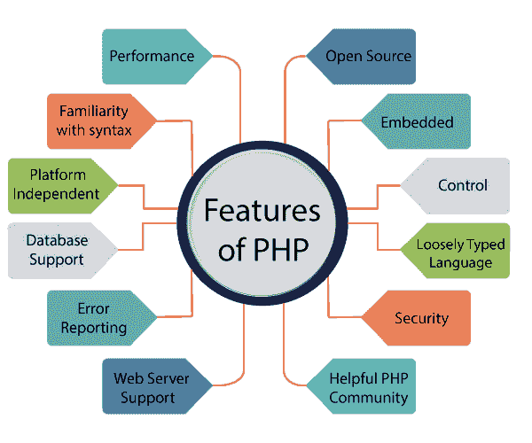

# PHP 教程

> 原文：<https://www.javatpoint.com/php-tutorial>

针对初学者和专业人士的 PHP 教程提供了 PHP 脚本语言的深入知识。我们的 PHP 教程将帮助您轻松学习 PHP 脚本语言。

本 PHP 教程涵盖了 PHP 的所有主题，如简介、控制语句、函数、数组、字符串、文件处理、表单处理、正则表达式、日期和时间、PHP 中的面向对象编程、数学、PHP MySQL、带有 Ajax 的 PHP、带有 jQuery 的 PHP 和带有 XML 的 PHP。

## 什么是 PHP

PHP 是一种开源的、解释的、面向对象的脚本语言，可以在服务器端执行。PHP 非常适合网络开发。因此，它用于开发 web 应用程序(在服务器上执行并生成动态页面的应用程序。).

PHP 由**拉斯马斯·勒德尔夫在 1994 年**创造，但在 1995 年出现在市场上。 **PHP 7.4.0** 是 PHP 的最新版本，于**11 月 28 日**发布。关于 PHP 需要注意的一些要点如下:

*   PHP 代表超文本预处理器。
*   PHP 是一种解释语言，即不需要编译。
*   PHP 比其他脚本语言更快，例如 ASP 和 JSP。
*   PHP 是一种服务器端脚本语言，用于管理网站的动态内容。
*   PHP 可以嵌入到 HTML 中。
*   PHP 是一种面向对象的语言。
*   PHP 是一种开源脚本语言。
*   PHP 是简单易学的语言。

## 为什么要用 PHP

PHP 是一种服务器端脚本语言，用于设计带有 MySQL 数据库的动态 web 应用程序。

*   它为网站处理动态内容、数据库以及会话跟踪。
*   可以用 PHP 创建会话。
*   它可以访问 cookie 变量，也可以设置 cookie。
*   它有助于加密数据和应用验证。
*   PHP 支持多种协议，如 HTTP、POP3、SNMP、LDAP、IMAP 等。
*   使用 PHP 语言，您可以控制用户访问您网站的某些页面。
*   由于 PHP 易于安装和设置，这是 PHP 是最好学习的语言的主要原因。
*   PHP 可以处理表单，例如-使用表单从用户那里收集数据，将其保存到数据库中，并向用户返回有用的信息。**例如** -登记表。

## PHP 特性

PHP 是一种非常流行的语言，因为它简单且开源。下面给出了 PHP 的一些重要特性:

**性能:**

PHP 脚本的执行速度比用 JSP 和 ASP 等其他语言编写的脚本快得多。PHP 使用自己的内存，所以服务器的工作量和加载时间会自动减少，从而带来更快的处理速度和更好的性能。

**开源:**

PHP 源代码和软件可以在网上免费获得。您可以根据自己的需求开发所有版本的 PHP，而无需支付任何费用。它的所有组件都可以免费下载和使用。

**熟悉语法:**

PHP 有容易理解的语法。程序员对用它编码感到很舒服。

**嵌入式:**

PHP 代码可以很容易地嵌入到 HTML 标签和脚本中。

**平台无关:**

PHP 适用于 WINDOWS、MAC、LINUX & UNIX 操作系统。在一个操作系统中开发的 PHP 应用程序也可以在其他操作系统中轻松执行。

**数据库支持:**

PHP 支持所有领先的数据库，如 MySQL、SQLite、ODBC 等。

**错误报告-**

PHP 有预定义的错误报告常数，可以在运行时生成错误通知或警告。例如，错误、警告、严格、解析。

**松散类型语言:**

PHP 允许我们在不声明变量数据类型的情况下使用变量。它将在执行时根据其值包含的数据类型自动获取。

**网络服务器支持:**

PHP 几乎兼容现在使用的所有本地服务器，比如 Apache、Netscape、微软 IIS 等。

**安全:**

PHP 是开发网站的安全语言。它由多层安全组成，以防止线程和恶意攻击。

**控制:**

不同的编程语言需要很长的脚本或代码，而 PHP 可以在几行代码中完成同样的工作。它对网站有最大限度的控制，就像你可以随时轻松地进行更改一样。

**一个有用的 PHP 社区:**

它有一个庞大的开发人员社区，他们定期更新文档、教程、在线帮助和常见问题。从社区中学习 PHP 是一个显著的好处。

## 网络开发

PHP 现在广泛应用于网络开发。PHP 可以轻松开发动态网站。但是你也必须具备以下网络开发技术的基础知识。

*   超文本标记语言
*   半铸钢ˌ钢性铸铁(Cast Semi-Steel)
*   Java Script 语言
*   埃阿斯
*   XML 和 JSON
*   框架

## 先决条件

学习 PHP 之前，必须具备 **HTML、CSS、**和 **JavaScript** 的基础知识。所以，学习这些技术来更好地实现 PHP。

**HTML -** HTML 用于设计静态网页。

**CSS -** CSS 有助于让网页内容更有效果，更有吸引力。

**JavaScript -** JavaScript 是用来设计一个互动网站的。

## 观众

我们的 PHP 教程旨在帮助初学者和专业人士。本 PHP 教程将帮助那些不了解 PHP 概念但对计算机编程有基本了解的人。

## 问题

我们向您保证，您不会在这个 PHP 教程中发现任何问题。但如果有任何错误或差错，请在联系表中注明。

* * *