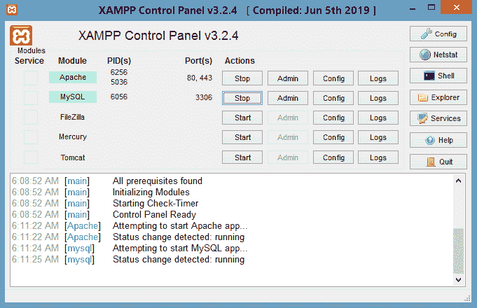

# 安装 PHP

> 原文：<https://www.javatpoint.com/install-php>

要安装 PHP，我们会建议你安装 AMP (Apache、MySQL、PHP)软件栈。它适用于所有操作系统。市场上有许多放大器选项，如下所示:

*   **WAMP** 为窗户
*   **LAMP** 适用于 Linux
*   **MAMP** 为 Mac
*   【Solaris 的 SAMP
*   **FAMP** 代表 FreeBSD
*   **跨平台的 XAMPP** (Cross、Apache、MySQL、PHP、Perl):也包括一些其他的组件，比如 FileZilla、OpenSSL、Webalizer、Mercury Mail 等。

如果你在 Windows 上，不想要 Perl 和 XAMPP 的其他特性，你应该去 WAMP。同样，你可以在 Linux 上使用 LAMP，在 Macintosh 上使用 MAMP。

### 下载并安装 WAMP 服务器

[Click me to download WAMP server](http://www.wampserver.com/en/)

### 下载并安装 LAMP 服务器

[Click me to download LAMP server](http://csg.sph.umich.edu/abecasis/LAMP/download/)

### 下载并安装 MAMP 服务器

[Click me to download MAMP server](https://www.mamp.info/en/downloads/)

### 下载并安装 XAMPP 服务器

[Click me to download XAMPP server](https://www.apachefriends.org/download.html)

## 如何在 windows 上安装 XAMPP 服务器

我们将逐步学习如何在 windows 平台上安装 XAMPP 服务器。按照以下步骤在您的系统上安装 XAMPP 服务器。

**第一步:**根据您的窗口需求，点击上面提供的链接下载 **XAMPP 服务器**。

**第二步:**下载 XAMPP 后，双击下载的文件，让 XAMPP 在你的系统中进行修改。将弹出一个窗口，您必须点击**下一步**按钮。

**第三步:**在这里选择要安装的组件，点击**下一步**。

**第 4 步:**在系统中选择要安装 XAMPP 的文件夹，点击**下一步**。

**第五步:**点击**下一步**继续前进。

**第六步:** XAMPP 准备安装，点击**下一步**按钮，安装 XAMPP。

**第 7 步:**安装成功后会显示完成窗口。点击**完成**按钮。

**第八步:**选择自己喜欢的语言。

**第九步:** XAMPP 准备使用。启动 Apache 服务器和 MySQL，并在本地主机上运行 php 程序。

如何在 XAMPP 上运行 PHP 程序，请参见下一个教程。

**步骤 10:** 如果没有显示错误，则 XAMPP 运行成功。

* * *