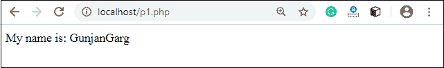
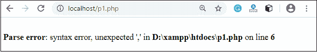
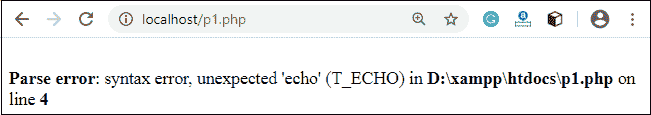
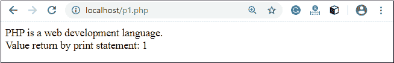

# PHP 回显和打印语句

> 原文:[https://www.javatpoint.com/php-echo-and-print-statements](https://www.javatpoint.com/php-echo-and-print-statements)

我们经常使用 echo 语句来显示输出。有两种基本方法可以在 PHP 中获得输出:

*   回声
*   打印

echo 和 print 是语言构造，它们的行为从来不像函数。因此，不需要括号。但是，这两个语句都可以带括号或不带括号使用。我们可以使用这些语句来输出变量或字符串。

## 回声和打印的区别

### 回声

*   echo 是一个语句，用于显示输出。
*   echo 可以带括号，也可以不带括号。
*   echo 不返回值。
*   我们可以在 echo 中传递多个由逗号(，)分隔的字符串。
*   echo 比 print 语句更快。

### 打印

*   print 也是一个语句，用作多次回显输出的替代。
*   print 可以带括号，也可以不带括号。
*   print 总是返回一个整数值，即 1。
*   使用 print，我们不能传递多个参数。
*   打印比 echo 语句慢。

借助以下程序，您可以看到 echo 语句和 print 语句之间的区别。

### 例如(检查多个参数)

您可以在 echo 中传递由逗号(，)分隔的多个参数。它不会产生任何语法错误。

```php
<?php
     $fname = "Gunjan";
     $lname = "Garg";
     echo "My name is: ".$fname,$lname;
?>

```

**输出:**



它会因为打印语句中的多个参数而产生**语法错误**。

```php
<?php
     $fname = "Gunjan";
     $lname = "Garg";
     print "My name is: ".$fname,$lname;
?>

```

**输出:**



### 例如(检查返回值)

echo 语句不返回值。如果您试图显示它的返回值，它将生成一个错误。

```php
<?php
     $lang = "PHP";
     $ret = echo $lang." is a web development language.";
     echo "</br>";
     echo "Value return by print statement: ".$ret; 
?>

```

**输出:**



正如我们已经讨论过的，print 返回的值总是 1。

```php
<?php
     $lang = "PHP";
     $ret = print $lang." is a web development language.";
     print "</br>";
print "Value return by print statement: ".$ret; 
?>

```

**输出:**



* * *