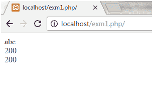
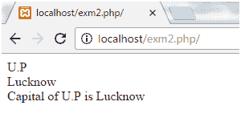
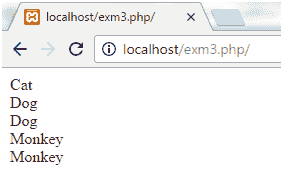

# PHP $和$$变量

> 原文:[https://www.javatpoint.com/php-dollar-doubledollar](https://www.javatpoint.com/php-dollar-doubledollar)

**$var** (单美元)是一个名为 var 的普通变量，它存储任何值，如字符串、整数、浮点数等。

The **$$var** (double dollar) is a reference variable that stores the value of the $variable inside it.

为了更好地理解区别，让我们看一些例子。

### 例 1

```php
<?php
$x = "abc";
$$x = 200;
echo $x."<br/>";
echo $$x."<br/>";
echo $abc;
?>

```

**输出:**



在上面的例子中，我们给变量 **x** 赋值为 **abc** 。参考变量 **$$x** 的值被指定为 **200** 。

现在我们已经打印了值 **$x、$$x** 和 **$abc** 。

### 示例 2

```php
<?php
 $x="U.P";
$$x="Lucknow";
echo $x. "<br>";
echo $$x. "<br>";
echo "Capital of $x is " . $$x;
?>

```

**输出:**



在上面的例子中，我们给变量 **x** 赋值为 **U.P** 。参考变量 **$$x** 的值被指定为**勒克瑙。**

现在我们已经打印了值 **$x、$$x** 和一个字符串。

### 示例 3

```php
<?php
$name="Cat";
${$name}="Dog";
${${$name}}="Monkey";
echo $name. "<br>";
echo ${$name}. "<br>";
echo $Cat. "<br>";
echo ${${$name}}. "<br>";
echo $Dog. "<br>";
?>

```

**输出:**



在上面的例子中，我们已经为变量名 **Cat** 赋值。参考变量 **${$name}** 的值被指定为**狗**， **${${$name}}** 被指定为**猴**。

现在我们已经将这些值打印为 **$name、${$name}、$Cat、${${$name}}** 和 **$Dog。**

* * *