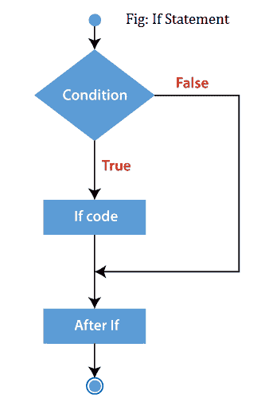
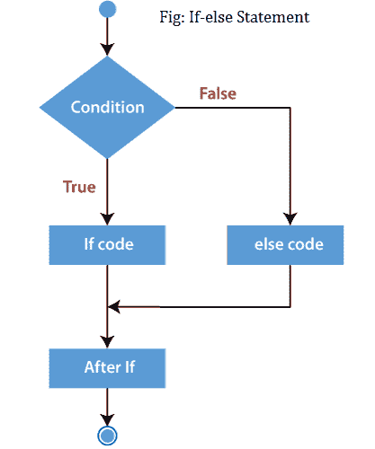
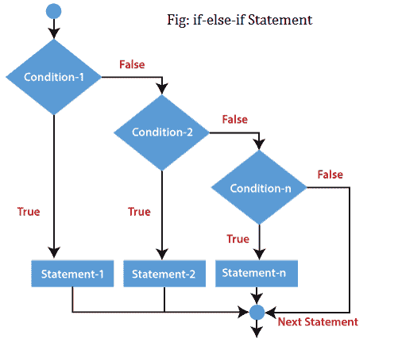
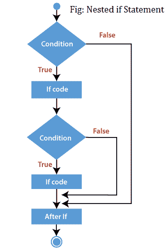

# PHP If Else

> 原文:[https://www.javatpoint.com/php-if-else](https://www.javatpoint.com/php-if-else)

PHP if else 语句用于测试条件。在 PHP 中使用 if 语句有多种方式。

*   [如果](#if)
*   [如果-否则](#if-else)
*   [if-else-if](#if-else-if)
*   [嵌套 if](#nested-if)

## PHP If 语句

PHP if 语句允许代码的条件执行。如果条件为真，则执行。

If 语句用于仅在指定条件为真时执行 if 语句中存在的代码块。

**语法**

```php
if(condition){
//code to be executed
}

```

**流程图**



**例**

```php
<?php
$num=12;
if($num<100){
echo "$num is less than 100";
}
?>

```

**输出:**

```php
12 is less than 100

```

## PHP If-else 语句

不管条件是真还是假，都会执行 PHP if-else 语句。

If-else 语句与 If 语句略有不同。如果指定条件为**真**，则执行一段代码，如果条件为**假**，则执行另一段代码。

**语法**

```php
if(condition){
//code to be executed if true
}else{
//code to be executed if false
}

```

**流程图**



**例**

```php
<?php
$num=12;
if($num%2==0){
echo "$num is even number";
}else{
echo "$num is odd number";
}
?>

```

**输出:**

```php
12 is even number

```

## PHP 如果-否则-如果语句

PHP if-else-if 是一个用于组合多个 if 的特殊语句？。else 语句。因此，我们可以使用这个语句检查多个条件。

**语法**

```php
if (condition1){  
//code to be executed if condition1 is true  
} elseif (condition2){    
//code to be executed if condition2 is true  
} elseif (condition3){    
//code to be executed if condition3 is true  
....
}  else{  
//code to be executed if all given conditions are false  
}  

```

**流程图**



**例**

```php
<?php
    $marks=69;    
    if ($marks<33){  
        echo "fail";  
    }  
    else if ($marks>=34 && $marks<50) {  
        echo "D grade";  
    }  
    else if ($marks>=50 && $marks<65) {  
       echo "C grade"; 
    }  
    else if ($marks>=65 && $marks<80) {  
        echo "B grade"; 
    }  
    else if ($marks>=80 && $marks<90) {  
        echo "A grade";  
    }
	else if ($marks>=90 && $marks<100) {  
        echo "A+ grade"; 
    }
   else {  
        echo "Invalid input";  
    }  
?>

```

**输出:**

```php
B Grade

```

## PHP 嵌套 if 语句

嵌套的 if 语句在另一个 if 块中包含 if 块。只有当外部 if 语句中的指定条件为**真**时，内部 if 语句才会执行。

**语法**

```php
if (condition) {  
//code to be executed if condition is true 
if (condition) {  
//code to be executed if condition is true  
}  
} 

```

**流程图**



**例**

```php
<?php
               $age = 23;
	$nationality = "Indian";
	//applying conditions on nationality and age
	if ($nationality == "Indian")
	{
		if ($age >= 18) {
			echo "Eligible to give vote";
		}
		else {	
			echo "Not eligible to give vote";
		}
	}
?>

```

**输出:**

```php
Eligible to give vote

```

**PHP 开关示例**

```php
<?php
              $a = 34; $b = 56; $c = 45;
	if ($a < $b) {
		if ($a < $c) {
			echo "$a is smaller than $b and $c";
		}
	}
?>

```

**输出:**

```php
34 is smaller than 56 and 45

```

* * *