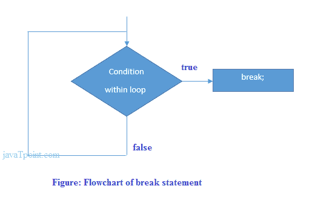

# PHP Break

> 原文：<https://www.javatpoint.com/php-break>

PHP break 语句中断当前 for、while、do-while、switch 和 for 每个循环的执行。如果在内部循环中使用 break，它只会中断内部循环的执行。

**break** 关键字立即结束循环或开关结构的执行。它在指定的条件下中断程序的当前流程，程序控制在循环之外的下一个语句处恢复。

break 语句可用于所有类型的循环，如 while、do-while、for、foreach 循环，也可用于 switch case。

### 句法

```php
jump statement;
break;

```

### 流程图



## PHP Break:内部循环

让我们看一个简单的例子，如果 I 的值等于 5，就中断 for 循环的执行。

```php
<?php  
for($i=1;$i<=10;$i++){  
echo "$i <br/>";  
if($i==5){  
break;  
}  
}  
?>

```

**输出:**

```php
1
2
3
4
5

```

## PHP Break:内部循环

PHP break 语句只中断内部循环的执行。

```php
<?php  
for($i=1;$i<=3;$i++){  
 for($j=1;$j<=3;$j++){  
  echo "$i   $j<br/>";  
  if($i==2 && $j==2){  
   break;  
  }  
 }  
}  
?>

```

**输出:**

```php
1 1
1 2
1 3
2 1
2 2
3 1
3 2
3 3

```

## PHP Break:内部开关语句

PHP break 语句也中断了开关盒的流程。

```php
<?php      
$num=200;      
switch($num){      
case 100:      
echo("number is equals to 100");      
break;      
case 200:      
echo("number is equal to 200");      
break;      
case 50:      
echo("number is equal to 300");      
break;      
default:      
echo("number is not equal to 100, 200 or 500");      
}     
?>

```

**输出:**

```php
number is equal to 200

```

## PHP Break:用字符串数组

```php
<?php
//declare an array of string
$number = array ("One", "Two", "Three", "Stop", "Four");
foreach ($number as $element) {
if ($element == "Stop") {
break;
}
echo "$element </br>";
}
?>

```

**输出:**

```php
One 
Two 
Three

```

您可以在上面的输出中看到，在获得指定的条件 true 之后，break 语句立即结束循环，并且控制从循环中出来。

## PHP Break:不带 Break 的 switch 语句

没有必要列出 switch 语句的所有情况。但是如果你想只执行一个案例，你必须使用 break 语句。

```php
<?php
$car = 'Mercedes Benz';
switch ($car) {  
default:
echo '$car is not Mercedes Benz<br>';
case 'Orange':
echo '$car is Mercedes Benz';
}
?>

```

**输出:**

```php
$car is not Mercedes Benz
$car is Mercedes Benz

```

## PHP Break:使用可选参数

break 接受一个可选的数字参数，该参数描述它将退出多少嵌套结构。默认值为 1，它会立即从封闭结构中退出。

```php
<?php
$i = 0;
while (++$i) {
    switch ($i) {
        case 5:
            echo "At matched condition i = 5<br />\n";
            break 1;  // Exit only from the switch. 
       case 10:
            echo "At matched condition i = 10; quitting<br />\n";
            break 2;  // Exit from the switch and the while. 
       default:
            break;
    }
}?>

```

**输出:**

```php
At matched condition i = 5
At matched condition i = 10; quitting

```

#### 注意:break 关键字立即结束当前结构的执行。

* * *