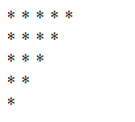
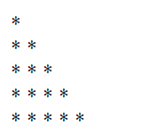
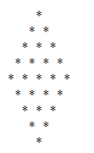
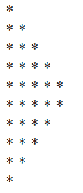
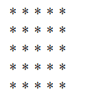

# PHP 程序

> 原文:[https://www.javatpoint.com/php-programs](https://www.javatpoint.com/php-programs)

PHP 程序在面试中经常被问到。这些程序可以从基础、控制语句、数组、字符串、oops、文件处理等方面进行询问。让我们看看顶级 PHP 程序的列表。

* * *

## 1) [位数之和](php-sum-of-digits)

写一个 PHP 程序打印数字总和。

**输入:** 23

**输出:** 5

**输入:** 624

**输出:** 12

* * *

## 2) [偶数或奇数](php-even-odd-program)

**输入:** 23

**输出:**奇数

**输入:** 12

**输出:**偶数

* * *

## 3) [质数](php-prime-number)

写一个 PHP 程序检查质数。

**输入:** 17

**输出:**不是质数

**输入:** 57

**输出:**质数

* * *

## 4) [编号表](php-table-of-number)

写一个 PHP 程序来打印一个数字的表格。

**输入:** 2

**产量:** 2 4 6 8 10 12 14 16 18 20

**输入:** 5

**产量:** 5 10 15 20 25 30 35 40 45 50

* * *

## 5) [因子](php-factorial-program)

写一个 PHP 程序来打印一个数的阶乘。

**输入:** 5

**输出:** 120

**输入:** 6

**输出:** 720

* * *

## 6) [阿姆斯特朗号](php-armstrong-number)

写一个 PHP 程序来检查阿姆斯特朗号。

**输入:** 371

**输出:**阿姆斯特朗

**输入:** 342

**输出:**不是阿姆斯特朗

* * *

## 7) [回文号](php-palindrome-number)

写一个 PHP 程序检查回文号。

**输入:** 121

**输出:**不是回文号

**输入:** 113

**输出:**回文号

* * *

## 8) [斐波那契数列](php-fibonacci-series)

写一个 PHP 程序打印斐波那契数列，不用递归，用递归。

**输入:** 10

**输出:【1 1 2 3 5 8 13 21 34**

* * *

## 9) [反转号](php-reverse-number)

写一个 PHP 程序来反转给定的数字。

**输入:** 234

**输出:** 432

* * *

## 10) [反弦](php-reverse-string)

编写一个 PHP 程序来反转给定的字符串。

**输入:** amit

**输出:**马体

* * *

## 11) [互换两个号码](php-swapping-two-numbers)

编写一个 PHP 程序，在使用和不使用第三个变量的情况下交换两个数字。

**输入:** a=5 b=10

**输出:** a=10 b=5

* * *

## 12) [两个数相加](php-adding-two-numbers)

写一个 PHP 程序把两个数字相加。

**第一次输入:** 10

**第二次输入:** 20

**输出:** 30

* * *

## 13) [减去两个数](php-subtracting-two-numbers)

写一个 PHP 程序来减去两个数字。

**首次输入:** 50

**第二次输入:** 10

**输出:** 40

* * *

## 14) [三角形面积](php-area-of-triangle)

写一个 PHP 程序求三角形的面积。

**基本输入:** 10

**高度输入:** 15

**输出:** 75

* * *

## 15) [矩形面积](php-area-of-rectangle)

写一个 PHP 程序，求矩形的面积。

**长度输入:** 10

**宽度输入:** 20

**输出:** 200

* * *

## 16) [闰年](php-leap-year)

写一个 PHP 程序，看看给定的年份是不是闰年。

**输入:** 2000

**产量:**闰年

**输入:** 2001

**输出:**不是闰年

* * *

## 17) [使用 PHP 方法的字母三角形](php-alphabet-triangle-method)

写一个 PHP 程序打印字母三角形。

**输出:**

```php
     A
    ABA
   ABCBA
  ABCDCBA
 ABCDEDCBA

```

## 18) [字母三角图案](php-alphabet-triangle-pattern)

写一个 PHP 程序打印字母三角形。

**输出:**

```php
     A
    ABA
   ABCBA
  ABCDCBA
 ABCDEDCBA

```

## 19) [数字三角形](php-number-triangle)

写一个 PHP 程序打印数字三角形。

**输出:**

```php
enter the range= 6
      1
     121
    12321
   1234321
  123454321
 12345654321

```

* * *

## 20) [星三角](php-star-triangle)

写一个 PHP 程序打印星形三角形。

**输出:**



**输出:**



**输出:**



**输出:**



**输出:**

