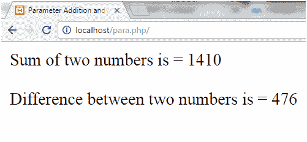
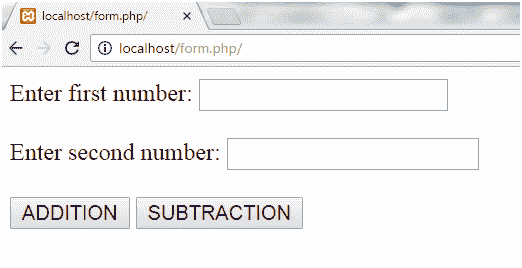
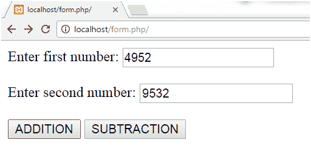
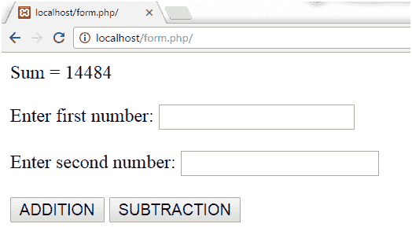
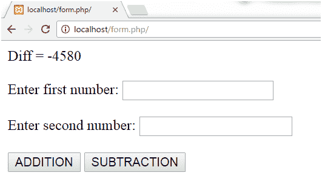

# 参数化函数

> 原文：<https://www.javatpoint.com/php-parameterized-function>

参数化函数是带有参数的函数。您可以在函数内部传递任意数量的参数。这些传递的参数在您的函数中充当变量。

它们在函数名后面的括号内指定。

输出取决于作为参数传递给函数的动态值。

* * *

## PHP 参数化示例 1

**加减**

在这个例子中，我们在两个函数 **add()** 和 **sub()** 中传递了两个参数 **$x** 和 **$y** 。

```php
<!DOCTYPE html>
<html>
<head>
	<title>Parameter Addition and Subtraction Example</title>
</head>
<body>
<?php
		//Adding two numbers
         function add($x, $y) {
            $sum = $x + $y;
            echo "Sum of two numbers is = $sum <br><br>";
         } 
         add(467, 943);

         //Subtracting two numbers
         function sub($x, $y) {
            $diff = $x - $y;
            echo "Difference between two numbers is = $diff";
         } 
         sub(943, 467);
      ?>
</body>
</html>

```

输出:



* * *

## PHP 参数化示例 2

**动态数字加减**

在这个例子中，我们在两个函数 **add()** 和 **sub()** 中传递了两个参数 **$x** 和 **$y** 。

```php
<?php
//add() function with two parameter
function add($x,$y)  
{
$sum=$x+$y;
echo "Sum = $sum <br><br>";
}
//sub() function with two parameter
function sub($x,$y)  
{
$sub=$x-$y;
echo "Diff = $sub <br><br>";
}
//call function, get  two argument through input box and click on add or sub button
if(isset($_POST['add']))
{
//call add() function
 add($_POST['first'],$_POST['second']);
}	
if(isset($_POST['sub']))
{
//call add() function
sub($_POST['first'],$_POST['second']);
}
?>
<form method="post">
Enter first number: <input type="number" name="first"/><br><br>
Enter second number: <input type="number" name="second"/><br><br>
<input type="submit" name="add" value="ADDITION"/>
<input type="submit" name="sub" value="SUBTRACTION"/>
</form>	

```

输出:



我们传递了以下数字，



现在点击加法按钮，我们得到以下输出。



现在点击减法按钮，我们得到以下输出。

