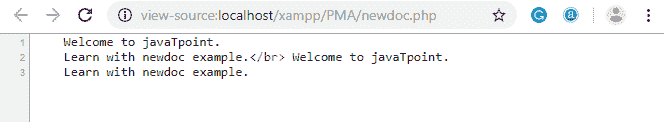

# PHP 字符串

> 原文：<https://www.javatpoint.com/php-string>

PHP 字符串是一个字符序列，即用于存储和操作文本。PHP 只支持 256 个字符集，因此它不提供本机 Unicode 支持。在 PHP 中有 4 种方法可以指定字符串。

1.  单引号
2.  双重引用
3.  heredoc 语法
4.  newdoc 语法(从 PHP 5.3 开始)

* * *

## 单引号

我们可以用 PHP 创建一个字符串，用单引号将文本括起来。在 PHP 中指定字符串是最简单的方法。

要指定原义单引号，请使用反斜杠(\)对其进行转义，要指定原义反斜杠(\)请使用双反斜杠(\\)。带有反斜杠的所有其他实例，如\r 或\n，将按它们指定的方式输出，而不具有任何特殊含义。

**例如**

下面给出了一些例子，以便更好地理解单引号的 PHP 字符串:

**例 1**

```php
<?php
       $str='Hello text within single quote';
       echo $str;
?>

```

**输出:**

```php
Hello text within single quote

```

我们可以在一个单引号 PHP 字符串中存储多行文本、特殊字符和转义序列。

**例 2**

```php
<?php
$str1='Hello text 
multiple line
text within single quoted string';
$str2='Using double "quote" directly inside single quoted string';
$str3='Using escape sequences \n in single quoted string';
echo "$str1 <br/> $str2 <br/> $str3";
?>

```

**输出:**

```php
Hello text multiple line text within single quoted string 
Using double "quote" directly inside single quoted string 
Using escape sequences \n in single quoted string

```

**例 3**

```php
<?php
$num1=10; 
$str1='trying variable $num1';
$str2='trying backslash n and backslash t inside single quoted string \n \t';
$str3='Using single quote \'my quote\' and \\backslash';
echo "$str1 <br/> $str2 <br/> $str3";
?>

```

**输出:**

```php
trying variable $num1 
trying backslash n and backslash t inside single quoted string \n \t 
Using single quote 'my quote' and \backslash

```

#### 注意:在单引号 PHP 字符串中，大多数转义序列和变量都不会被解释。但是，我们可以在单引号 PHP 字符串中使用单引号“”和反斜杠“”。

* * *

## 双重引用

在 PHP 中，我们也可以通过双引号将文本括起来来指定字符串。但是转义序列和变量将使用双引号 PHP 字符串进行解释。

**例 1**

```php
<?php
$str="Hello text within double quote";
echo $str;
?>

```

**输出:**

```php
Hello text within double quote

```

现在你**不能在双引号字符串里面直接用双引号**。

**例 2**

```php
<?php
$str1="Using double "quote" directly inside double quoted string";
echo $str1;
?>

```

**输出:**

```php
Parse error: syntax error, unexpected 'quote' (T_STRING) in C:\wamp\www\string1.php on line 2

```

我们**可以将多行文本、特殊字符和转义序列**存储在一个双引号的 PHP 字符串中。

**例 3**

```php
<?php
$str1="Hello text 
multiple line
text within double quoted string";
$str2="Using double \"quote\" with backslash inside double quoted string";
$str3="Using escape sequences \n in double quoted string";
echo "$str1 <br/> $str2 <br/> $str3";
?>

```

**输出:**

```php
Hello text multiple line text within double quoted string 
Using double "quote" with backslash inside double quoted string 
Using escape sequences in double quoted string

```

在双引号字符串中，**变量将被解释为**。

**例 4**

```php
<?php
$num1=10; 
echo "Number is: $num1";
?>

```

**输出:**

```php
Number is: 10

```

* * *

## 埃多克

Heredoc 语法(<

### 命名规则

标识符应遵循命名规则，即它必须只包含字母数字字符和下划线，并且必须以下划线或非数字字符开头。

### 例如

**有效示例**

```php
<?php
    $str = <<<Demo
It is a valid example
Demo;    //Valid code as whitespace or tab is not valid before closing identifier
echo $str;
?>

```

**输出:**

```php
It is a valid example 

```

**无效示例**

我们不能在标识符和分号前后使用任何空格或制表符，这意味着标识符不能缩进。标识符必须从新行开始。

```php
<?php
    $str = <<<Demo
It is Invalid example
       Demo;    //Invalid code as whitespace or tab is not valid before closing identifier
echo $str;
?>

```

该代码将产生一个错误。

**输出:**

```php
Parse error: <strong>syntax error, unexpected end of file in</strong> C:\xampp\htdocs\xampp\PMA\heredoc.php on <strong>line 7</strong>

```

Heredoc 类似于双引号字符串，没有双引号，意味着在 heredoc 中不需要引号。它还可以打印变量的值。

**例**

```php
<?php
	$city = 'Delhi';
	$str = <<<DEMO
Hello! My name is Misthi, and I live in $city.
DEMO;
	echo $str;
 ?>

```

**输出:**

```php
Hello! My name is Misthi, and I live in Delhi. 

```

**例**

我们可以在 heredoc 语法之间添加多行文本。

```php
<?php
	$str = <<<DEMO
It is the example 
of multiple
lines of text.
DEMO;
	echo $str;

echo '</br>';

echo <<<DEMO    // Here we are not storing string content in variable str. 
It is the example 
of multiple
lines of text.
DEMO;
 ?>

```

**输出:**

```php
It is the example of multiple lines of text.
It is the example of multiple lines of text.

```

下面是类及其变量的例子

**例**

```php
<?php
class heredocExample{
		var $demo;
		var $example;
		function __construct()
		{
				$this->demo = 'DEMO';
				$this->example = array('Example1', 'Example2', 'Example3');
		}
	}
	$heredocExample = new heredocExample();
	$name =  'Gunjan';

	echo <<<ECO
	My name is "$name". I am printing some $heredocExample->demo example.
	Now, I am printing {$heredocExample->example[1]}.
	It will print a capital 'A': \x41
ECO;
 ?>

```

**输出:**

```php
My name is "Gunjan". I am printing some DEMO example. 
Now, I am printing Example2\. 
It will print a capital 'A': A

```

* * *

## 纽多克

Newdoc 类似于 heredoc，但在 newdoc 中，解析没有完成。它也用三个小于符号<<< followed by an identifier. But here identifier is enclosed in single-quote, **来标识，例如<<<【EXP】**。Newdoc 遵循与此处文档相同的规则。

newdoc 和 heredoc 的区别在于- Newdoc 是**单引号字符串**，而 heredoc 是**双引号字符串**。

#### 注意: Newdoc 作为单引号工作。

**示例-1:**

```php
<?php
    $str = <<<'DEMO'
	Welcome to javaTpoint.
           Learn with newdoc example.
DEMO;
echo $str;
echo '</br>';

echo <<< 'Demo'    // Here we are not storing string content in variable str.
	Welcome to javaTpoint.
           Learn with newdoc example.
Demo;
?>

```

**输出:**

```php
Welcome to javaTpoint. Learn with newdoc example.
Welcome to javaTpoint. Learn with newdoc example.

```

转到查看页面源代码，查看程序的源代码。



**例**

下面的示例显示 newdoc 不打印变量的值。

```php
<?php
class heredocExample{
		var $demo;
		var $example;
		function __construct()
		{
				$this->demo = 'DEMO';
				$this->example = array('Example1', 'Example2', 'Example3');
		}
	}
	$heredocExample = new heredocExample();
	$name =  'Gunjan';

	echo <<<ECO
	My name is "$name". I am printing some $heredocExample->demo example.
	Now, I am printing {$heredocExample->example[1]}.
	It will print a capital 'A': \x41
ECO;
 ?>

```

**输出:**

上述程序的输出如下所示:

```php
My name is "<strong>$name</strong>". I am printing some <strong>$heredocExample->demo</strong> example. 
Now, I am printing <strong>{$heredocExample->example[1]}</strong>. 
It will print a capital 'A': <strong>\x41</strong>

```

#### 注意:PHP 5 . 3 . 0+版本支持的 newdoc。

**无效示例**

我们不能在标识符和分号前后使用任何空格或制表符，这意味着标识符不能缩进。标识符必须从新行开始。它在 newdoc 中也是无效的。

```php
<?php
    $str = <<<'Demo'
It is Invalid example
Demo;  //Invalid code as whitespace or tab is not valid before closing identifier
echo $str;
?>

```

该代码将产生一个错误。

**输出:**

```php
Parse error: <strong>syntax error, unexpected end of file in</strong> C:\xampp\htdocs\xampp\PMA\newdoc.php on <strong>line 7</strong>

```