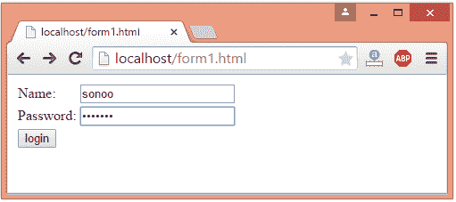
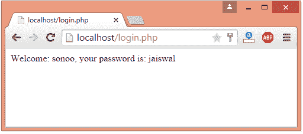

# PHP 表单处理

> 原文:[https://www.javatpoint.com/php-form](https://www.javatpoint.com/php-form)

我们可以在 PHP 中创建和使用表单。要获取表单数据，我们需要使用 PHP superglobals $_GET 和$_POST。

表单请求可以是 get 或 post。要从 get 请求中检索数据，我们需要使用$_GET，对于 post 请求$_POST。

## PHP 获取表单

Get 请求是默认的表单请求。通过 get 请求传递的数据在 URL 浏览器上可见，因此不安全。您可以通过 get 请求发送有限数量的数据。

让我们看一个用 PHP 从 get 请求接收数据的简单例子。

File: form1.html

```php
<form action="welcome.php" method="get">
Name: <input type="text" name="name"/>
<input type="submit" value="visit"/>
</form>

```

File: welcome.php

```php
<?php
$name=$_GET["name"];//receiving name field value in $name variable
echo "Welcome, $name";
?>

```

## PHP 帖子表单

Post request 广泛应用于文件上传、图片上传、登录表单、注册表单等数据量较大的表单提交。

通过 post 请求传递的数据在 URL 浏览器上不可见，因此是安全的。您可以通过 post 请求发送大量数据。

让我们看一个用 PHP 从 post 请求接收数据的简单例子。

File: form1.html

```php
<form action="login.php" method="post"> 
<table> 
<tr><td>Name:</td><td> <input type="text" name="name"/></td></tr>
<tr><td>Password:</td><td> <input type="password" name="password"/></td></tr> 
<tr><td colspan="2"><input type="submit" value="login"/>  </td></tr>
</table>
</form> 

```

File: login.php

```php
<?php
$name=$_POST["name"];//receiving name field value in $name variable
$password=$_POST["password"];//receiving password field value in $password variable

echo "Welcome: $name, your password is: $password";
?>

```

输出:

 