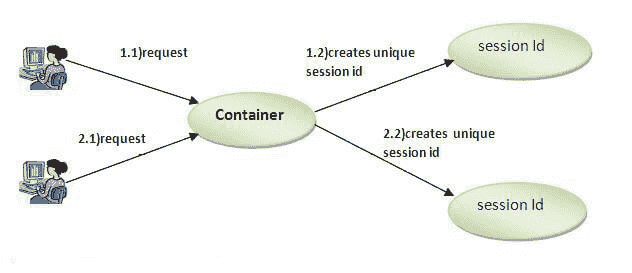

# PHP 会话

> 原文:[https://www.javatpoint.com/php-session](https://www.javatpoint.com/php-session)

PHP session 用于临时存储信息并将信息从一个页面传递到另一个页面(直到用户关闭网站)。

PHP 会话技术广泛应用于购物网站，我们需要将购物车信息(如用户名、产品代码、产品名称、产品价格等)从一个页面存储并传递到另一个页面。

PHP session 为每个浏览器创建唯一的用户 id，以识别用户并避免多个浏览器之间的冲突。



## PHP session_start()函数

函数的作用是:启动会话。它会启动一个新会话或恢复现有会话。如果会话已经创建，它将返回现有会话。如果会话不可用，它将创建并返回新会话。

**语法**

```php
bool session_start ( void )

```

**例**

```php
session_start();

```

## PHP $_SESSION

PHP $_SESSION 是一个包含所有会话变量的关联数组。它用于设置和获取会话变量值。

**示例:存储信息**

```php
$_SESSION["user"] = "Sachin";

```

**示例:获取信息**

```php
echo $_SESSION["user"];

```

## PHP 会话示例

File: session1.php

```php
<?php session_start();
???>

<?php $_SESSION["user"] = "Sachin";
echo "Session information are set successfully.<br/??>";
?>
<a href="session2.php">Visit next page</a>

```

File: session2.php

```php
<?php session_start();
???>

<?php echo "User is: ".$_SESSION["user"];
???>

```

## PHP 会话计数器示例

File: sessioncounter.php

```php
<?php session_start();

   if (!isset($_SESSION['counter'])) {
      $_SESSION['counter'] = 1;
   } else {
      $_SESSION['counter']++;
   }
   echo ("Page Views: ".$_SESSION['counter']);
???>

```

## PHP 销毁会话

PHP session_destroy()函数用于彻底销毁所有会话变量。

File: session3.php

```php
<?php session_start();
session_destroy();
???>

```