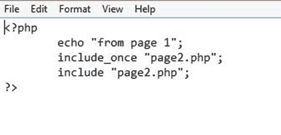
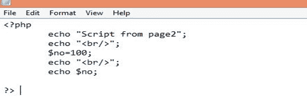
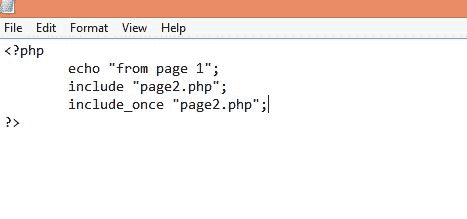

# 包含一次

> 原文：<https://www.javatpoint.com/php-include_once>

它与 include 类似，但只包含一次外部文件。首先，它将检查指定的文件是否已经包含。如果文件不包括在内，那么它只包括一个外部文件。

## 例 1

另存为 page1.php

另存为 page2.php

**输出:**

## 例 2

**更改 page1.php 的声明**

**输出:**

在示例 2 中，require_once 不起作用。