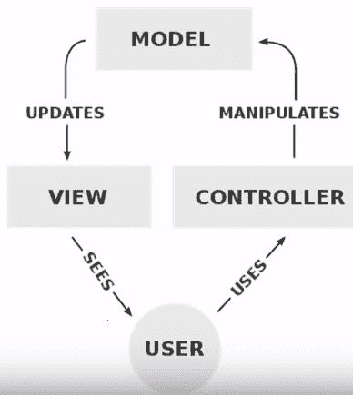

# MVC 架构

> 原文：<https://www.javatpoint.com/php-mvc-architecture>

MVC 是一种在计算机上实现用户界面的软件架构模式。它将一个给定的应用程序分成三个相互关联的部分。这样做是为了将信息的内部表示与信息呈现给用户和用户接受信息的方式分开。

*   MVC 代表“**模型视图和控制器**”。
*   **MVC 架构**的主要目的是将**业务逻辑&应用数据**与**用户界面**分离。
*   有不同类型的架构可供选择。分别是**三层架构、N 层架构、MVC 架构等等**。
*   体系结构的主要优势是可重用性、安全性和提高应用程序的性能。

**模型:**数据库操作，如取数据或更新数据等。

**视图:**最终用户 GUI，用户可以通过它与系统进行交互，即 HTML、CSS。

**控制器:**包含业务逻辑，提供模型和视图之间的链接。

让我们详细理解这个 MVC 概念:

## 型号:

*   模型对象知道所有需要显示的数据。
*   该模型表示控制数据更新的应用程序数据和业务规则。
*   模型不知道数据的呈现方式以及数据将如何显示给浏览器。

## 视图:

*   视图代表应用程序的表示。
*   如果业务逻辑中有任何修改，视图对象指的是保持不变的模型。
*   换句话说，我们可以说视图的责任是保持其呈现和模型变化的一致性。

## 控制器:

*   每当用户发送一个请求，它总是通过控制器。
*   控制器负责从视图中截取请求，并传递给模型进行适当的操作。
*   对数据采取操作后，控制器负责直接将适当的视图传递给用户。
*   在图形用户界面中，控制器和视图紧密配合。