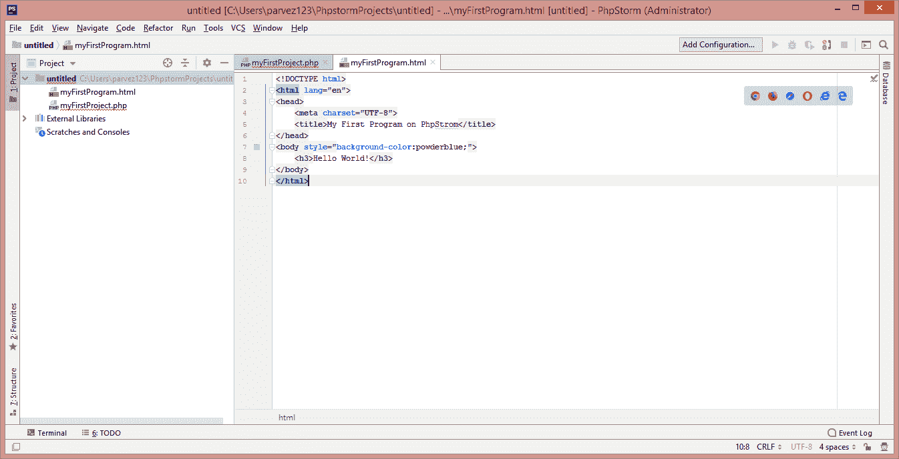

# 什么是 PhpStorm？

> 哎哎哎:# t0]https://www . javatppoint . com/phpstorm

PhpStorm 是一个面向 PHP 和 web 开发人员的 IDE(集成开发环境)，由 **JetBrains** 设计。它不是免费提供的。支持 **PHP 5.3** 及以上版本。PhpStorm 建立在 **IntelliJ IDEA 平台**上，用 **Java** 编写。

**jetbarks PhpStorm**是一个创新的跨平台 IDE，在过去几年中变得流行起来。它非常适合与 **Drupal、Symfony、Laravel、WordPress、Zend Framework、Joomla、CakePHP 和其他框架一起工作。PhpStorm 2019.1.3** 是 PhpStorm 的最新版本。

```php

PhpStorm = WebStorm + PHP + DB/SQL

```


所有的 WebStorm 特性都包含在 PhpStorm 中，除此之外还增加了对 PHP 和数据库的全面支持。PhpStorm 通过为 PHP 代码提供可编辑的 UML 类图来帮助开发人员理解和更改他们的代码。

PhpStorm IDE 提供**代码重构、自动完成、动态防错、零配置调试、**以及扩展的 **HTML、CSS** 和 **JavaScript 编辑器**。

PhpStorm 为在项目中使用数据库和 SQL 提供了工具和代码辅助功能。它与数据库连接，编辑表和模式，运行查询，甚至用 UML 图分析模式。

#### 注意:PhpStorm 不是免费的。它可以免费试用 30 天。

## PhpStorm 的主要特性

*   **完整的开发环境**
    大多数 PHP 开发人员不仅仅使用 PHP，他们还使用 HTML、CSS、JavaScript 和其他语言。PhpStorm 通过提供代码完成和语法突出显示支持，使开发人员可以轻松地使用所有语言。
*   **支持多个 PHP 框架**
    如果你使用 PHP 框架，PHP 表单是一个完美的选择。它与许多框架有效地集成在一起，如 **Laravel、CakePHP、Symfony2 和 YI**-所有这些框架也都受到未来托管的支持？的 PHP 框架应用服务器。
*   **伟大的版本控制集成**
    PhpStorm 为大范围的版本控制系统提供全面支持，最重要的包括- **GitHub 和 Git** 。程序员可以在集成开发环境中进行分支和合并。
    此外，PhpStorm 还包括出色的 FTP 支持，代码可以在几秒钟内上传到远程服务器。
*   **数据库支持**
    PhpStorm 提供了在项目中使用 SQL 和数据库的工具和代码辅助功能。它与数据库连接，编辑表数据，执行查询，甚至用 UML 图分析模式。
*   **调试和测试**
    零配置调试使应用程序调试变得容易。PHPUnit 支持从集成开发环境中开发和运行单元测试。使用 **Xdebug 和 Zend 调试器**分析应用程序，并在 PhpStorm 中检查聚合报告。

## PhpStorm 10

PhpStorm 包括许多新特性，使基于 PHP 的应用程序更加令人愉快。PhpStorm 的首要特性是它为 PHP 7 提供**全面支持，另一个令人兴奋的新特性是 **Docker 集成**。开发人员可以从集成开发环境内部轻松处理 Docker 容器。正是 PhpStorm 10 的强大功能使得构建几乎可以在任何 Linux 服务器上运行的开发和部署环境变得容易。**

## 使用 PhpStorm 的好处

*   在 PhpStorm 中快速准确地扫描项目。我们能够基于现有的类和函数快速执行自动编译。
*   出色的项目范围搜索选项。
*   继承的最佳跟踪选项。
*   搜索有很多选项和搜索。我们可以根据文件、目录和其他几个选项来组织搜索结果。
*   出色的内置比较工具，语法突出显示。
*   清除匹配的大括号高亮显示。
*   有用的警报可用，它会在编辑器上弹出，告诉我们某些东西可能配置不正确。

## PHP 表单的系统要求

*   最小 2GB 内存
*   推荐 4GB
*   视窗 10/8/7/Vista/XP (64 位)
*   1024x768 屏幕分辨率。

## 如何安装 PhpStorm

**第一步:**从以下链接[https://www . JetBrains . com/PhpStorm/Download/# section = windows](https://www.jetbrains.com/phpstorm/download/#section=windows)下载最新版本**JetBrains PhpStorm 2019 . 1 . 3**免费试用 30 天。您可以根据需要选择任何平台(窗口、Linux 和 MacOS)。


**步骤 2:** 下载完成后，运行 PhpStorm。我们将在需要点击**下一步**按钮的地方找到向导。


**第 3 步:**浏览目标文件夹安装 PhpStorm，点击下一步。


**第三步:**在这里，我们不需要做任何事情，点击下一步，继续前进。但是要在桌面上创建快捷方式，请根据系统配置检查创建桌面快捷方式。


**第 4 步:**选择/输入开始菜单文件夹名称，创建程序的快捷方式。默认情况下，喷气大脑会显示。现在点击安装按钮，开始提取文件。


**步骤 5:** 一旦成功提取所有文件，单击运行 PhpStorm 复选框，然后单击完成完成安装过程。


**第 6 步:**将显示一个向导来导入 PhpStorm 设置。选择不导入设置，然后按确定。


**第 7 步:**现在，接受用户协议条款并继续。


**第 8 步:**点击发送使用情况统计，继续前进。


**第九步:**从这里设置 UI 主题(如下图所示)，深色主题选择**达尔库拉**，浅色主题选择**浅色**。我们也可以通过单击跳过剩余部分并设置默认值来跳过这一步。


**第 10 步:**点击跳过剩余部分并设置默认按钮，跳过该步骤。


**第 11 步:**30 天免费试用，选择**免费评估**而不是激活，点击评估。


**步骤 12:** PhpStorm 安装成功。现在，创建一个新项目，并开始使用 PhpStorm。


## 如何在 PhpStorm 中创建项目

**步骤 1:** 用 PhpStorm 创建一个新项目，并提供保存位置。


**第二步:**右键点击你的项目创建一个新的 HTML 文件。新建→ HTML，我们也可以在这里创建 PHP、JavaScript 等文件。


**第三步:**编写 HTML 代码，在浏览器上运行。



```php
<html>
<head>
	<title>My First Program on PhpStorm</title>
</head>
<body style="background-color: powderblue;">
	<h3> Hello World!</h3>
</body>
</html>

```

**第四步:**上述程序的输出将是-


* * *