# PHP PDO 简介

> 原文：<https://www.javatpoint.com/php-pdo>

PHP 是一种开源的通用脚本语言，广泛用于创建动态的交互式网页。PHP 可以访问大量的关系数据库管理系统，如 **MYSQL，SQLite** ，以及 **PostgreSQL** 。 **PHP 5.1** 版本提供了一个新的数据库连接抽象库，这就是 **PHP 数据对象** (PDO)。

## 什么是 PDO？

PDO 引用了 **PHP 数据对象**，这是一个 PHP 扩展，它定义了一个轻量级和一致的接口来访问 PHP 中的数据库。它是一组 PHP 扩展，提供了一个核心的 PDO 类和特定于数据库的驱动程序。每个数据库驱动程序都可以将特定于数据库的特性公开为实现 PDO 接口的常规扩展函数。

#### 注意:我们不能通过使用 PDO 扩展本身来执行任何类型的数据库功能。要访问数据库服务器，我们必须使用特定于数据库的 PDO 驱动程序。

PDO 主要关注数据访问抽象，而不是数据库抽象。它提供了**数据访问抽象层**，这意味着无论我们使用哪个数据库，我们都必须使用该数据库提供的相同功能来发出查询和获取数据。PDO 不提供数据抽象，因为它不重写 SQL 或模拟缺失的特性。

## PDO 的优势

PDO 提供了各种处理对象的方法，并检索准备好的语句，使工作变得更加容易。它是 PHP 中的一个数据库访问工具，通过它我们可以跨多个数据库进行统一访问。

PDO 允许在不同的数据库和平台之间进行相对无缝的切换，这可以通过更改连接字符串轻松实现。它不支持特定于数据库的语法。

PDO 的一些优势如下:

*   **数据库支持**
    PDO 扩展可以访问为 PDO 驱动程序编写的任何数据库。有几个可用的 PDO 驱动程序可用于 **FreeTDS、微软 SQL Server、Sybase、IBM DB2、甲骨文调用接口、火鸟/Interbase 6** 和 **PostgreSQL** 数据库等。
    驱动程序不是每个系统都自动可用的，所以我们必须找到可用的驱动程序，并在需要时添加驱动程序。
*   **数据库连接**
    建立数据库连接有不同的语法。这些语法取决于特定的数据库。在使用 PDO 时，操作必须包装在 try/catch 块中，并使用异常技术。
    通常只需要创建一个连接，通过编程将数据库设置为 null 来关闭这些连接。
*   **错误处理**
    PDO 允许使用异常进行错误处理。为了产生一个异常，PDO 可以被强制进入一个相关的错误模式属性。
    有三种错误模式，即**静默**(默认)**警告****异常**。警告和异常在 DRY 编程中更有用。
    1.  **静音** -默认错误模式。
    2.  **警告** -对调试有用。
    3.  **异常** -该模式允许在隐藏某人可能用来利用您的系统的数据时进行良好的错误处理。
*   **插入更新**
    PDO 将常用的插入更新数据库操作简化为两步流程，即
    ***准备> >【绑定】> >执行。***
    通过这种方法，我们可以充分利用 PDO 准备好的声明，这些声明可以抵御通过 SQL 注入的恶意攻击。
    Prepared 语句是预编译的 SQL 语句，可以通过将这些数据发送到服务器来多次执行。占位符中使用的这些数据会自动受到保护，免受 SQL 注入攻击。

## 使用 PDO 的好处

PDO 是本地数据库驱动程序。使用 PDO 有以下好处:

*   **可用性** -它包含很多辅助功能来操作自动例行操作。
*   **可重用性** -它提供了统一的应用编程接口来访问多个数据库。
*   **安全** -它使用一个预先准备好的声明来保护自己免受 SQL 注入的攻击。准备好的语句是预编译的 SQL 语句，它将 SQL 语句的指令与数据分开。

## PDO 班

有三个 PDO 类，如下所示:

*   **PDO** -它代表 PHP 和数据库之间的连接。
*   **PDOStatement** -它代表准备好的语句，在语句执行后，设置一个关联的结果。
*   **pdoeexception**-代表 PDO 提出的错误。

## PDO 支持的数据库

1.  关系型数据库
2.  一种数据库系统
3.  神谕
4.  火鸟
5.  微软
6.  Sybase
7.  数据库
8.  国际商用机器公司
9.  FreeTDS
10.  数据库
11.  库弗德
12.  4D

## PDO 与 MySQLi 的比较

使用 PHP 访问数据库，主要有两个选项-**MySQL**和 **PDO** (PHP 数据对象)。MySQLi 是 PHP 的原生语言，可以提供更快的性能，而大多数有经验的开发人员更喜欢与 PDO 合作，因为它支持各种各样的数据库驱动程序。下面列出的 PDO 和 MySQLi 基于它们的特性有一些不同。

| 特征 | 数据对象 | 麦斯奎利 |
| **数据库支持** | 12 个不同的司机 | 仅 MySQL |
| **连接** | 容易的 | 容易的 |
| API | 面向对象的程序设计(Object Oriented Programming) | 面向对象程序设计 |
| **性能** | 快的 | 快的 |
| **命名参数** | 是 | 不 |
| **对象映射** | 是 | 是 |
| **存储过程** | 是 | 是 |
| **客户端准备报表** | 是 | 不 |
| **安全** | 比 MySQLi 更安全。 | 安全，但不会超过 PDO。 |

## PDO 和 MySQLi 应该选择哪个？

PDO 和 MySQLi 都有自己的优势:

*   正如我们之前看到的，PDO 可以在 12 个不同的数据库系统上工作，而 MySQL 只能在 MySQL 数据库上工作。因此，如果我们想将我们的项目切换到另一个数据库，PDO 让它变得简单。在 MySQLi 中，我们必须重写整个代码。
*   PDO 和 MySQL 都是面向对象的，但是 MySQL 也提供过程化的 API。两者都支持准备好的声明。准备好的声明对于网络应用程序的安全性很重要，因为它可以抵御 SQL 注入攻击。

## 要求

不需要外部库来构建这个扩展。

## 安装过程

**第一步:**从这里下载最新的 XAMPP 服务器[https://www.apachefriends.org/download.html](https://www.apachefriends.org/download.html)适用于 Windows、Linux、MacOS 等不同平台。

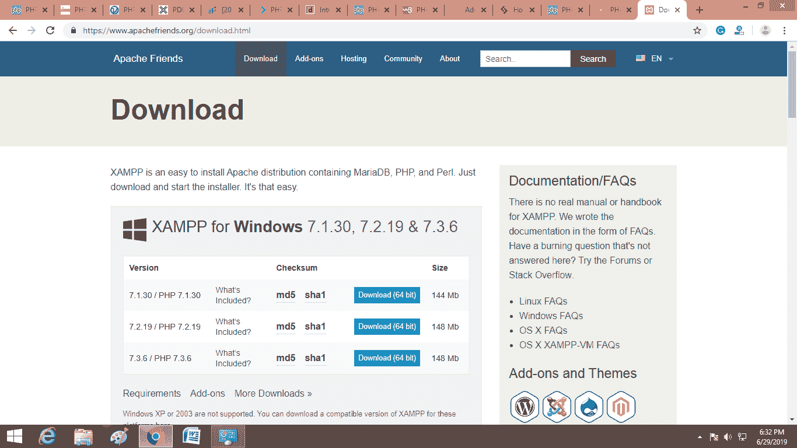

#### 注意:这里我们只讨论 Windows 操作系统的安装过程。

**步骤 2:** 按照以下步骤在您的系统上安装 XAMPP 服务器。

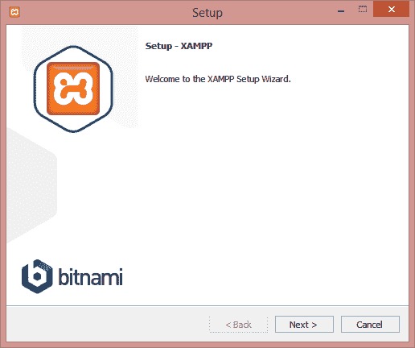

**步骤 3:** 选择要安装的组件，点击下一步按钮。

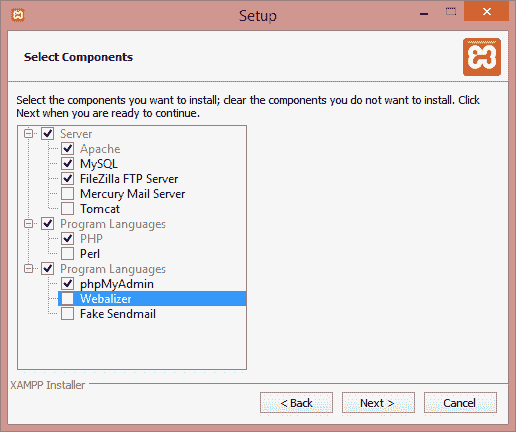

**步骤 4:** 在要安装 XAMPP 的位置创建名为 xampp 的新文件夹。

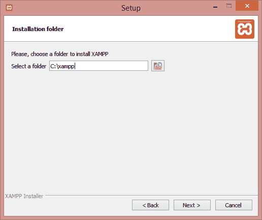

**第五步:**点击这里的下一步，继续前进。XAMPP 服务器的安装将从这里开始。

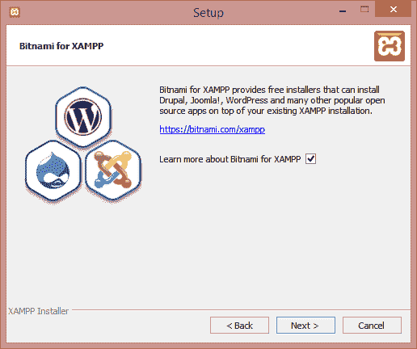

**步骤 6:** XAMPP 安装成功。点击完成按钮。

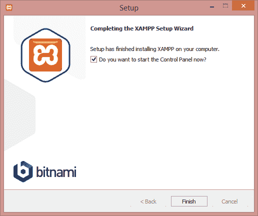

**第 7 步:**选择首选语言。

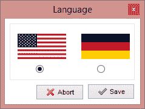

**步骤 8:** 从这里运行 Apache 服务器和 MySQL(根据给定的截图)。

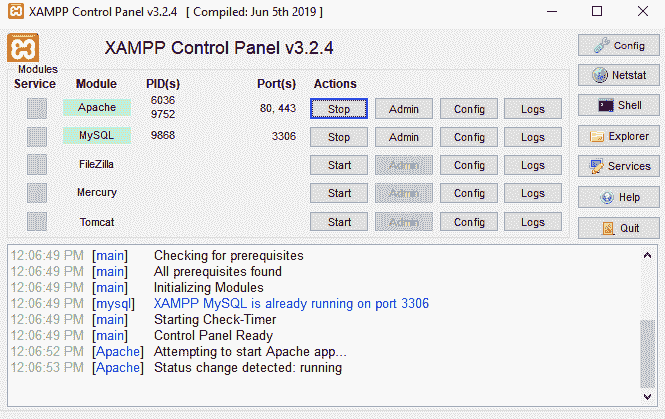

**第 9 步:**现在，从 **C:/xampp/php/php.ini** (您安装了 xampp 的地方)打开 php.ini，并取消注释扩展**“PHP _ PDO _ mysql . dll”**和**“PHP _ PDO . dll”**(如果您使用的是 MySQL 数据库)，或者**“PHP _ PDO _ OCI . dll”**(如果您使用的是 Oracle 数据库)现在，开始使用数据库。在 PHP 5.1 上层版本中，已经设置好了。

## 与 PDO 合作

首先我们需要创建一个数据库，所以从这里创建一个名为 myDB 的数据库。

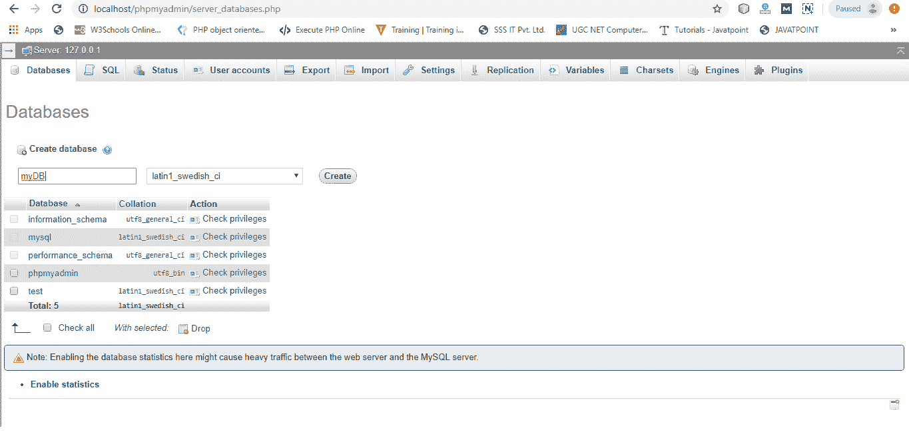

## 数据库连接

与数据库交互总是需要数据库连接。因此，我们需要知道访问数据库的标识符，即数据库的位置、数据库名称、用户名和密码。

现在，使用 PDO 在任何文本编辑器(如记事本或 notepad++)中创建数据库连接程序，并用 coonection.php 的名字保存它。使用 localhost/80 在 XAMPP 服务器上运行它。

### 例子

```php
<?php
	$dbHost="localhost";
	$dbName="myDB";
	$dbUser="root";		 //by default root is user name.
	$dbPassword="";		//password is blank by default
	try{
		$dbConn= new PDO("mysql:host=$dbHost;dbname=$dbName",$dbUser,$dbPassword);
		Echo "Successfully connected with myDB database";
	} catch(Exception $e){
	Echo "Connection failed" . $e->getMessage();
	}
?>

```

**输出**

使用以下网址**localhost/Xampp/PDO example/connection . PHP/**或您保存程序的位置在服务器上运行它。

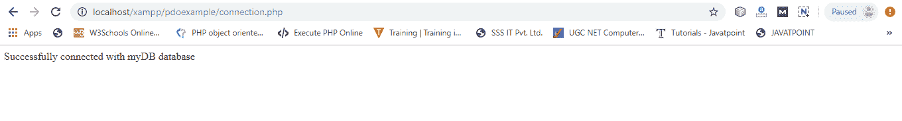

## 处理连接错误

如果有任何连接错误，将引发 PDOException 对象。如果我们想处理错误情况，我们可能会捕获异常，或者我们也可以将其留给全局异常处理程序，该程序可以通过 **set_exception_handler()** 函数来设置。

### 例子

在这个例子中，dbUser(user-id)是错误的，所以它会抛出一个异常，正如我们在输出中看到的。

```php
<?php
	$dbHost="localhost";
	$dbName="myDB";
	$dbUser="rroot";		
	$dbPassword="";		
	try{
		$dbConn= new PDO("mysql:host=$dbHost;dbname=$dbName",$dbUser,$dbPassword);

		//Set the PDO error mode to exception.
		$conn->setAttribute(PDO::ATTR_ERRMODE, PDO::ERRMODE_EXCEPTION);
		Echo "Successfully connected with myDB database";
	} catch(Exception $e){
	Echo "Connection failed" . $e->getMessage();
	}
?>

```

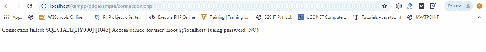

## 关闭数据库连接

```php
<?php
	$dbHost="localhost";
	$dbName="myDB";
	$dbUser="root";		 //by default root is user name.
	$dbPassword="";		//password is blank by default
	try{
		$dbConn= new PDO("mysql:host=$dbHost;dbname=$dbName",$dbUser,$dbPassword);
		Echo "Successfully connected with myDB database";
	} catch(Exception $e){
	Echo "Connection failed" . $e->getMessage();
	}
// this command close the connection.
	$dbConn = null;	
?>

```

**输出**

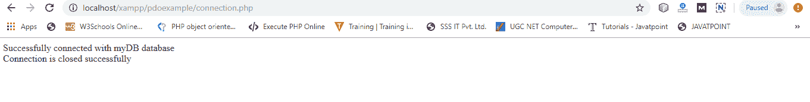

* * *