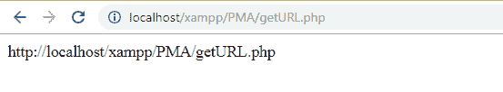
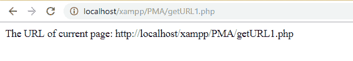
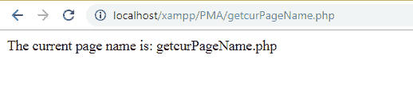

# PHP 中如何获取当前页面 URL？

> 原文：<https://www.javatpoint.com/how-to-get-current-page-url-in-php>

为了得到当前页面的 URL，PHP 提供了一个超全局变量 **$_SERVER** 。$ SERVER _ 是 PHP 的一个内置变量，用来获取当前页面的 URL。它是一个超全局变量，意味着它总是在所有范围内可用。

如果我们想要页面的完整网址，那么我们需要检查协议(或方案名)，无论是 https 还是 http。请参见下面的示例:

```php

<?php
	if(isset($_SERVER['HTTPS']) && $_SERVER['HTTPS'] === 'on') 
   		 $url = "https://"; 
	else
   		 $url = "http://"; 
	// Append the host(domain name, ip) to the URL. 
	$url.= $_SERVER['HTTP_HOST']; 

	// Append the requested resource location to the URL 
	$url.= $_SERVER['REQUEST_URI'];  

	echo $url;
  ?>	

```

**输出**

```php


```

#### 注意:此处使用 isset()函数检查 HTTPS 是否启用。它检查变量是否存在。

或者，我们也可以使用下一个示例中给出的另一种方式获取当前页面的完整网址。

```php

<?php
$protocol = ((!empty($_SERVER['HTTPS']) && $_SERVER['HTTPS'] != 'off') || $_SERVER['SERVER_PORT'] == 443) ? "https://" : "http://";
$CurPageURL = $protocol . $_SERVER['HTTP_HOST'] . $_SERVER['REQUEST_URI'];
echo "The URL of current page: ".$CurPageURL;
?>	

```

**输出**

```php


```

要仅获取在浏览器中打开的当前页面的名称，请参见下面的示例:

```php
<?php
	$curPageName = substr($_SERVER["SCRIPT_NAME"],strrpos($_SERVER["SCRIPT_NAME"],"/")+1);
	echo "The current page name is: ".$curPageName;
	echo "</br>";
  ?>	

```

**输出**

```php


```

* * *