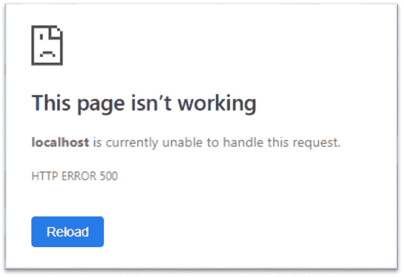
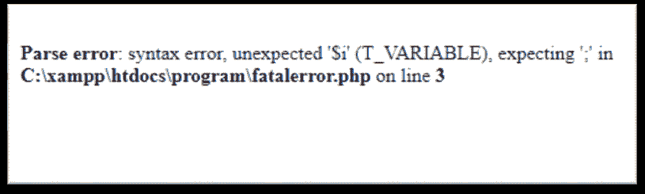

# PHP 中如何显示所有错误？

> 原文:[https://www.javatpoint.com/how-to-display-all-errors-in-php](https://www.javatpoint.com/how-to-display-all-errors-in-php)

一个 PHP 应用程序在脚本运行时会生成几级错误和警告。PHP 提供了四种不同的方式来显示这些错误和警告，如下所示:

1.  **错误报告:**显示除 E-NOTICE、E-STRICT 和 E _ 弃用级别错误以外的所有级别错误。
2.  **display_errors:** 默认情况下，display_errors 的值为 **off** 。将其设置为上的**以显示所有错误，包括解析(语法)错误。**
3.  **log _ errors:**log _ errors 的默认值为 **ON** ，表示是否进行错误记录。
4.  **错误日志字符串:**错误日志字符串设置脚本错误应该记录的文件名。

下面给出了几行代码，将它添加到您的 PHP 文件中以显示错误。这是显示所有 PHP 错误和警告的最快方法。

```php

ini_set ('display_errors', 1);
ini_set ('display_startup_errors', 1);
error_reporting (E_ALL);

```

上述功能和指令的工作如下:

**ini_set（）**

该函数试图覆盖 **php.ini** 文件中的配置。

**显示 _ 错误**

display_errors 是一个**指令**，用于确定错误是显示给用户还是保持隐藏。它不处理 PHP 启动序列中出现的错误。

**显示 _ 启动 _ 错误**

display_startup_errors 也是一个**指令**，用来查找 PHP 启动序列中的错误。

**错误报告()**

error_reporting 是 PHP 的一个**原生函数**。它用于显示错误。

### 程序

```php
<?php
	ini_set('display_errors', 1); 
	ini_set('display_startup_errors', 1); 
	error_reporting(E_ALL); 
	//include a php file which does not exist
	include("jtp.php");
?>

```

**输出**

输出将向浏览器显示警告。

```php
Warning: include(jtp.php): failed to open stream: No such file or directory in C:\xampp\htdocs\program\phperror.php on line 6

Warning: include(): Failed opening 'jtp.php' for inclusion (include_path='C:\xampp\php\PEAR') in C:\xampp\htdocs\program\phperror.php on line 6

```

#### 注意:这些指令 display_errors 和 display_startup_errors 都不能显示解析错误。因此，必须修改 PHP.ini 配置。

## 配置 PHP.ini 以显示所有错误和警告

必须在 **php.ini** 文件中进行以下更改，以**显示所有错误，**包括解析错误，并在 **xampp** 中重新启动 **apache 服务器**。

```php

display_errors = on

```

将 PHP.ini 文件中的 **display_errors** 指令设置为上的**。它将显示所有错误，这些错误不能通过调用 ini_set()函数来显示，例如-语法和解析错误**

### 程序

在 php.ini 文件中当 **display_errors** 为**禁用**或设置为**关闭**时的 PHP 程序。

```php
<?php
	//semicolon is missing, which generates parse error in php code
	for ($i = 5; $i >= 0 $i--) {
		echo "It will generate parse error";
	}
?>

```

**输出**

当 **display_errors** 指令为**禁用**时，输出将显示在浏览器中，如下图所示。



**输出:**

在 php.ini 文件中 **display_errors** 为**启用**或设置为上的**时，上述程序的输出，服务器重启。**



### 错误报告级别

正如我们已经讨论过的，PHP 会产生不同级别的错误。那么，让我们了解一下在 PHP 代码中会产生什么样的错误。

| 常数 | 描述 |
| **E_ERROR** | 致命的运行时错误。脚本的执行已经停止。 |
| **E_WARNING** | 非致命运行时错误。脚本的执行不会停止。 |
| **E_PARSE** | 由解析器生成的编译时错误。 |
| **E_NOTICE** | 这是一个运行时通知。PHP 脚本发现了一些可能是错误的东西。 |
| **E_USER_ERROR** | E_USER_ERROR 类似于 E_ERROR，但它是由 PHP 脚本使用 trigger_error()函数生成的。这是一条**致命的用户生成的**错误消息。 |
| **电子用户警告** | E_USER_WARNING 是一个非致命的用户生成的警告，它类似于 E_WARNING。但是它也是由 PHP 脚本使用 trigger_error()函数生成的。 |
| **电子用户通知** | 它是用户生成的通知，类似于 E_NOTICE。 |
| **E_STRICT** | 严格来说，这不是一个错误。在 PHP 5 . 4 . 0 版本之后，它成为了 E_ALL 的一部分。 |
| **E_ALL** | 启用所有错误和警告。 |

* * *