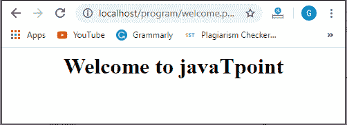

# PHP 头()

> 原文：<https://www.javatpoint.com/php-header>

标头()是 PHP 的**预定义网络函数**，它向客户端发送一个**原始 HTTP 标头**。关于 header()函数需要注意的一点是，它必须在发送任何实际输出之前被调用。

header()函数以原始形式向客户端或浏览器发送一个 HTTP 头。在发送任何其他输出之前，HTTP 函数处理网络服务器发送给客户端或浏览器的信息。

### 句法

```php

void header (string $header, boolean $replace = TRUE, int $http_response_code)

```

### 因素

header()函数接受三个参数，这些参数将在下面详细讨论:

### $header(必填)

标头参数包含要发送的标头字符串。这个函数有两种特殊的头调用。

第一个报头以“ **HTTP/** ”字符串开头，该字符串定位用于发送的 HTTP 状态代码。

表头第二种特殊情况以“**位置:**”表头开始。它不仅将报头发送回浏览器，还将**重定向(302)状态代码**提供给浏览器，直到已经设置了 201 或 3xx 状态代码。

### $replace(可选)

此参数用于指定前一个相同的标头是否应由该标头替换或添加另一个相同类型的标头。$replace 是一个**布尔**类型**可选**参数。

默认值为**真，**表示替换之前相同的表头。但是如果将 **FALSE** 作为第二个参数传递，则可以绑定几个相同类型的头。

### http_response_code(可选)

$http_response_code 是一个**可选的**参数，它强制 http 响应代码为一个指定的值。

#### 注意:如果标头不为空，http_response_code 参数会有影响。

### 返回值

PHP header()函数不返回值。

### 变化

**PHP 版本 5.1.2** 后，此功能停止发送多个头部，防止头部注入攻击。它一次只允许一个标题。

### 使用

*   它会改变页面位置。
*   它设置时区。
*   它发送停止状态。
*   该函数设置缓存控件。
*   它启动强制下载。

### 例子

借助下面的例子，您可以了解 header()函数在运行时环境中的实际工作情况-

### 示例 1:重定向浏览器

下面的代码将把你的用户重定向到另一个页面。

```php
<?php
	// This will redirect the user to the new location
	header('Location: http://www.javatpoint.com/');

	//The below code will not execute after header
	exit;
?>

```

**输出**

它将重定向到新的网址位置，该位置在上述程序的 header()函数中给出，即[www.javatpoint.com](https://www.javatpoint.com)。如果任何一行代码写在头()之后，它将不会执行。


### 示例 2:重定向间隔

以下代码将在 10 秒后**将您的用户重定向到另一个页面**。****

```php
<?php
	// This will redirect after 10 seconds
	header('Refresh: 10; url = http://www.javatpoint.com/');
	exit;
?>

```

**输出**

```php
The output will be same as the example 1, but it will take 10 seconds to load.

```

#### 注意:如果任何一行代码写在 header()函数之后，它将不会执行。

### 示例 3:不缓存页面

通过使用以下代码，您可以防止浏览器缓存页面。

```php
<?php
	// PHP program to describes header function 

	// Set a past date 
	header("Expires: Tue, 03 March 2001 04:50:34 GMT"); 
	header("Cache-Control: no-cache"); 
	header("Pragma: no-cache"); 
?>
<html> 
	<body> 
	<p>Hello Javatpoint!</p> 

	<!-- PHP program to display 
	header list --> 
	<?php 
		print_r(headers_list()); 
	?> 
	</body> 
</html>

```

**输出**

```php
Hello Javatpoint!
Array ( 
[0] => X-Powered-By: PHP/7.3.13 
[1] => Expires: Tue, 03 March 2001 04:50:34 GMT 
[2] => Cache-Control: no-cache 
[3] => Pragma: no-cache 
)

```

### 绝对的 URI

一些较老的客户端需要绝对 URI，包括主机名、方案和绝对路径，而大多数当代客户端接受相对 URI 作为**位置**的参数。要制作绝对 URI，可以使用 **$SERVER['PHP_SELF']** ， **$SERVER['HTTP_HOST']** ，以及 dirname()。

### 例 4

创建两个 php 文件，一个用于包含头文件代码，另一个用于重定向到浏览器上的新页面。

*标头检查.php*

```php
<?php
	$host  = $_SERVER['HTTP_HOST'];
	$uri   = rtrim(dirname($_SERVER['PHP_SELF']), '/\\');
	$newpage = 'welcome.php';

	/* Redirect to a different page requested in the current directory*/
	header("Location: http://$host$uri/$newpage");
	exit;
?>

```

*welcome.php*

```php
<!-- welcome.php file redirect to new page -->
<html>
		<head>
			<title> Welcome page </title>
		</head>
		<body>
			<h1> <center> Welcome to javaTpoint </center> </h1>
		</body>
</html>

```

**输出**



* * *