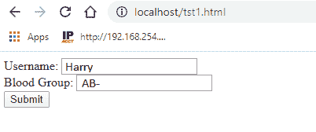
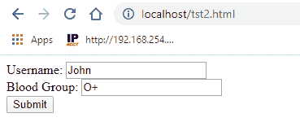

# PHP 中的获取和发布方法

> 原文：<https://www.javatpoint.com/get-and-post-methods-in-php>

PHP 提供了两种方法，客户端(浏览器)可以通过它们向服务器发送信息。下面给出了这些方法，并进行了详细讨论:

1.  GET 方法
2.  开机自检方法

Get 和 Post 方法是在 *<表单>* 标签中使用的 [HTTP](https://www.javatpoint.com/http-full-form) 请求方法，用于向服务器发送表单数据。

[HTTP](https://www.javatpoint.com/http-tutorial) 协议支持客户端和服务器之间的通信，其中浏览器可以是客户端，运行在托管您网站的计算机系统上的应用程序可以是服务器。

## GET 方法

使用 **GET** 方法提交 [HTML 表单](https://www.javatpoint.com/html-form)数据。该数据由预定义的 **$_GET 变量**收集进行处理。

使用 GET 方法从 [HTML](https://www.javatpoint.com/html-tutorial) 表单发送的信息在浏览器的地址栏中对每个人都是可见的，这意味着所有的变量名及其值都将显示在 URL 中。因此，get 方法不安全，无法发送敏感信息。

**例如**

```php

localhost/gettest.php?username=Harry&bloodgroup=AB+

```

上面的[网址](https://www.javatpoint.com/url-full-form)中的**粗体**部分是变量名称，*斜体*部分包含相应变量的值。

#### 请注意，使用 GET 方法只能发送有限数量的信息。

借助一个例子，让我们理解 GET 方法是如何工作的——

### 例子

下面的代码将显示一个包含两个输入字段和一个提交按钮的 HTML 表单。在这个 HTML 表单中，我们使用方法=“get”来提交表单数据。

档案:test1.html

```php
<html>
   <body>

      <form action = "gettest.php" method = "GET">
         Username: <input type = "text" name = "username" /> <br>
         Blood Group: <input type = "text" name = "bloodgroup" /> <br>
         <input type = "submit" />
      </form>

   </body>
</html>

```



创建 gettest.php 文件，它将接受 HTML 表单发送的数据。

档案:gettest.php

```php
<html>
   <body>

      Welcome <?php echo $_GET["username"]; ?> </br>
      Your blood group is: <?php echo $_GET["bloodgroup"]; ?>

   </body>
</html>

```

当用户填写完表单后点击**提交**按钮时，发送到服务器的网址可能是这样的:

***localhost/gettest.php？用户名=哈利&血型= AB-*T3】**

输出如下所示:

```php
Welcome Harry
Your blood group is: AB-

```

### GET 方法的优点(method =“GET”)

*   您可以用特定的查询字符串为页面添加书签，因为 GET 方法发送的数据显示在 URL 中。
*   可以缓存 GET 请求。
*   获取请求总是保留在浏览器历史记录中。

### GET 方法的缺点

*   发送任何敏感信息时都不应使用 GET 方法。
*   可以使用 method = "get "发送有限数量的数据。此限制不应超过 2048 个字符。
*   出于安全原因，不要使用 GET 方法发送用户名和密码等高度敏感的信息，因为它会在 URL 中显示这些信息。
*   GET 方法不能用于向服务器发送二进制数据(如图像或 word 文档)。

## 开机自检方法

与 GET 方法类似， **POST** 方法也用于提交 HTML 表单数据。但是这个方法提交的数据是由预定义的超全局变量 **$_POST** 而不是$_GET 收集的。

与 GET 方法不同，它对要发送的信息量没有限制。使用 POST 方法从 HTML 表单发送的信息对任何人都不可见。

**例如**

```php

localhost/posttest.php

```

#### 请注意，“post”方法比“get”方法更安全，因为使用 POST 方法发送的数据对用户不可见。

借助一个例子，让我们理解 POST 方法是如何工作的——

### 例子

下面的代码将显示一个包含两个输入字段和一个提交按钮的 HTML 表单。在这个 HTML 表单中，我们使用了方法=“post”来提交表单数据。

档案:test2.html

```php
<html>
   <body>

      <form action = "posttest.php" method = "post">
         Username: <input type = "text" name = "username" /> <br>
         Blood Group: <input type = "text" name = "bloodgroup" /> <br>
         <input type = "submit" />
      </form>

   </body>
</html>

```



现在创建**posttest.php**文件接受 HTML 表单发送的数据。

档案:posttest.php

```php
<html>
   <body>

      Welcome <?php echo $_POST["username"]; ?> </br>
      Your blood group is: <?php echo $_POST["bloodgroup"]; ?>

   </body>
</html>

```

当用户填写完表单后点击**提交**按钮时，发送到服务器的网址可能是这样的:

*localhost/post test . PHP*T3]

输出如下所示:

```php
Welcome Harry
Your blood group is: O+ 

```

### POST 方法的优点(方法=“POST”)

*   POST 方法对于发送任何敏感信息都很有用，因为使用 POST 方法发送的信息对任何人都不可见。
*   使用开机自检方法发送的数据大小没有限制。使用这种方法可以发送大量信息。
*   二进制和 ASCII 数据也可以使用开机自检方法发送。
*   数据安全性依赖于 HTTP 协议，因为使用 POST 方法发送的信息要经过 HTTP 头。通过使用安全 HTTP，您可以确保您的数据是安全的。

### 开机自检方法的缺点

*   开机自检请求不缓存。
*   开机自检请求永远不会保留在浏览器历史记录中。
*   无法为页面添加书签，因为变量没有显示在网址中。

## $_REQUEST 变量

**$_REQUEST** 变量是一个**超全局变量**，可以同时保存$_GET 和$_POST 变量的内容。换句话说， [PHP](https://www.javatpoint.com/php-tutorial) $_REQUEST 变量用于收集 GET 或 POST 方法发送的表单数据。它还可以收集$_COOKIE 变量的数据，因为它不是方法特定的变量。

* * *