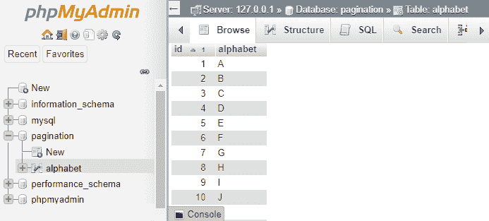
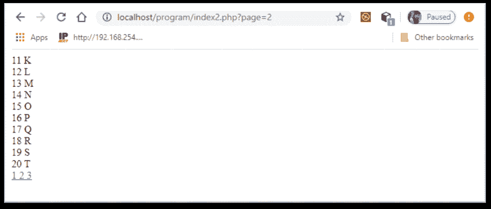
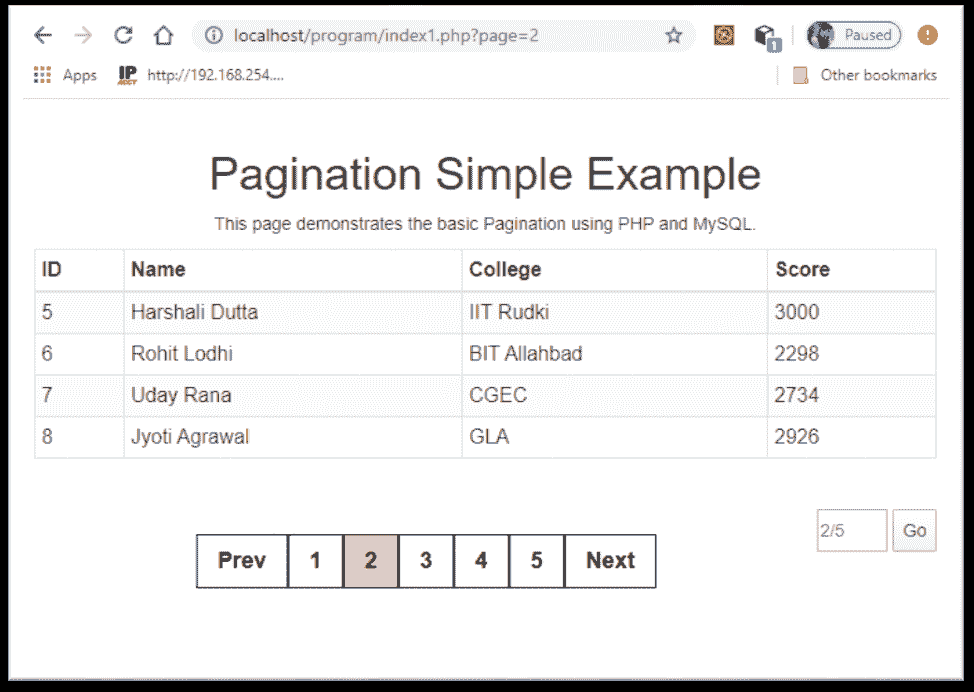
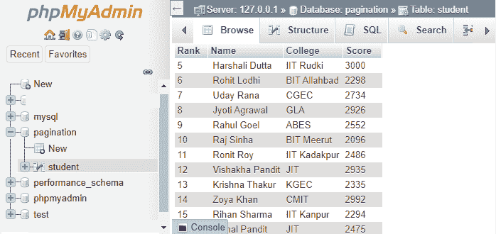

# PHP 分页

> 原文:[https://www.javatpoint.com/php-pagination](https://www.javatpoint.com/php-pagination)

PHP 主要用于存储和显示数据库中的数据。分页可以用 ajax 完成，但这里是用非 ajax 完成的。在本教程中，我们将使用 MySQL 学习 PHP 中的**分页。让我们用一个例子来简单回顾一下分页**

一个 SQL SELECT 查询可能会返回数百万条记录。在一页上显示所有记录不是一个好主意。单个页面上的大量记录可能需要花费大量时间来加载页面，并且还会消耗时间来查找特定数据。这可能会导致用户的思维混乱。因此，根据用户需求将这些记录分成几页。

那么，我们可以做些什么来将这些大量的记录分布在多个页面上呢？将单个列表分配到多个页面的方法称为**分页**。分页是指将查询结果显示在多个页面上，而不是单个页面上。

## 什么是分页？

分页是一种在多个页面上显示数据的方式，而不是将数据放在单个页面上。分页有助于将记录分成几页，这使得数据更加易读和易懂。

分页是 PHP 开发人员的常见任务。MySQL 通过使用 **LIMIT** 子句帮助开发人员创建分页，该子句接受两个参数。第一个参数为**偏移量**，第二个参数为**将从数据库返回的记录数**。

让我们看看在 PHP 中使用分页概念的一些优点和缺点-

## 分页的优点

*   分页在大型项目中非常有用，因为它使 web 工作更加专业。不仅更加专业，还能让网页工作得更快、更精准、更高效。
*   在分页的帮助下，我们可以通过划分不同页面上的数据来节省页面的加载时间。它使我们不必一次加载大量信息。
    **例如-** 一个有 1000 张图片的网页加载图片的时间会比每个网页上的 50 张图片要长。
    这意味着成千上万的图像需要成千上万的 HTTP 请求，这会使页面没有响应。这个问题通过使用 LIMIT 子句在分页的帮助下限制数据量来解决。
*   分页的使用改善了用户体验，增加了广告收入，减少了页面的加载时间。

## 分页的缺点

虽然分页有一些强大的优势，但仍有许多开发人员避免使用它。除了一些强大的优点之外，分页的缺点也很少，如下所示:

*   分页本身在 PHP 中是一个很大的开销，这也是分页的缺点之一。这完全是一种开销，因为它是一种外部特性，可以以无关的标记、样式和逻辑为代价来实现。使用分页时通常会忽略一个小数据集。
*   分页可能会导致搜索引擎的页面排名较低，因为当一个页面远离主页并需要多次点击时，它通常不会获得较高的页面排名。
*   它还限制了链接数量、社交份额、网页上可见的结果总数，以及当信息被拆分到几个页面时，一个页面收到的锚文本。

> 通过修改导航设置的结构，可以避免使用分页技术。

## 用 PHP 和 MySQL 实现分页

为了实现分页，我们需要一个大数据集来对其应用分页。因此，首先我们需要创建一个数据库和表。之后，提供表中的记录并开始编码以创建分页。这样从数据库中提取的数据就可以分成几页。

这里我们将介绍两个分页的例子。第一个例子是一个简单而基本的没有 CSS 的分页创建例子，而在第二个例子中，我们将使用 CSS 和 bootstrap 以吸引人的方式创建分页。您可以看到两者的输出。以下是分页创建的步骤；

创建分页的简单步骤-

1.  创建数据库和表。向表中提供记录列表。
2.  连接 MySQL 数据库。
3.  创建分页链接，将数据拆分到多个页面，并将其添加到表格底部。
4.  从数据库中获取数据，并将其显示在多个页面上。

按照下面的步骤一个接一个地创建简单的分页。

## 例 1

下面的代码是分页的一个简单例子，它是在 MySQL 数据库的帮助下用 PHP 完成的。它将从数据库中提取的数据分成几页。在这个例子中，我们将为显示在几页上的字母创建分页。

### 数据库创建

首先，创建一个名为**分页**的数据库，并在其中创建一个名为**字母表**的表。按名称 **id** 和**字母**创建属性，并在表格中提供数据。



### 数据库连接

将 PHP 文件连接到数据库是一项必需的任务。这样就可以将数据库中存储的数据显示到网页上。因此，连接 PHP 文件中的数据库，以便在网页上显示数据。

您可以在同一个文件中编写数据库连接代码，也可以将其单独保存到另一个文件中，并将其包含到所需的 PHP 文件中。数据库连接代码-

```php

$conn = mysqli_connect('localhost', 'root', '');
if (! $conn) {
         die("Connection failed" . mysqli_connect_error());
}
else {
         mysqli_select_db($conn, 'pagination');
}

```

在本教程中，我们使用的是**MySQL**扩展。所以，所有的查询都是按照 mysqli 格式编写的。

### 获取当前页码

下面的代码确定了用户当前访问的页码。如果不存在，默认情况下将页码设置为 1。

```php

	if (!isset ($_GET['page']) ) {
		$page = 1;
	} else {
		$page = $_GET['page'];
	}

```

### 分页公式

对于分页，您需要设置每页显示记录的数量限制。这里，我们将每页的结果限制设置为 10，因此它将显示在每页上，如下所示-

第 1 - A 至 J 页(1-10)

第 2 页-从 K 到 T (11-20)

第 3 页-从 U 到 Z (21-26)

```php

$results_per_page = 10;
$page_first_result = ($page-1) * $results_per_page;

```

### 获取总页数

```php

$query = "select *from alphabet";
$result = mysqli_query($conn, $query);
$number_of_result = mysqli_num_rows($result);

//determine the total number of pages available
$number_of_page = ceil ($number_of_result / $results_per_page);

```

### 检索数据并显示在网页上

下面的代码用于从数据库中检索数据，并显示在相应划分的网页上。

```php
$query = "SELECT *FROM alphabet LIMIT " . $page_first_result . ',' . $results_per_page;
	$result = mysqli_query($conn, $query);

	//display the retrieved result on the webpage
	while ($row = mysqli_fetch_array($result)) {
		echo $row['id'] . ' ' . $row['alphabet'] . '</br>';
            }

```

### 在网址中显示页面的链接

使用此代码，每个页面的网页网址都会改变。

```php
for($page = 1; $page<= $number_of_page; $page++) {
	echo '<a href = "index2.php?page=' . $page . '">' . $page . ' </a>';

```

## 最终代码

现在，将所有代码放在一个文件中进行分页。

档案:Index2.php

```php
<html>
<head>
<title> Pagination </title>
</head>
<body>

<?php

	//database connection
	$conn = mysqli_connect('localhost', 'root', '');
	if (! $conn) {
die("Connection failed" . mysqli_connect_error());
	}
	else {
mysqli_select_db($conn, 'pagination');
	}

	//define total number of results you want per page
	$results_per_page = 10;

	//find the total number of results stored in the database
	$query = "select *from alphabet";
	$result = mysqli_query($conn, $query);
	$number_of_result = mysqli_num_rows($result);

	//determine the total number of pages available
	$number_of_page = ceil ($number_of_result / $results_per_page);

	//determine which page number visitor is currently on
	if (!isset ($_GET['page']) ) {
		$page = 1;
	} else {
		$page = $_GET['page'];
	}

	//determine the sql LIMIT starting number for the results on the displaying page
	$page_first_result = ($page-1) * $results_per_page;

	//retrieve the selected results from database 
	$query = "SELECT *FROM alphabet LIMIT " . $page_first_result . ',' . $results_per_page;
	$result = mysqli_query($conn, $query);

	//display the retrieved result on the webpage
	while ($row = mysqli_fetch_array($result)) {
		echo $row['id'] . ' ' . $row['alphabet'] . '</br>';
	}

	//display the link of the pages in URL
	for($page = 1; $page<= $number_of_page; $page++) {
		echo '<a href = "index2.php?page=' . $page . '">' . $page . ' </a>';
	}

?>
</body>
</html>

```

**输出:**

以上分页示例见下面的输出-



## 例 2

下面的例子是分页的另一个例子，在这个例子中，我们使用了 CSS 和 HTML 来使网页视图更有吸引力。CSS 让网页更有创意，更有吸引力。另一方面，MySQL 将数据存储在数据库中。所以，你可以更好地学习分页。

除了数据库连接，我们已经在一个文件中编写了完整的代码。因此，我们将创建两个文件，即 connection.php 和 index1.php。将两个文件都保存在**中。php** 扩展。在下面的示例中，您将学习如何创建更具创造性和吸引力的分页。

*   **php:** 为数据库连接而创建
*   **php:** 为分页而创建

档案:connection.php

```php
<?php
$conn = mysqli_connect('localhost', 'root', '');
	if (! $conn) {
die("Connection failed" . mysqli_connect_error());
}
	else {
mysqli_select_db($conn, 'pagination');
}
?>

```

档案:index1.php

```php
<html> 
  <head> 
    <title>Pagination</title> 
	<link rel="stylesheet"
	href="https://maxcdn.bootstrapcdn.com/bootstrap/3.3.7/css/bootstrap.min.css"> 
	<style> 
	table {
		border-collapse: collapse;
	}
     	.inline{ 
         	display: inline-block; 
         	float: right; 
         	margin: 20px 0px; 
     	} 

     	input, button{ 
         	height: 34px; 
     	} 

	.pagination { 
	    display: inline-block; 
	} 
	.pagination a { 
	    font-weight:bold; 
	    font-size:18px; 
	    color: black; 
	    float: left; 
	    padding: 8px 16px; 
	    text-decoration: none; 
	    border:1px solid black; 
	} 
	.pagination a.active { 
    		background-color: pink; 
	} 
	.pagination a:hover:not(.active) { 
	    background-color: skyblue; 
	} 
    	</style> 
  </head> 
  <body> 
  <center>
    <?php

	// Import the file where we defined the connection to Database.   
    	require_once "connection.php"; 

    	$per_page_record = 4;  // Number of entries to show in a page. 
    	// Look for a GET variable page if not found default is 1\.      
    	if (isset($_GET["page"])) {  
      		$page  = $_GET["page"];  
    	}  
    	else {  
    	  $page=1;  
    	}  

    	$start_from = ($page-1) * $per_page_record;   

    	$query = "SELECT * FROM student LIMIT $start_from, $per_page_record";   
    	$rs_result = mysqli_query ($conn, $query);  
    ?>  

    <div class="container"> 
      <br> 
      <div> 
        <h1>Pagination Simple Example</h1> 
        <p>This page demonstrates the basic  
           Pagination using PHP and MySQL. 
        </p> 
        <table class="table table-striped table-condensed  
                                          table-bordered"> 
          <thead> 
            <tr> 
              <th width="10%">ID</th> 
              <th>Name</th> 
              <th>College</th> 
              <th>Score</th> 
            </tr> 
          </thead> 
          <tbody> 
	<?php   
          	while ($row = mysqli_fetch_array($rs_result)) {  
                  // Display each field of the records.  
        	?>   
        	<tr>   
         	 <td><?php echo $row["Rank"]; ?></td>   
          	<td><?php echo $row["Name"]; ?></td> 
          	<td><?php echo $row["College"]; ?></td> 
          	<td><?php echo $row["Score"]; ?></td>                                         
        	</tr>   
        	<?php   
        		};  
        	?>   
          </tbody> 
        </table> 

     <div class="pagination">  
      <?php
        $query = "SELECT COUNT(*) FROM student";   
        $rs_result = mysqli_query($conn, $query);   
        $row = mysqli_fetch_row($rs_result);   
        $total_records = $row[0];   

	echo "</br>";   
        // Number of pages required. 
        $total_pages = ceil($total_records / $per_page_record);   
        $pagLink = "";     

        if($page>=2){ 
            echo "<a href='index1.php?page=".($page-1)."'>  Prev </a>"; 
        }     

        for ($i=1; $i<=$total_pages; $i++) { 
          if ($i == $page) { 
              $pagLink .= "<a class = 'active' href='index1.php?page="
                                                .$i."'>".$i." </a>"; 
          }             
          else  { 
              $pagLink .= "<a href='index1.php?page=".$i."'> 
                                                ".$i." </a>";   
          } 
        };   
        echo $pagLink; 

        if($page<$total_pages){ 
            echo "<a href='index1.php?page=".($page+1)."'>  Next </a>"; 
        } 

      ?>  
      </div>

      <div class="inline"> 
      <input id="page" type="number" min="1" max="<?php echo $total_pages?>" 
      placeholder="<?php echo $page."/".$total_pages; ?>" required> 
      <button onClick="go2Page();">Go</button> 
     </div>  
    </div> 
  </div>
</center> 
  <script> 
    function go2Page() 
    { 
        var page = document.getElementById("page").value; 
        page = ((page><?php echo $total_pages; ?>)?<?php echo $total_pages; ?>:((page<1)?1:page)); 
        window.location.href = 'index1.php?page='+page; 
    } 
  </script>
  </body> 
</html>

```

**输出:**

以上分页示例见下面的输出-



请注意，写在

### 代码解释

现在，我们将解释用于创建分页的代码。

### 数据库创建

首先，创建一个名为**分页**的数据库，并在其中创建一个名为**学生**的表。按名称**等级、名称、学院、**和**评分**创建属性，表中至少提供 25 条记录。



### 数据库连接

将 PHP 文件连接到数据库是一项必需的任务。在本教程中，我们使用的是**MySQL**扩展。所以，所有的查询都是按照 mysqli 格式编写的。

数据库连接代码可以写在同一个文件中，或者您也可以将它单独保存到另一个文件中，并将其包含到所需的 PHP 文件中。数据库连接代码-

```php

$conn = mysqli_connect('localhost', 'root', '');
if (! $conn) {
         die("Connection failed" . mysqli_connect_error());
}
else {
         mysqli_select_db($conn, 'pagination');
}

```

### 获取数据并显示在网页上

由于我们已经创建了数据集，现在我们需要获取并将其显示到各种网页上。下面的代码用于从数据库中检索数据，并显示在相应划分的网页上。

### 取数据

在“connection.php”文件中建立数据库连接后，我们只需要使用 require_once 关键字将其导入到我们的代码中。我们将明确定义每页显示的记录数。

```php

require_once "connection.php"; 

$per_page_record = 4;  // Number of entries to show in a page. 
// Look for a GET variable page if not found default is 1\.      
if (isset($_GET["page"])) {  
      $page  = $_GET["page"];  
 }  
 else {  
       $page=1;  
 }  

//determine the sql LIMIT starting number for the results on the displaying page
 $start_from = ($page-1) * $per_page_record;   

 $query = "SELECT * FROM student LIMIT $start_from, $per_page_record";   
 $rs_result = mysqli_query ($conn, $query);  

```

### 显示数据

这一节很简单。在本节中，我们对提取的记录进行循环，并显示存储在表的列中的每条记录。

```php
<?php   
  while ($row = mysqli_fetch_array($rs_result)) {  
            // Display each field of the records.  
  ?>   
  <tr>   
  <td><?php echo $row["Rank"]; ?></td>   
  <td><?php echo $row["Name"]; ?></td> 
  <td><?php echo $row["College"]; ?></td> 
  <td><?php echo $row["Score"]; ?></td> 
  </tr>   
  <?php   
  };  
  ?>

```

### 分页链接创建

现在最重要的代码是分页链接创建。因此，我们将为分页创建上一个、下一个和数字链接，并将它们添加到表格的底部。

```php
if($page>=2) { 
        echo "<a href='index1.php?page=".($page-1)."'>  Prev </a>"; 
}     

for ($i=1; $i<=$total_pages; $i++) { 
        if ($i == $page) { 
              $pagLink .= "<a class = 'active' href='index1.php?page="
                                                .$i."'>".$i." </a>"; 
          }             
          else  { 
              $pagLink .= "<a href='index1.php?page=".$i."'> 
                                                ".$i." </a>";   
          } 
};   
echo $pagLink; 

if($page<$total_pages){ 
          echo "<a href='index1.php?page=".($page+1)."'>  Next </a>"; 
} 

```

在不使用 CSS 的情况下，分页的创建将与下面的截图相同，类似于示例 1。


在 index1.php 文件中包含 CSS 代码后，分页将如下图所示。在示例 1 中，我们创建了逻辑上正确的简单分页，但是在视觉上却不太好。


### 随机力矩代码

万一页数太多，这段代码可以帮助我们随机抽取。通过在输入字段中输入页码，用户可以直接移动到该页面。这段代码是用 JavaScript 编写的。

```php
function go2Page() 
{ 
        var page = document.getElementById("page").value; 
        page = ((page><?php echo $total_pages; ?>)?<?php echo $total_pages; ?>:((page<1)?1:page)); 
        window.location.href = 'index1.php?page='+page; 
} 

```

除了所有这些代码之外，我们还将 bootstrap 包含到 index1.php 中，以使表格视图更好。该代码写在标签内。

```php
<link rel="stylesheet"
	href="https://maxcdn.bootstrapcdn.com/bootstrap/3.3.7/css/bootstrap.min.css"> 

```

* * *