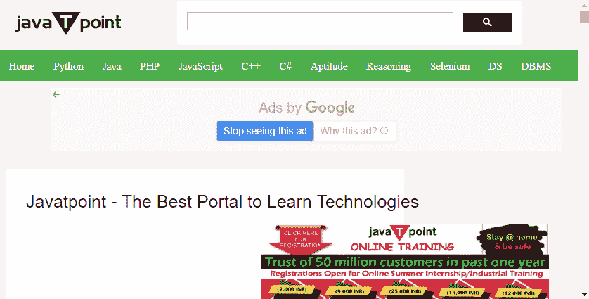
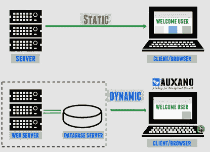
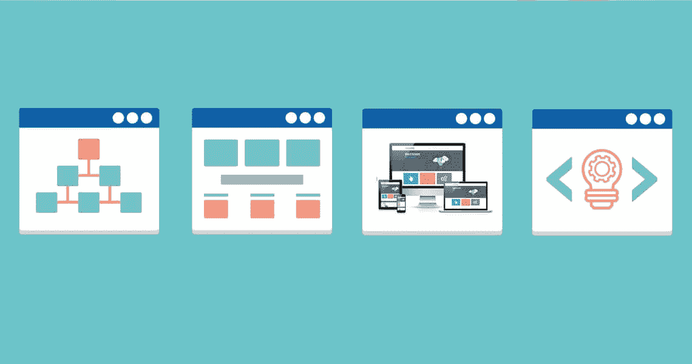
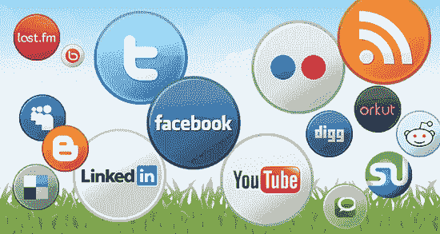
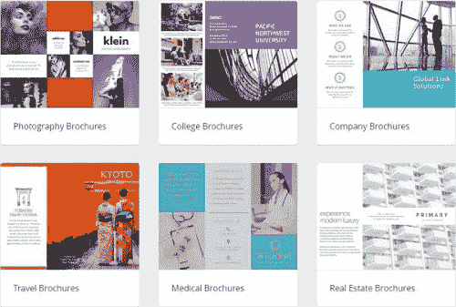
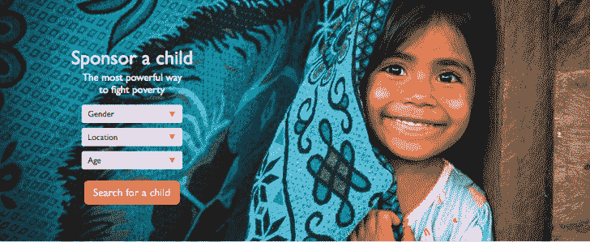

# 什么是网站

> 原文：<https://www.javatpoint.com/what-is-a-website>

互联网上的网页和媒体的集合称为网站。该网站可以在至少一个网络服务器上发布，并且可以通过一个公共域名来识别，例如 javatpoint.com、google.com、youtube.com。

所有可公开访问的网站都在[万维网](https://www.javatpoint.com/what-is-world-wide-web)下。有一个[网站](https://www.javatpoint.com/website)只能通过私人网络访问。大多数网站致力于特定的主题或目的，例如教育、新闻、商业、娱乐或社交网络。网站从一个主页开始，然后是一些导航页面，这些导航页面通过网页之间的超链接进行链接。

### 网站历史

英国欧洲核子研究中心的物理学家蒂姆·伯纳斯·李在 1990 年创建了万维网。欧洲核子研究中心从 1993 年 4 月 30 日起免费开放。gopher 协议和[文件传输协议](https://www.javatpoint.com/ftp-full-form)(文件传输协议)是在 [HTTP](https://www.javatpoint.com/http-full-form) (超文本传输协议)引入之前使用的。它们只提供了一个简单的目录结构，文档将呈现为一个没有任何格式的纯文本文件。

### 网站类型

| 静态网站 | 动态网站 |
| 以发送到客户端网络浏览器的相同格式存储在服务器上的网页组合是静态网站。静态网站最初是用 HTML 和 CSS 编码的，用来控制基本 HTML 之外的外观。使用 CSS，图像会影响所需的外观和内容部分。它通常向所有用户显示相同的信息。例如-不会改变的打印纸。比如小册子网站。 | 动态网站是一组网页的集合，这些网页会自动且频繁地更改或自定义自身。来自的动态页面将被计算机代码“动态”修改。互联网软件种类繁多，如 CGI、Java Servlets 和 Java Server Pages 等。动态网站显示用户之间对话的当前状态，以某种方式提供用户所需的任何信息。例如，当我们请求任何网站的首页时，运行在网络服务器上的代码可能会将存储的 HTML 片段与从数据库中检索的新闻故事结合起来。 |

### 网站类别

**1。博客:**它是一种提供信息的网站，或者帖子按照相反的时间顺序定期添加，最新的帖子或条目在主页的顶部，旧的帖子或条目在底部。博客通常由一个人或一小群人拥有。博客中的内容是以非正式或对话的方式撰写的，可以专注于一个主题或广泛的相关主题。此外，如果需要的话，这些帖子被组织成类别，例如，提供类似信息的帖子可以被保存在单独的类别中。博客的内容通常被称为博客文章，它通常以流页面上的文章的形式出现。博客中的信息会定期更新，例如，每天都会添加文章、照片和视频，以保持读者的参与度并增加博客的流量。它还允许读者对帖子发表评论。

**2。电商:**这些类型的网站就像网上商店，人们可以在家里、办公室等舒适的地方通过在线支付购买产品。任何想在网上销售产品的人都可以创建一个电子商务网站，而不是投资建立一个传统的实体店。

**3。信息类:**这些网站的创建是为了向用户提供免费的在线信息，例如教程、新闻、一般的基于知识的网站。今天，你不需要去图书馆看书、看报、看小说等。由于大量信息网站的存在。

**4。在线社区:**这些网站提供了一个通过互联网与他人互动和分享想法的平台。您可以找到兴趣和背景相似的人，并与他们互动以实现您的目标，这些目标可能包括推广产品或服务、获取关于您的产品的反馈或询问与调查相关的问题。

**5。社交媒体:**这些网站的创建是为了给用户提供一个平台，在这个平台上，他们可以建立自己的个人资料，具有许多功能，如创建朋友列表、发送和接受朋友请求、发送消息、创建和加入群组，以及与其他用户共享信息、评论他人的帖子、图片、视频等。

**6。宣传册:**这是最简单的网站类型，只有几页。小型企业使用它进行简单的在线展示或提供业务概述。这种网站通常是静态的，内容不变，即向所有用户显示相同的信息。

**7。非营利:**创建这些网站是为了筹集资金用于社会事业，如向穷人提供免费医疗、向儿童提供免费初等教育、向儿童提供免费食物以防止营养不良等。

* * *