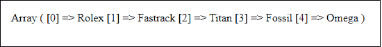
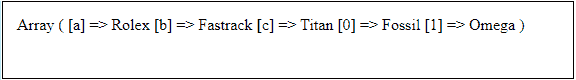
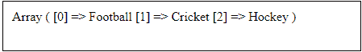

# PHP 数组 _push

> 原文：<https://www.javatpoint.com/php-array_push>

array_push()是 PHP 的一个内置函数。这个函数帮助用户在数组的末尾添加元素。它允许在数组中插入任意数量的元素。甚至可以添加字符串和数值。每当元素添加或推入数组时，数组的长度都会增加。

#### 注意-如果您的数组有字符串值，那些添加的元素总是有数字键。

array_push()方法它几乎与 array()函数相似，具有相同的效果。它将数组视为堆栈..

### 句法

array_push()的语法如下:

```php

array_push(array, value1, value2, ..... value_n)

```

该函数有一个或多个参数，其中一个是永久参数，另一个是可选参数。这些参数简述如下-

**数组(必选)-** 是参数的数组类型。必须在这个函数中传递这个参数。此数组参数可以包含任何类型的值，可以是字符串或数字。

**value1(必选/可选)-** 在 PHP 7.3 之前，它是必选参数，必须在这个函数中传递。[PHP](https://www.javatpoint.com/php-tutorial)7.3 版本之后，现在变成了可选参数。此参数包含要推入数组的值。

**值 2(可选)—**为可选参数，不需要传入该函数。此参数还包含要推入数组的值。

### 返回值

函数的作用是:返回数组中元素的个数。它返回数组中所有被推入的元素。

### 例 1

下面是 array_push()函数的一个简单例子，我们将初始化一个包含三个元素的数组。我们将在其中增加两个元素。

在您的服务器上执行以下代码。

```php
<?php
     $ele = array("Rolex", "Fastrack", "Titan");
     array_push($ele, "Fossil", "Omega");
     print_r($ele);
?>

```

**输出**

在下面的输出中，您可以看到元素被添加到数组的末尾，并为其提供了默认索引，从 0 开始。

```php
Array ([0] => Rolex [1] => Fastrack [2] => Titan [3] => Fossil [4] => Omega)

```

***屏幕截图***



### 例 2

在这个例子中，我们将初始化一个包含三个元素的数组以及内存索引。现在，我们将在其中再推两个元素，这将从 0 开始取索引。

在您的服务器上执行以下代码。

```php
<?php
     $ele = array("a" => "Rolex", "b" => "Fastrack", "c" => "Titan");
     array_push($ele, "Fossil", "Omega");
     print_r($ele);
?>

```

**输出**

在下面的输出中，您可以看到在数组末尾添加了两个元素，索引为 0，然后是 1。

```php
Array ([a] => Rolex [b] => Fastrack [c] => Titan [0] => Fossil [1] => Omega)

```

***屏幕截图***



### 例 3

在本例中，我们不会将可选值传递给 array_push()以将其推入数组。在您的服务器上执行以下代码。

```php
<?php
     $ele = array("Football", "Cricket", "Hockey");
     array_push($ele);
     print_r($ele);
?>

```

**输出**

这将按原样返回数组值，并在不发生任何错误的情况下显示它们。

```php
Array ([0] => Football [1] => Cricket [2] => Hockey)

```

***屏幕截图***



* * *