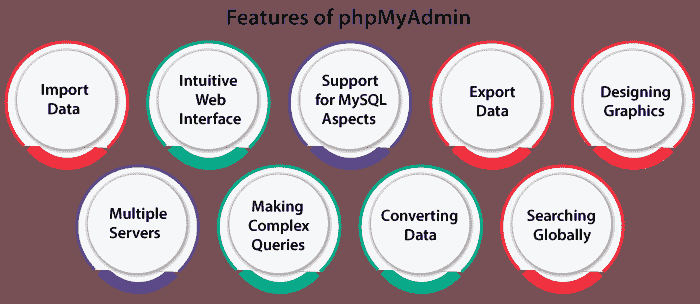

# phpmyadmin 登录

> 原文:[https://www.javatpoint.com/phpmyadmin-login](https://www.javatpoint.com/phpmyadmin-login)

## 介绍

[***phpMyAdmin***](https://www.javatpoint.com/phpmyadmin)是 [***PHP***](https://www.javatpoint.com/php-tutorial) 中指定的自由软件工具，专为处理 web 上的 MySQL 管理而设计。这个软件工具支持 [***【马里亚数据库】***](https://www.javatpoint.com/mariadb-tutorial) 和[***MySQL***](https://www.javatpoint.com/mysql-tutorial)上的庞大操作范围。最常用的操作有权限、用户、索引、关系、列、表、管理数据库等。它可以通过用户界面来实现。尽管如此，我们仍然能够直接运行 SQL 语句。

***phpMyAdmin*** 使用了巨大的文档范围，用户将能够更新 wiki 页面并分发几个操作的想法。它会支持我们，以防我们面临任何问题。我们可以利用支持渠道的多样性来获得支持。

还有， ***phpMyAdmin*** 在开发者解释的一本书里面有很好的记载- ***掌握 phpMyAdmin 进行有效的 MySQL 管理*** ，在 ***西班牙语*** 和 ***英语*** 都有。

## 要点:

*   ***phpMyAdmin*** 支持 RTL 和 LTR 两种语言并转换成 ***72*** ***语言*** 。
*   ***phpMyAdmin*** 是使用最广泛的成熟项目之一，拥有灵活稳定的代码库。我们可以找到更多关于它的历史、项目和它收集的奖项。
*   这个项目是软件自由保护组织的成员。软件自由保护协会是一家非营利企业，支持改进、推广、开发、开源软件、自由软件和捍卫自由项目。

## phpMyAdmin 的特点:



*   通过 SQL 和 CSV 导入数据
*   直观的网络界面
*   对 MySQL 方面的支持:
    *   拖放和浏览数据库、索引、字段、视图和表。
    *   更改、重命名、删除、复制和创建数据库、索引、字段和表。
    *   用服务器上的建议维护表、数据库和服务器
    *   标记、编辑和执行批处理查询和 SQL 语句。
    *   管理 MySQL 权限和用户帐户。
    *   管理存储的触发器和过程。
*   导出几种格式的数据: **PDF、XML、SQL、JEC/JSO、CSV** 。
*   设计几种格式的数据库布局图形。
*   多台服务器。
*   用 QBE 进行复杂的查询(逐例查询)。
*   将存储的数据转换为具有预定义功能集的格式，例如将 BLOB 数据显示为下载链接或图像。
*   在数据库或其任何子集内进行全局搜索。

## phpMyAdmin 连接

出于各种安全原因，在使用主机名 127.0.0.1 时，可以访问 phpMyAdmin。我们应该创建 SSH 隧道，通过 127.0.0.1 将请求定向到任何网络服务器，以便通过远程系统访问它。这表明我们应该能够通过 SSH 连接到我们的服务器来远程访问应用程序。

#### 注意:在继续以下步骤之前，请确保我们的数据库服务器和网站正在运行。

为了通过 SSH 隧道访问 phpMyAdmin，我们需要 SSH 客户端。在下面的说明中，我们选择了 PuTTY。PuTTY 是 LINUX 和 Windows 平台的 SSH 客户端(免费)。第一步是 PuTTY 配置。

一旦我们正确配置了 SSH 客户端，并确认可以使用 SSH 成功访问我们的实例，我们就需要创建 SSH 隧道来访问 phpMyAdmin。请考虑以下步骤:

*   在“连接-> SSH ->隧道”一节中，通过引入以下值来包含新端口:
    *   来源端口:8888
    *   目的地:本地主机:80

#### 注意:如果我们将 HTTP 的请求重定向到一个 HTTP 端口，我们必须考虑端口 443 而不是 80。

它将通过在远程服务器上为本地主机(local host 或 127.0.0.1)上的任何端口转发端口来建立受保护的隧道。

*   按下按钮，即“添加”，将受保护的通道配置添加到任何会话。我们将在“转发端口”列表中看到一个添加的端口。
*   通过按“会话”部分中的“保存”来保存我们的修改。
*   按下按钮，即“打开”，打开服务器的 SSH 会话。这个 SSH 会话将在两个描述的端口之间添加一个受保护的隧道。
*   从我们通过浏览到 http://127 . 0 . 0 . 1:8888/phpMyAdmin 创建的受保护隧道访问 phpMyAdmin 控制台。
*   现在，使用以下信息登录到 phpMyAdmin:
    *   用户名:root
    *   密码:应用程序密码

## 通过 MacOS 和 Linux 访问 phpMyAdmin

要访问使用我们的网络浏览器的应用程序，创建 SSH 隧道，如下所述:

*   在我们的本地系统上打开终端窗口(新的)(在 Ubuntu 或 MacOS 内的 Dash 中，使用“Finder ->应用程序->实用程序->终端”)。
*   确保我们有 SSH 凭据(也描述为。pem 密钥文件)。
*   使用 SSH 的密钥文件执行以下命令来配置 SSH 隧道。请记住，使用我们的服务器的主机名或 IP 地址(公共)替换我们的服务器 IP 路径和私钥的 KEYFILE:

```php

ssh -N -L 8888:127.0.0.1:80 -ⅰKEYFILE     bitnami@SERVER-IP

```

*   使用 SSH 的密码执行以下命令来配置 SSH 隧道。我们需要使用我们服务器的主机名或 IP 地址(公共)来替换 SERVER-IP。出现提示时，输入 SSH 的密码。

```php

ssh -N -L 8888:127.0.0.1:80 KEYFILE bitnami@SERVER-IP

```

#### 注意:该命令将创建 SSH 隧道。但是，它不会在服务器控制台上显示任何结果。

*   通过浏览到 hhtp://127 . 0 . 0 . 1:8888/phpMyAdmin，从我们创建的受保护隧道访问 phpMyAdmin 控制台。
*   现在，使用以下信息登录到 phpMyAdmin:
    *   用户名:root
    *   密码:应用程序密码

* * *