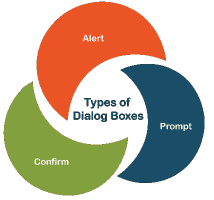
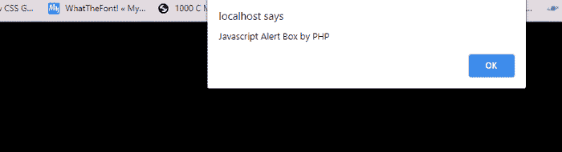
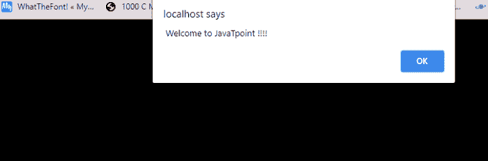
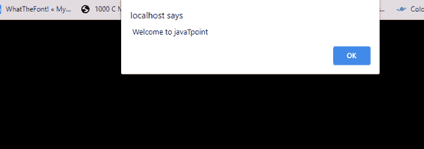
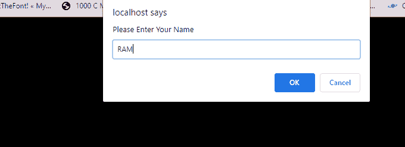
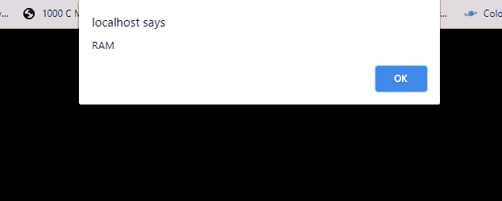
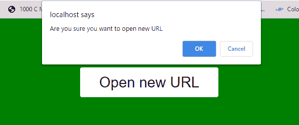

# PHP 警报

> 原文：<https://www.javatpoint.com/php-alert>

在本文中，我们将学习 JavaScript 对话框的使用，即 PHP 中的警告框、确认框和提示对话框。在这篇文章中，我们将学习 JavaScript、PHP、对话框及其示例的一些基础知识。

### 你说的 JavaScript 是什么意思？

JavaScript 是一种事件驱动的语言。它在特定事件发生时执行一些代码，例如在某个元素上滚动鼠标或按下某个特定的表单按钮等。

[JavaScript](https://www.javatpoint.com/javascript-tutorial) 是一种基于解释器的脚本语言，因为它不需要编译步骤。浏览器解释 JavaScript 语句的方式与解释 [HTML](https://www.javatpoint.com/html-tutorial) 标签的方式相同。它是一种基于对象的高级语言，因为它可以访问网页中包含的各种 HTML 对象。

### JavaScript 中的对话框:

[JavaScript 的 **alert ()** 方法](https://www.javatpoint.com/javascript-alert)是向查看者显示消息的最简单方式。它将文本输出发送到浏览器窗口。JavaScript 提供了各种对话框来接收用户的输入或显示小块文本。这些框作为单独的窗口出现，可以显示警告消息、确认消息，或者通过**【确定】****【取消】**按钮获取一些用户信息。

### JavaScript 有 3 种类型的对话框，如下所示:



### PHP 是什么意思？

[PHP](https://www.javatpoint.com/php-tutorial) 是一种服务器端语言脚本语言。包含 PHP 的网页通常包含文件扩展名。php 而不是。html 或。htm 扩展。PHP 特别擅长处理表单，比 CGI 脚本更容易使用。PHP 是开源的，旨在与全球使用最广泛的网络服务 Apache 服务器合作。

PHP 没有弹出**提醒消息框**的功能，但是可以使用 PHP 代码中的 JavaScript 代码来显示提醒消息框。这样就可以在 PHP 中显示 [JavaScript 的提醒消息框。](https://www.javatpoint.com/javascript-vs-php)

### 警报对话框:

**提醒对话框**只是一个弹出窗口，在您的屏幕上显示一些需要用户注意的消息或信息。它主要用于在用户错过输入值或在表单或文本框中给出无效数据时提示消息。它接受一个字符串参数，然后用“确定”按钮显示传递的字符串。

### 语法:

```php

alert (message);

```

在上面的语法中，alert()是一个函数，而 message 是一个可用于与 alert 对话框一起显示的值。

**我们举一个例子，用 php 使用一个警告对话框。**

### 例 1:

```php
<! DOCTYPE html>
<html>
<head>
<title> JavaScript alert Box by PHP </title>
<meta name="viewport" content="width=device-width, initial-scale=1">
<meta charset ="utf-8">
<style>
body {
	background-color: black;
}
</style>
<?php 
 echo '<script type ="text/JavaScript">';
echo 'alert("JavaScript Alert Box by PHP")';
echo '</script>';
?>
</head>
<body>
</body>
</html>

```

**输出:**

该示例的输出如下所示:



### 例 2:

```php
<! DOCTYPE html>
<html>
<head>
<title> JavaScript alert Box by PHP </title>
<meta name="viewport" content="width=device-width, initial-scale=1">
<meta charset ="utf-8">
<style>
body {
	background-color: black;
}
</style>
<?php 
 echo '<script type ="text/JavaScript">';
echo 'alert(" Welcome to JavaTpoint !!!! ")';
echo '</script>';
?>
</head>
<body>
</body>
</html>

```

**输出:**

该示例的输出如下所示:



### 例 3:

```php
<! DOCTYPE html>
<html>
<head>
<title> JavaScript alert Box by PHP </title>
<meta name="viewport" content="width=device-width, initial-scale=1">
<meta charset ="utf-8">
<style>
body {
	background-color: black;
}
</style>
<?php 
// PHP program to pop an alert 
// message box on the screen 
  // Function definition 
function function_alert($message) { 
 // Display the alert box  
    echo "<script type ='text/JavaScript'>";
	echo "alert('$message')";
	echo "</script>"; 
} 
// Function call 
function_alert(" Welcome to javaTpoint  "); 
  ?>
</head>
<body>
</body>
</html>

```

**输出:**

该示例的输出如下所示:



### 提示对话框:

警告框只是用来显示信息。两者都不能用于根据某些消息从用户那里收集信息，也不能用于根据用户输入定制网页。因此，JavaScript 提供了另一种方法，称为**提示()，**接受用户输入。

如果要在进入页面前输入值，通常会使用提示框。它需要两个参数——一个要在文本框中显示的消息和文本框的默认字符串。[提示对话框](https://www.javatpoint.com/javascript-prompt-dialog-box)也显示两个按钮:确定和取消按钮，并带有消息。处理将暂停，直到用户单击其中一个按钮。

*   如果用户在文本框中输入一些文本，点击确定按钮，输入的文本将被传递给程序，称为**提示对话框。**
*   如果用户没有在文本框中键入文本并单击“确定”按钮，提示方法的第二个参数中指定的默认文本将被传递给程序，该程序称为提示对话框。
*   如果用户单击“取消”按钮，一个空值将返回给名为提示对话框的程序。

### 语法:

```php

Prompt ("message," "default value");

```

在上面的语法中，prompt()是一个函数，而 message 是一个可用于显示提示对话框的值。

**我们来举个例子，用 php 使用一个提示对话框。**

### 例 1:

```php
<! DOCTYPE html>
<html>
<head>
<title> JavaScript alert Box by PHP </title>
<meta name="viewport" content="width=device-width, initial-scale=1">
<meta charset ="utf-8">
<style>
body {
	background-color: black;
}
</style>
<?php
function  createConfirmationmbox() {
    echo '<script type="text/javascript"> ';
    echo 'var inputname = prompt("Please enter your name", "");';
    echo 'alert(inputname);';
    echo '</script>';
}
?>
<! doctype html>
<html>
<head>
<meta charset="utf-8">
<title> JavaScript Prompt Box by PHP </title>
<?php
    createConfirmationmbox();
?>
</head>
<body>
</body>
</html>

```

**输出:**

在本例中，localhost 向您显示一个带有**确定**和**取消**按钮的提示对话框，您可以在其中输入您的姓名，在提示对话框中输入姓名后，您可以选择确定按钮或取消按钮。



**例如**，如果你点击确定按钮，输入的文本将被传递给程序，程序称为提示对话框，然后你的名字用一个提醒框显示，下面的输出用一个提醒框显示你的名字。



## 确认对话框:

在 JavaScript 的确认对话框中，使用 JavaScript 的**确认()**方法来[确认](https://www.javatpoint.com/confirm-password-validation-in-javascript)用户的动作。如果您希望用户验证某些内容，请使用此对话框。确认对话框显示带有两个按钮的预定义消息:确定和取消按钮。用户必须单击任一按钮才能继续。

*   如果用户单击“确定”按钮，该框将返回到程序的“真”状态。
*   如果用户单击“取消”按钮，该框将向程序返回 false。

### 语法:

```php

confirm ("message");

```

在上面的语法中， **confirm ()** 是一个函数，一条消息是一个可以用确认对话框显示的值。

**我们举一些用 php 使用确认对话框的例子。**

### 例 1:

```php
<?php
function  createConfirmationmbox() {
    echo '<script type="text/javascript"> ';
    echo ' function openulr(newurl) {';
    echo '  if (confirm("Are you sure you want to open new URL")) {';
    echo '    document.location = newurl;';
    echo '  }';
    echo '}';
    echo '</script>';
}
?>
<! doctype html>
<html>
<head>
<meta charset="utf-8">
<title> JavaScript confirm Box by PHP </title>
<style>
body {
	background-color: green;
}
a {
	font-size: 30px;
	color: red;	
}
.confirm {
	margin: 100px;
	color: red;
}
a.button1 {
	display: inline-block;
	padding: 0.35em 1.2em;
	border: 0.1em solid #FFFFFF;
	margin: 0 0.3em 0.3em 0;
	border-radius: 0.12em;
	box-sizing: border-box;
	text-decoration: none;
	font-family: 'Roboto',sans-serif;
	font-weight: 300;
	color: #FFFFFF;
	text-align: center;
	transition: all 0.2s;
}
a.button1:hover {
	color: #000000;
	background-color: #FFFFFF;
}
</style>
<?php
createConfirmationmbox();
?>
</head>
<body>
<center>
<div class ="confirm">
<strong>  <b> <a href="javascript:openulr('#');" class="button1"> Open new URL </a> </b> </strong>
</div>
</center>
</body>
</html>

```

**输出:**


当我们单击一个按钮时，将显示确认对话框。该示例的输出如下所示:



点击确定按钮后，示例输出如下:


* * *