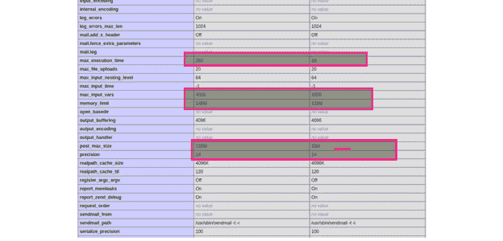

# 在 CPanel 中创建自定义 php.ini 文件

> 原文：<https://www.javatpoint.com/creation-of-custom-php-ini-file-in-cpanel>

在本节中，我们将学习如何使用 CPanel 来创建一个自定义的 php.ini 文件。php.ini 文件是最重要的配置文件。在这个文件中，我们将声明我们的 PHP 设置更改。当我们使用 php 运行任何应用程序时，在运行时解决配置问题将非常有用。我们将主要在文件超时、资源限制和控制上传大小时使用它。如果我们想要控制许多 php 设置，php.ini 文件将对我们非常有用，因为它提供了指令。当我们想要定义网站的功能时，我们可以设置一个或多个自定义的 php.ini 文件。我们网站的主页可能在我们的目录中包含一个自定义文件，如/home/username/public_html。我们网站的图像文件可能在我们的目录中包含一个单独的自定义文件，如/home/username/public _ html/images。默认情况下，自定义 php.ini 文件只会影响它所在的目录。

我们可以使用 Godaddy cpanel 和另一个宿主来创建它。在 CPanel 中，我们可以增加 memory_limit、max_file_uploads、upload_max_filesize、max_execution_time、post_max_size 等可能在 php ini 文件中更多的东西。

在默认的 [php](https://www.javatpoint.com/php-tutorial) ini 文件中，基本配置主要是由托管 raja 服务器、a2 托管服务器、GoDaddy 服务器等服务器提供的。有时，我们需要增加文件的内存限制、最大上传文件大小等。在创建 php ini 文件的情况下，不同的服务器使用不同的方法来创建它。为了解释它，我们提供了两个例子。在这个例子中，我们将看到一个自定义的 php.ini 文件的创建，它有一个 PHP . ini 文件的更改默认值。



我们将在名为. user.ini 的 GoDaddy 项目文件中进行以下更改。因此，我们必须将以下代码放在我们的根目录下，因为如果我们不这样做，它将影响我们的整个项目。

**路径:public _ html/mypro . com/index . PHP**

**创建文件路径:public _ html/mypro . com/. user . ini**

```php

memory_limit = 148M
max_input_vars = 4000
upload_max_filesize = 120M
post_max_size = 120M
max_execution_time = 250

```

如果任何情况下，上述解决方案都不起作用，对此的替代解决方案描述如下:

**创建文件路径:public _ html/mypro . com/PHP . ini**

```php

memory_limit = 148M
max_input_vars = 4000
upload_max_filesize = 120M
post_max_size = 120M
max_execution_time = 250

```

在这段代码之后，我们可以运行以下命令来检查它:


* * *