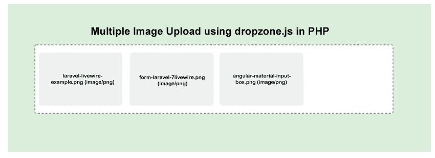

# PHP 中使用 Dropzone JS 的多文件上传

> 原文:[https://www . javatpoint . com/multi-file-upload-use-drop zone-js-in-PHP](https://www.javatpoint.com/multiple-file-upload-using-dropzone-js-in-php)

在本节中，我们将使用 Dropzone JS 上传多个文件。当我们使用我们的项目或网站时，它总是需要能够上传多个图像或制作多个文件的功能。如果我们使用多个输入来上传图像，看起来就不太好。其实我们网站的用户也不喜欢。所以我们必须努力让它变得更好。现在每个网站都有图片上传的功能。但是如果我们使用像 Yii、 [Codeigniter](https://www.javatpoint.com/codeigniter-tutorial) 、 [Laravel](https://www.javatpoint.com/laravel) 等 PHP 的框架，或者 [PHP](https://www.javatpoint.com/php-tutorial) 的框架，使用 Dropzone JS 库会很棒。是一个 [JavaScript](https://www.javatpoint.com/javascript-tutorial) 库，开源的。

使用这个库，我们可以轻松地拖放多个文件上传。Dropzone JS 库的使用非常简单。这个库为我们提供了验证功能，例如特定的扩展名、最大文件上传等。在给定的示例中，我们将解释如何使用 dropzone.js 上传多个图像并构建多个文件。在我们的示例中，我们还将通过使用引导来构建更好的布局。上传图像和构建文件的步骤如下:

1.  创建一个名为 index.php 的文件
2.  创建一个名为 upload.php 的文件
3.  创建名为上传的文件夹

我们可以使用给定的分步过程上传图像。我们已经描述了三个步骤，能够提供完整的图像上传知识。在下面的例子中，我们将使用 dropzone.js cdn 导入。如果我们想下载，我们可以在本地下载。上传图像的步骤如下:

**第一步:**

在这一步中，我们将**创建 index.php 文件**。我们将使用根文件夹来创建这个文件。为了执行此操作，我们将使用以下代码，并将其放在 index.php 文件中。这个文件中的 CDN 用于 JS、JQuery、Bootstrap 和 Dropzone CSS，描述如下:

**index.php**

```php
<!DOCTYPE html>
<html>
<head>
	<title> Multiple Image upload using dropzone.js in PHP </title>
	<script src="http://demo.javatpoint.com/plugin/jquery.js"></script>
	<link rel="stylesheet" href="http://demo.javatpoint.com/plugin/bootstrap-3.min.css">
	<link href="https://cdnjs.cloudflare.com/ajax/libs/dropzone/4.0.1/min/dropzone.min.css" rel="stylesheet">
	<script src="https://cdnjs.cloudflare.com/ajax/libs/dropzone/4.2.0/min/dropzone.min.js"></script>
</head>
<body>

<div class="container">
	<div class="row">
		<div class="col-md-12">
			<h2> Multiple Image Upload using dropzone.js in PHP </h2>
			<form action="upload.php" enctype="multipart/form-data" class="dropzone" id="image-upload">
				<div>
					<h3>Upload Multiple Image By Click On Box</h3>
				</div>
			</form>
		</div>
	</div>
</div>

<script type="text/javascript">
	Dropzone.options.imageUpload = {
        maxFilesize:1,
        acceptedFiles: ".jpeg,.jpg,.png,.gif"
    };
</script>

</body>
</html>

```

**第二步:**

在这一步中，我们将创建**upload.php**文件。我们将使用根文件夹来创建这个文件。这个文件会写图片上传的代码，描述如下:

上传. php

```php
<?php

$uploadDir = 'uploads';

if (!empty($_FILES)) {
 $tmpFile = $_FILES['file']['tmp_name'];
 $filename = $uploadDir.'/'.time().'-'. $_FILES['file']['name'];
 move_uploaded_file($tmpFile,$filename);
}

?>

```

**第三步:**

这是最后一步，这一步我们要创建**上传文件夹**。在我们的例子中，我们需要存储图像。这就是为什么我们将创建一个上传文件夹。上传也可以有不同的名称。我们也应该小心在 upload.php 的档案上进行更改。

现在我们上面的例子可以运行了。因此，我们将使用根文件夹运行以下命令。

```php

php -S localhost:8000

```

现在，我们将使用浏览器打开网址，描述如下:

```php

http://localhost:8000

```

当我们在浏览器上打开这个网址时，我们会得到一些输出，描述如下:



* * *