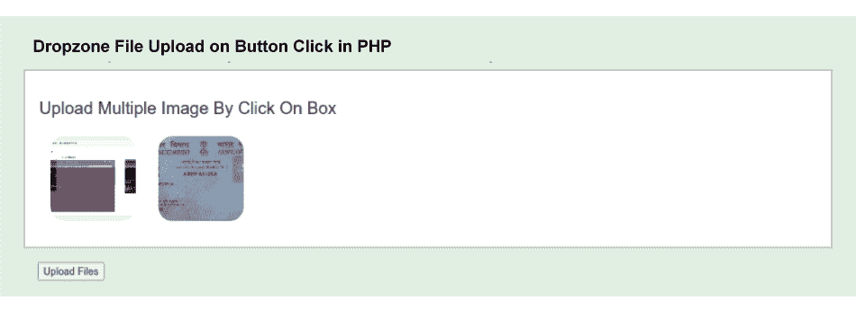

# 点击按钮上传文件

> 原文：<https://www.javatpoint.com/php-dropzone-file-upload-on-button-click>

在这一节中，我们将学习如何通过点击 PHP dropzone 中的按钮来上传文件。我们将使用提交按钮在 PHP Dropzone 中上传一个或多个文件。

当我们使用拖放上传一个或多个文件时，我们通常使用 dropzone JS，但它对我们不起作用。因为当我们选择一个文件或图像时，只有 dropzone js 才会上传一个图像或文件。在我们下面的例子中，我们将描述如何使用 PHP 和 Dropzone 在按钮点击时上传所有图像或文件。我们将使用 dropzone.js 的库来上传图像和构建多个文件。我们还将使用 Bootstrap，这将有助于我们提供一个非常有吸引力和漂亮的布局。我们确实使用 dropzone.js cdn 进行导入。我们也可以用我们的本地下载。为了在按钮点击时上传文件，我们必须使用一些步骤，描述如下:

**第一步:**

在这一步中，我们将创建**index.php 文件**。我们将使用根文件夹来创建这个文件。为了执行此操作，我们将使用以下代码并将其放在 index.php 文件中。我们还将对 JS、JQuery、Dropzone CSS 和 Bootstrap 使用 CDN。对于按钮的执行，我们将编写一些点击事件。单击按钮时，图像或文件将上传到服务器上。

**index.php:**

```php
<!DOCTYPE html>
<html>
<head>
  <title> File Upload on Button Click Using PHP Dropzone </title>
  <script src="http://demo.javatpoint.com/plugin/jquery.js"></script>
  <link rel="stylesheet" href="http://demo.javatpoint.com/plugin/bootstrap-3.min.css">
  <link href="https://cdnjs.cloudflare.com/ajax/libs/dropzone/4.0.1/min/dropzone.min.css" rel="stylesheet">
  <script src="https://cdnjs.cloudflare.com/ajax/libs/dropzone/4.2.0/min/dropzone.min.js"></script>
</head>
<body>

<div class="container">
  <div class="row">
    <div class="col-md-12">
      <h2> File Upload on Button Click Using PHP Dropzone </h2>
      <form action="upload.php" enctype="multipart/form-data" class="dropzone" id="image-upload">
        <div>
          <h3>Upload Multiple Image By Click On Box</h3>
        </div>
      </form>
      <button id="uploadFile">Upload Files</button>
    </div>
  </div>
</div>

<script type="text/javascript">

    Dropzone.autoDiscover = false;

    var myDropzone = new Dropzone(".dropzone", { 
       autoProcessQueue: false,
       maxFilesize: 1,
       acceptedFiles: ".jpeg,.jpg,.png,.gif"
    });

    $('#uploadFile').click(function(){
       myDropzone.processQueue();
    });

</script>

</body>
</html>

```

**第二步:**

第二步，我们要创建**Upload.php 文件**。我们将使用根目录来创建这个文件。该文件将用于编写图像上传文件夹的代码，如下所示:

上传. php:

```php
<?php

$uploadDir = 'uploads';

if (!empty($_FILES)) {
 $tmpFile = $_FILES['file']['tmp_name'];
 $filename = $uploadDir.'/'.time().'-'. $_FILES['file']['name'];
 move_uploaded_file($tmpFile,$filename);
}

?>

```

**第三步:**

这是最后一步，这一步我们要创建**上传文件夹**。在我们的例子中，我们需要存储图像。这就是为什么我们将创建一个上传文件夹。如果我们想在上传时指定不同的名称，我们可以这样做，但是我们也应该注意在 upload.php 文件中更改该名称。

现在我们上面的代码已经准备好了，我们可以运行它了。我们将使用根文件夹运行以下命令:

```php

php -S localhost:8000 

```

现在，我们将使用浏览器打开如下网址:

```php

http://localhost:8000

```

之后，将生成以下输出:



* * *