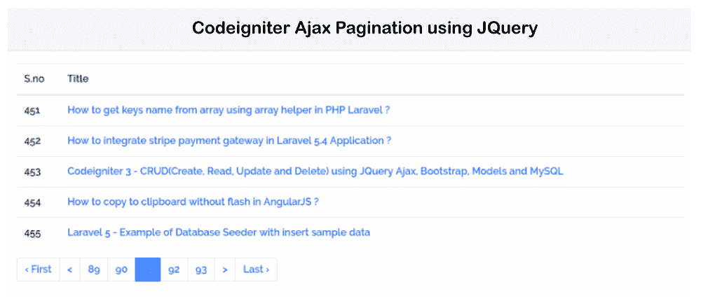

# PHP Codeigniter 3 使用 Jquery 的 Ajax 分页

> 原文:[https://www . javatpoint . com/PHP-codeigniter-3-Ajax-分页-使用-jquery](https://www.javatpoint.com/php-codeigniter-3-ajax-pagination-using-jquery)

在本节中，我们将学习 Codeigniter 3 中的 ajax 分页。我们将使用 JQuery 来实现这一点。每个网站开发人员都希望通过使用 JQuery Ajax 的代码来制作网站，因为节省时间和忽略额外的加载时间很有用。如果不使用 [JQuery](https://www.javatpoint.com/jquery-tutorial) Ajax，每次都需要加载我们网站的页面。当我们在网站上使用 Jquery Ajax 时，它不会加载整个页面，只会加载数据。

为了执行 Ajax 分页，我们必须遵循一些步骤。首先，我们必须创建一个名为“Post”的表。之后，我们将使用该表添加一些伪记录。然后我们将使用 Ajax 分页并显示所有数据。执行此操作的步骤描述如下:

**第一步:**

在这一步中，我们将进入**创建帖子表**。我们首先创建一个名为“posts”的表，然后在表中添加一些伪记录，描述如下:

```php

posts table
CREATE TABLE IF NOT EXISTS `posts` (
  `id` int(10) unsigned NOT NULL AUTO_INCREMENT,
  `slug` varchar(255) COLLATE utf8_unicode_ci NOT NULL,
  `title` varchar(255) COLLATE utf8_unicode_ci NOT NULL,
  PRIMARY KEY (`id`)
) ENGINE=InnoDB  DEFAULT CHARSET=utf8 COLLATE=utf8_unicode_ci AUTO_INCREMENT=533 ;

```

**第二步:**

在这一步中，我们将**进行数据库配置**。为此，我们将添加一些关于数据库的信息，如数据库名称、用户名和密码，描述如下:

**应用程序/配置/数据库. php**

```php
<?php
defined('BASEPATH') OR exit('No direct script access allowed');

$active_group = 'default';
$query_builder = TRUE;

$db['default'] = array(
	'dsn'	=> '',
	'hostname' => 'localhost',
	'username' => 'root',
	'password' => 'root',
	'database' => 'test',
	'dbdriver' => 'mysqli',
	'dbprefix' => '',
	'pconnect' => FALSE,
	'db_debug' => (ENVIRONMENT !== 'production'),
	'cache_on' => FALSE,
	'cachedir' => '',
	'char_set' => 'utf8',
	'dbcollat' => 'utf8_general_ci',
	'swap_pre' => '',
	'encrypt' => FALSE,
	'compress' => FALSE,
	'stricton' => FALSE,
	'failover' => array(),
	'save_queries' => TRUE
);

```

**第三步:**

在这一步中，我们将进入**创建后置控制器**。将使用 loadRecord()和 index()创建此控制器。我们将通过使用 loadRecord()获取 ajax 数据。视图由索引方法返回。现在我们将使用控制器文件夹，并在其中创建一个新方法，如下所示:

**应用程序/控制器/Post.php**

```php
<?php
defined('BASEPATH') OR exit('No direct script access allowed');

class Post extends CI_Controller {

    /**
     * This method returns all the data.
     *
     * @return Response
    */
    public function __construct(){
       parent::__construct();
       $this->load->helper('url');
       $this->load->library('pagination');
       $this->load->database();
    }

    /**
     * This method returns all the data.
     *
     * @return Response
    */
    public function index(){
       $this->load->view('post_view');
    }

    /**
     * This method returns all the data.
     *
     * @return Response
    */
    public function loadRecord($rowno=0){

        $rowperpage = 5;

        if($rowno != 0){
          $rowno = ($rowno-1) * $rowperpage;
        }

        $allcount = $this->db->count_all('posts');

        $this->db->limit($rowperpage, $rowno);
        $users_record = $this->db->get('posts')->result_array();

        $config['base_url'] = base_url().'post/loadRecord';
        $config['use_page_numbers'] = TRUE;
        $config['total_rows'] = $allcount;
        $config['per_page'] = $rowperpage;

        $config['full_tag_open']    = '<div class="pagging text-center"><nav><ul class="pagination">';
        $config['full_tag_close']   = '</ul></nav></div>';
        $config['num_tag_open']     = '<li class="page-item"><span class="page-link">';
        $config['num_tag_close']    = '</span></li>';
        $config['cur_tag_open']     = '<li class="page-item active"><span class="page-link">';
        $config['cur_tag_close']    = '<span class="sr-only">(current)</span></span></li>';
        $config['next_tag_open']    = '<li class="page-item"><span class="page-link">';
        $config['next_tag_close']  = '<span aria-hidden="true"></span></span></li>';
        $config['prev_tag_open']    = '<li class="page-item"><span class="page-link">';
        $config['prev_tag_close']  = '</span></li>';
        $config['first_tag_open']   = '<li class="page-item"><span class="page-link">';
        $config['first_tag_close'] = '</span></li>';
        $config['last_tag_open']    = '<li class="page-item"><span class="page-link">';
        $config['last_tag_close']  = '</span></li>';

        $this->pagination->initialize($config);

        $data['pagination'] = $this->pagination->create_links();
        $data['result'] = $users_record;
        $data['row'] = $rowno;

        echo json_encode($data);
  }

}

```

**第四步:**

在这一步中，我们将进入**创建视图文件**。我们将使用我们的视图文件夹并创建“post_view.php”文件作为新的视图文件。我们将把下面的代码添加到该文件中:

**应用/视图/post_view.php**

```php
<!DOCTYPE html>
<html lang="en">
  <head>
    <title> JQuery - Codeigniter 3 Ajax Pagination </title>
    <meta charset="utf-8">
    <link rel="stylesheet" href="https://cdnjs.cloudflare.com/ajax/libs/twitter-bootstrap/4.1.3/css/bootstrap.min.css" />
    <link href="https://fonts.googleapis.com/css?family=Raleway:100,600" rel="stylesheet" type="text/css">
    <style type="text/css">
      html, body { font-family: 'Raleway', sans-serif; }
      a{ color: #007bff; font-weight: bold;}
    </style>
  </head> 
  <body>

   <div class="container">
    <div class="card">
      <div class="card-header">
        Codeigniter Ajax Pagination using JQuery 
      </div>
      <div class="card-body">
           <!-- Posts List -->
           <table class="table table-borderd" id='postsList'>
             <thead>
              <tr>
                <th>S.no</th>
                <th>Title</th>
              </tr>
             </thead>
             <tbody></tbody>
           </table>

           <!-- Paginate -->
           <div id='pagination'></div>
      </div>
    </div>
   </div>

   <!-- Script -->
   <script src="https://ajax.googleapis.com/ajax/libs/jquery/3.3.1/jquery.min.js"></script>
   <script type='text/javascript'>
   $(document).ready(function(){

     $('#pagination').on('click','a',function(e){
       e.preventDefault(); 
       var pageno = $(this).attr('data-ci-pagination-page');
       loadPagination(pageno);
     });

     loadPagination(0);

     function loadPagination(pagno){
       $.ajax({
         url: '/post/loadRecord/'+pagno,
         type: 'get',
         dataType: 'json',
         success: function(response){
            $('#pagination').html(response.pagination);
            createTable(response.result,response.row);
         }
       });
     }

     function createTable(result,sno){
       sno = Number(sno);
       $('#postsList tbody').empty();
       for(index in result){
          var id = result[index].id;
          var title = result[index].title;
          var content = result[index].slug;
          content = content.substr(0, 60) + " ...";
          var link = result[index].slug;
          sno+=1;

          var tr = "<tr>";
          tr += "<td>"+ sno +"</td>";
          tr += "<td><a href='"+ link +"' target='_blank' >"+ title +"</a></td>";
          tr += "</tr>";
          $('#postsList tbody').append(tr);

        }
      }

    });
    </script>
  </body>
</html>

```

现在我们上面的代码已经准备好了，我们可以运行它了。当我们运行它时，将生成以下输出:



* * *