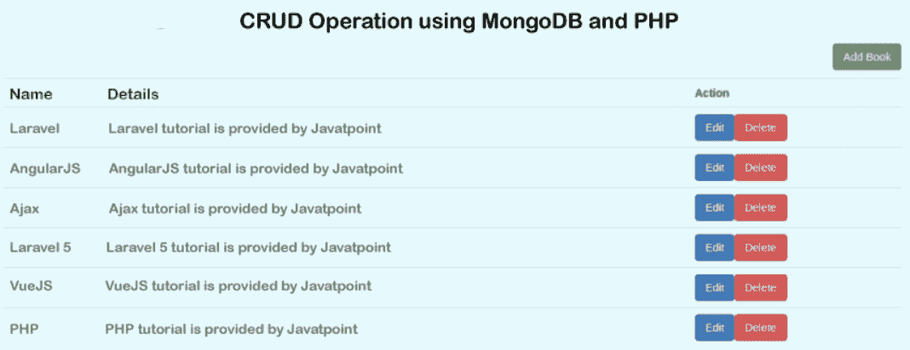

# 使用 PHP & Mongodb 的 CRUD 操作

> 原文：<https://www.javatpoint.com/crud-operation-using-php-and-mongodb>

在本节中，我们将执行查看、插入、删除和更新操作。我们将使用 PHP 和 Mongodb 来实现这一点。我们在应用程序中使用的数据库是 MongoDB。创建、更新和删除模块的分步过程描述如下。在 PHP 中，MongoDB 的各种操作很容易被给定的例子使用，比如更新、添加、查找、搜索、删除、选择等。 [MongoDB](https://www.javatpoint.com/mongodb-tutorial) 和 [PHP](https://www.javatpoint.com/php-tutorial) 之间的联系也将在本例中学习。

开源的非常著名的数据库是 MongoDB。这是一个基于文档的 [NoSQL 数据库](https://www.javatpoint.com/nosql-databases)。如果数据库有更多的数据或者包含大量的数据，我们将在我们的应用程序中使用 [MongoDB 数据库](https://www.javatpoint.com/mongodb-create-database)。MongoDB 数据库通过使用更少的内存来存储数据，它还可以用来获取快速记录。执行此操作的步骤描述如下:

**第一步**

在这一步中，我们将创建蒙古数据库。在我们的例子中，我们需要创建我们的图书收藏和 MongoDB 数据库。当我们成功安装 MongoDB 数据库时，我们将使用我们的命令提示符，连接到 MongoDB。对于连接，我们将创建一个数据库，然后创建一个集合。之后，我们将使用如下命令插入书籍:

```php
mongo
> use hddatabase
> db.books.insert( { "name": "laravel", "detail": "test" } )

```

**第二步:**

在这一步中，我们将安装 MongoDB 和 MongoDB 库。在我们的应用程序中，我们将使用 composer 包管理器，这样我们就可以安装它。为此，我们将在根目录中创建一个文件夹。之后，我们将打开命令提示符并运行以下命令:

```php

composer require mongodb/mongodb

```

**第三步:**

在这一步中，我们将为 CRUD 应用程序创建配置文件。创建配置文件后，我们将使用它来提供与 MongoDB 的连接。创建文件和建立连接的代码描述如下。为此，我们还想设置用户名、端口、密码和网址。我们还将设置集合名称和数据库。我们将把“books”描述为集合名称，把“hddatabase”描述为数据库。

**配置.php**

```php
<?php

require_once __DIR__ . "/vendor/autoload.php";

$collection = (new MongoDB\Client)->hddatabase->books;

?>

```

**第四步:**

在这一步中，我们将创建索引、创建、编辑和删除文件。为此，我们将创建许多文件，如 edit.php、index.php、create.php 和 delete.php。创建这些文件的命令描述如下:

**index.php**

```php
<?php
   session_start();
?>
<!DOCTYPE html>
<html>
<head>
   <title> CRUD Operation using MongoDB and PHP </title>
   <link href="https://stackpath.bootstrapcdn.com/bootstrap/3.3.7/css/bootstrap.min.css" rel="stylesheet" crossorigin="anonymous">
</head>
<body>

<div class="container">
<h1> CRUD Operation using MongoDB and PHP </h1>

<a href="create.php" class="btn btn-success">Add Book</a>

<?php

   if(isset($_SESSION['success'])){
      echo "<div class='alert alert-success'>".$_SESSION['success']."</div>";
   }

?>

<table class="table table-borderd">
   <tr>
      <th>Name</th>
      <th>Details</th>
      <th>Action</th>
   </tr>
   <?php

      require 'config.php';

      $books = $collection->find([]);

      foreach($books as $book) {
         echo "<tr>";
         echo "<td>".$book->name."</td>";
         echo "<td>".$book->detail."</td>";
         echo "<td>";
         echo "<a href='edit.php?id=".$book->_id."' class='btn btn-primary'>Edit</a>";
         echo "<a href='delete.php?id=".$book->_id."' class='btn btn-danger'>Delete</a>";
         echo "</td>";
         echo "</tr>";
      };

   ?>
</table>
</div>

</body>
</html>

```

**create.php**

```php
<?php

session_start();

if(isset($_POST['submit'])){

   require 'config.php';

   $insertOneResult = $collection->insertOne([
       'name' => $_POST['name'],
       'detail' => $_POST['detail'],
   ]);

   $_SESSION['success'] = "Creation of Book is successful";
   header("Location: index.php");
}

?>

<!DOCTYPE html>
<html>
<head>
   <title> CRUD Operation using MongoDB and PHP </title>
   <link href="https://stackpath.bootstrapcdn.com/bootstrap/3.3.7/css/bootstrap.min.css" rel="stylesheet" crossorigin="anonymous">
</head>
<body>

<div class="container">
   <h1>Create Book</h1>
   <a href="index.php" class="btn btn-primary">Back</a>

   <form method="POST">
      <div class="form-group">
         <strong>Name:</strong>
         <input type="text" name="name" required="" class="form-control" placeholder="Name">
      </div>
      <div class="form-group">
         <strong>Detail:</strong>
         <textarea class="form-control" name="detail" placeholder="Detail" placeholder="Detail"></textarea>
      </div>
      <div class="form-group">
         <button type="submit" name="submit" class="btn btn-success">Submit</button>
      </div>
   </form>
</div>

</body>
</html>

```

编辑. php

```php

<?php

session_start();

require 'config.php';

if (isset($_GET['id'])) {
   $book = $collection->findOne(['_id' => new MongoDB\BSON\ObjectID($_GET['id'])]);
}

if(isset($_POST['submit'])){

   $collection->updateOne(
       ['_id' => new MongoDB\BSON\ObjectID($_GET['id'])],
       ['$set' => ['name' => $_POST['name'], 'detail' => $_POST['detail'],]]
   );

   $_SESSION['success'] = "Updating of Book is successful";
   header("Location: index.php");
}

?>

<!DOCTYPE html>
<html>
<head>
   <title> CRUD Operation using MongoDB and PHP </title>
   <link href="https://stackpath.bootstrapcdn.com/bootstrap/3.3.7/css/bootstrap.min.css" rel="stylesheet" crossorigin="anonymous">
</head>
<body>

<div class="container">
   <h1>Create Book</h1>
   <a href="index.php" class="btn btn-primary">Back</a>

   <form method="POST">
      <div class="form-group">
         <strong>Name:</strong>
         <input type="text" name="name" value="<?php echo $book->name; ?>" required="" class="form-control" placeholder="Name">
      </div>
      <div class="form-group">
         <strong>Detail:</strong>
         <textarea class="form-control" name="detail" placeholder="Detail" placeholder="Detail"><?php echo $book->detail; ?></textarea>
      </div>
      <div class="form-group">
         <button type="submit" name="submit" class="btn btn-success">Submit</button>
      </div>
   </form>
</div>

</body>
</html&gt

```

现在我们上面的代码已经准备好了，我们可以在本地运行它。当我们运行它时，将生成以下输出:



* * *