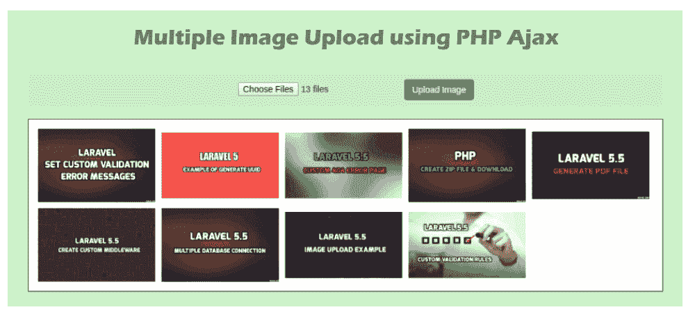

# 多图片上传

> 原文:[https://www.javatpoint.com/php-ajax-multiple-image-upload](https://www.javatpoint.com/php-ajax-multiple-image-upload)

在这一节中，我们将学习 PHP 中的多图像上传。我们将使用 Ajax 和 jQuery 来实现这一点。有时我们的项目需要选择多个图像上传。如果我们没有关于 PHP 的知识，这个例子对我们会非常有用。本示例将显示选定的图像。要上传多个文件，我们将创建两个文件，如下所示:

*   Index.php
*   上传文件.php

索引文件将有助于编写设计代码。在这个文件中，我们还将编写 jQuery Ajax 的代码。当我们选择图像并点击提交按钮时，所有图像将被上传到名为“媒体”的文件夹中。所以我们必须首先创建媒体文件夹。我们将使用根目录来创建它。以下示例显示了上传多个图像的小而最快的方法。

显示所选图像的主要代码如下:

```php
$("#uploadFile").change(function(){
  $('#image_preview').html("");
  var total_file=document.getElementById("uploadFile").files.length;
  for(var i=0;i<total_file p="" style="box-sizing: border-box;"/>
  {
   $('#image_preview').append(" ");
  }
});

```

显示用户选择的多图像上传的完整示例描述如下。在下面的示例中，我们将使用两个名为 index.php 和 uploadFile.php 的文件，如下所示:

**示例:**

**Index.php**

```php
<!DOCTYPE html>
<html>
<head>
  <title> Multiple Image Upload using PHP and Ajax </title>
  <link href="https://maxcdn.bootstrapcdn.com/bootstrap/3.3.6/css/bootstrap.min.css" rel="stylesheet">
  <script src="//ajax.googleapis.com/ajax/libs/jquery/1.12.4/jquery.min.js"></script>
  <script src="https://cdnjs.cloudflare.com/ajax/libs/jquery.form/4.2.2/jquery.form.min.js"></script>

  <style type="text/css">
    input[type=file]{
      display: inline;
    }
    #image_preview{
      border: 1px solid black;
      padding: 10px;
    }
    #image_preview img{
      width: 200px;
      padding: 5px;
    }
  </style>

</head>
<body>

<div class="container">
  <h1> Multiple Image Upload using PHP Ajax </h1>
  <form action="uploadFile.php" method="post" enctype="multipart/form-data">
      <input type="file" id="uploadFile" name="uploadFile[]" multiple/>
      <input type="submit" class="btn btn-success" name='submitImage' value="Upload Image"/>
  </form>

  <br/>
  <div id="image_preview"></div>
</div>

</body>

<script type="text/javascript">

  $("#uploadFile").change(function(){
     $('#image_preview').html("");
     var total_file=document.getElementById("uploadFile").files.length;

     for(var i=0;i<total_file;i++)
     {
      $('#image_preview').append("");
     }

  });

  $('form').ajaxForm(function() 
   {
    alert(?Successful Uploading");
   }); 

</script>
</html>

```

上传文件.php

```php
<?php

if(isset($_POST['submitImage']))
{
	for($i=0;$i<count($_FILES["uploadFile"]["name"]);$i++)
	{
		$uploadfile=$_FILES["uploadFile"]["tmp_name"][$i];
		$folder="media/";

		move_uploaded_file($_FILES["uploadFile"]["tmp_name"][$i], "$folder".$_FILES["uploadFile"]["name"][$i]);
	}
	exit();
}

?>

```

现在我们上面的代码已经准备好了，我们可以运行它了。当我们运行它时，将生成以下输出:



* * *