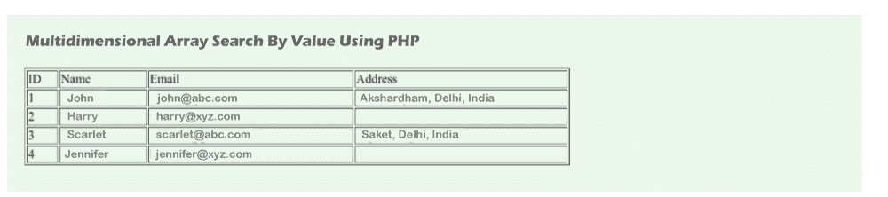

# PHP 多维数组按值搜索

> 原文:[https://www . javatpoint . com/PHP-多维-数组-按值搜索](https://www.javatpoint.com/php-multidimensional-array-search-by-value)

在本节中，我们将通过使用值来学习多维数组搜索。我们将使用 PHP 来实现这一点。如果我们不了解 PHP 中的[多维数组，这个例子对我们会非常有用。在下面的例子中，我们将使用值来搜索多维数组的键。如果我们想从多维数组中获取值，我们可以通过在数组中搜索键值来轻松实现。](https://www.javatpoint.com/php-multidimensional-array)

在我们的例子中，我们将使用一个简单的数组来解释这个例子。我们将使用两个名为$students 和$ studentsAddress 的数组。在我们的$students 数组中，我们将使用 foreach 循环。在我们的$ studentsAddress 数组中，我们也希望显示地址。但是我们面临一个问题，因为我们的示例有一个 user_id 键，它包含一些记录和第一个数组 id。为了解决这个问题，我们将使用 [array_column()](https://www.javatpoint.com/post/php-array_column-function) 和 array_column 的函数。

在多维数组中搜索值的简单代码描述如下:

```php

array_search($value['id'], array_column($studentsAddress, 'user_id'))

```

在多维数组中搜索值的完整示例描述如下:

**示例:**

```php
<?php

    $students = [
        [
            "id" => "1",
            "name" => "John",
            "email" => "john@abc.com"
        ],
        [
            "id" => "2",
            "name" => "Harry",
            "email" => "harry@xyz.com"
        ],
        [
            "id" => "3",
            "name" => "Scarlet",
            "email" => "scarlet@abc.com"
        ],
        [
            "id" => "4",
            "name" => "Jennifer",
            "email" => "jennifer@xyz.com"
        ]
    ];

    $studentsAddress = [
        [
            "user_id" => "3",
            "address" => "Saket, Delhi, India"
        ],
        [
            "user_id" => "1",
            "address" => "Akshardham, Delhi, India"
        ]
    ];
?>    

<h1> Multidimensional Array Search By Value Using PHP </h1>
<table border="1" width="700">
    <tr>
        <td>ID</td>
        <td>Name</td>
        <td>Email</td>
        <td>Address</td>
    </tr>

    <?php foreach ($students as $key => $value): ?>
    <tr>
        <td><?php echo $value['id'] ?></td>
        <td><?php echo $value['name'] ?></td>
        <td><?php echo $value['email'] ?></td>
        <td>
        <?php 
            $key = array_search($value['id'], array_column($studentsAddress, 'user_id'));

            if (!empty($key) || $key === 0) {
                echo $studentsAddress[$key]['address'];
            }
        ?>
        </td>
    </tr>
    <?php endforeach ?>
</table>

```

现在我们上面的代码已经准备好了，我们可以运行它了。当我们运行它时，将生成以下输出:



* * *