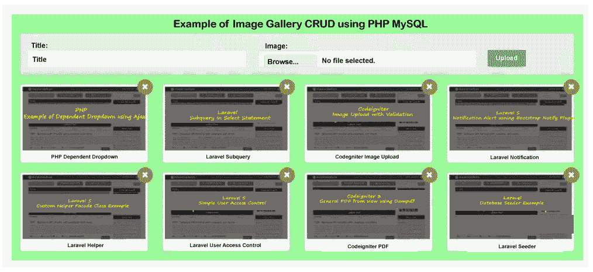

# 使用 PHP MySQL 的图像库 CRUD

> 原文：<https://www.javatpoint.com/image-gallery-crud-using-php-mysql>

在这一节中，我们将学习图像画廊凝乳。我们将使用 PHP 和 MySQL 来实现这一点。有时用户、学生、员工、管理员等，需要选择图库、删除模块和插入更新。所以我们需要为他们创造这些东西。为了轻松上传照片并通过验证移除该照片，我们将使用相册。在我们的应用程序中，我们将创建一个有吸引力的带有图像库的 Bootstrap 布局。

在这里，我们将使用 scratch 使照片库具有吸引人的布局。使用这种方式，我们将很容易用我们的应用程序构建它。在我们的应用程序中，我们将使用会话来执行正确的验证，并给出正确的成功和错误消息。如果我们成功插入图像，我们将获得正确的成功消息。我们的示例将创建一个名为“image_gallery”的新表，它将包含主“title”和“image”列。为了显示表单、验证、错误消息等，我们还将创建文件。制作照片库的步骤描述如下:

**第一步:**

这一步，我们要去**创建 image_gallery 表**。在这里，我们将使用我们的数据库来创建这个表。为了创建这个表，我们将使用一些 SQL 查询，如下所述:

**项目表:**

```php

CREATE TABLE `image_gallery` (
  `id` int(10) UNSIGNED NOT NULL,
  `title` varchar(255) COLLATE utf8mb4_unicode_ci NOT NULL,
  `image` varchar(255) COLLATE utf8mb4_unicode_ci NOT NULL,
  `created_at` timestamp NULL DEFAULT NULL,
  `updated_at` timestamp NULL DEFAULT NULL
) ENGINE=InnoDB DEFAULT CHARSET=utf8mb4 COLLATE=utf8mb4_unicode_ci;

```

**第二步:**

在这一步中，我们将进入**创建数据库配置文件**。为此，我们必须在数据库上设置一些细节，比如数据库名称、用户名和 phpmyadmin 数据库的密码。之后，我们将使用我们的根目录，创建一个名为“db_config.php”的新文件。之后，我们将像这样向其中添加以下代码:

db _ config . PHP

```php
<?php

define (DB_USER, "root");
define (DB_PASSWORD, "root");
define (DB_DATABASE, "sole");
define (DB_HOST, "localhost");

$mysqli = new mysqli(DB_HOST, DB_USER, DB_PASSWORD, DB_DATABASE);
?>

```

**第三步:**

在这一步中，我们将去**创建 Index.php 文件**。该文件用于显示带有删除按钮的显示图像。它也用于显示图像的标题。现在我们将使用我们的根目录并创建一个“index.php”文件。之后，我们将像这样向其中添加以下代码:

**index.php**

```php
<?php
  session_start();
?>

<!DOCTYPE html>
<html>
<head>
    <title>Image Gallery Example</title>
    <!-- Latest CSS which is minified and compiled -->
    <link rel="stylesheet" href="https://maxcdn.bootstrapcdn.com/bootstrap/3.3.7/css/bootstrap.min.css">
    <!-- References: https://github.com/fancyapps/fancyBox -->
    <link rel="stylesheet" href="https://cdnjs.cloudflare.com/ajax/libs/fancybox/2.1.5/jquery.fancybox.min.css" media="screen">
    <script src="https://cdnjs.cloudflare.com/ajax/libs/jquery/3.2.1/jquery.min.js"></script>
    <script src="https://cdnjs.cloudflare.com/ajax/libs/fancybox/2.1.5/jquery.fancybox.min.js"></script>

    <style type="text/css">
    .gallery
    {
        display: inline-block;
        margin-top: 20px;
    }
    .close-icon{
    border-radius: 50%;
        position: absolute;
        right: 5px;
        top: -10px;
        padding: 5px 8px;
    }
        .form-image-upload{
            background: #e8e8e8 none repeat scroll 0 0;
            padding: 15px;
        }
    </style>
</head>
<body>

<div class="container">

    <h3> Example of Image Gallery CRUD using PHP MySQL </h3>
    <form action="/imageUpload.php" class="form-image-upload" method="POST" enctype="multipart/form-data">

        <?php if(!empty($_SESSION['error'])){ ?>
            <div class="alert alert-danger">
                <strong>Whoops!</strong> Our input faces some problems. <br><br>
                <ul>
                    <li><?php echo $_SESSION['error']; ?></li>
                </ul>
            </div>
        <?php unset($_SESSION['error']); } ?>

        <?php if(!empty($_SESSION['success'])){ ?>
        <div class="alert alert-success alert-block">
            <button type="button" class="close" data-dismiss="alert">?</button>
                <strong><?php echo $_SESSION['success']; ?></strong>
        </div>
        <?php unset($_SESSION['success']); } ?>

        <div class="row">
            <div class="col-md-5">
                <strong>Title:</strong>
                <input type="text" name="title" class="form-control" placeholder="Title">
            </div>
            <div class="col-md-5">
                <strong>Image:</strong>
                <input type="file" name="image" class="form-control">
            </div>
            <div class="col-md-2">
                <br/>
                <button type="submit" class="btn btn-success">Upload</button>
            </div>
        </div>

    </form> 

    <div class="row">
    <div class='list-group gallery'>

            <?php
            require('db_config.php');

            $sql = "SELECT * FROM image_gallery";
            $images = $mysqli->query($sql);

            while($image = $images->fetch_assoc()){

            ?>
                <div class='col-sm-4 col-xs-6 col-md-3 col-lg-3'>
                    <a class="thumbnail fancybox" rel="ligthbox" href="/uploads/<?php echo $image['image'] ?>">
                        " />
                        <div class='text-center'>
                            <small class='text-muted'><?php echo $image['title'] ?></small>
                        </div> <!-- text-center / end -->
                    </a>
                    <form action="/imageDelete.php" method="POST">
                    <input type="hidden" name="id" value="<?php echo $image['id'] ?>">
                    <button type="submit" class="close-icon btn btn-danger"><i class="glyphicon glyphicon-remove"></i></button>
                    </form>
                </div> <!-- col-6 / end -->
            <?php } ?>

        </div> <!-- list-group / end -->
    </div> <!-- row / end -->
</div> <!-- container / end -->

</body>

<script type="text/javascript">
    $(document).ready(function(){
        $(".fancybox").fancybox({
            openEffect: "none",
            closeEffect: "none"
        });
    });
</script>
</html>

```

**第四步:**

在这一步中，我们将**创建一个 imageUpload.php 文件**。该文件用于使用会话、插入数据库代码和图像上传代码进行验证。所以我们将使用我们的根目录，创建一个名为“imageUpload.php”的新文件。之后，我们将像这样向其中添加以下代码:

**imageUpload.php**

```php

<?php

session_start();
require('db_config.php');

if(isset($_POST) && !empty($_FILES['image']['name']) && !empty($_POST['title'])){

	$name = $_FILES['image']['name'];
	list($txt, $ext) = explode(".", $name);
	$image_name = time().".".$ext;
	$tmp = $_FILES['image']['tmp_name'];

	if(move_uploaded_file($tmp, 'uploads/'.$image_name)){

		$sql = "INSERT INTO image_gallery (title, image) VALUES ('".$_POST['title']."', '".$image_name."')";
		$mysqli->query($sql);

		$_SESSION['success'] = 'Uploading of image is successfully.';
		header("Location: http://localhost:8000");
	}else{
		$_SESSION['error'] = 'Uploading of image is failed';
		header("Location: http://localhost:8000");
	}
}else{
	$_SESSION['error'] = 'Please Select Image or Write title';
	header("Location: http://localhost:8000");
}

?>

```

**第五步:**

在这一步中，我们将**创建一个 imageDelete.php 文件**。该文件用于从数据库中删除记录。所以我们将使用我们的根目录，创建一个名为“imageDelete.php”的新文件。之后，我们将像这样向其中添加以下代码:

**图像删除. php**

```php

<?php

session_start();
require('db_config.php');

if(isset($_POST) && !empty($_POST['id'])){

		$sql = "DELETE FROM image_gallery WHERE id = ".$_POST['id'];
		$mysqli->query($sql);

		$_SESSION['success'] = 'Deletion of image is successfully.';
		header("Location: http://localhost:8000");
}else{
	$_SESSION['error'] = 'Please Select Image or Write title';
	header("Location: http://localhost:8000");
}

?>

```

现在，我们上面的图像库示例可以运行了。为了运行这个，我们将使用我们的根文件夹并创建一个名为“上传”的新文件夹。在继续之前，我们需要完全权限，因为上传文件夹将保存所有图像。现在，我们将使用根目录并运行以下命令:

```php

php -S localhost:8000

```

现在我们可以使用浏览器打开下面的网址:

```php

http://localhost:8000/

```

打开这个后，我们可以看到如下输出:



* * *