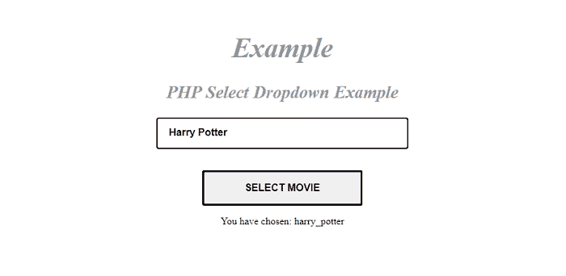
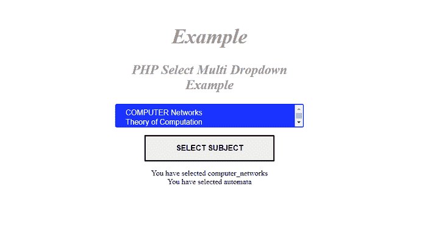

# 如何在 PHP 中获取选中的选项值

> 原文:[https://www . javatpoint . com/how-to-select-option-value-in-PHP](https://www.javatpoint.com/how-to-get-selected-option-value-in-php)

在本文中，我们将学习如何在 PHP 中获取选定的选项值。在这一节中，我们将学习一些基本的 PHP 概念，之后，我们将借助各种示例来学习这个概念。

### PHP 是什么意思？

[PHP](https://www.javatpoint.com/php-tutorial) 是一种广泛使用的开源服务器端脚本语言，允许 web 开发人员快速创建动态的交互式网页。PHP 文件的扩展名为. PHP。PHP 可以免费兼容几乎每一个[操作系统](https://en.wikipedia.org/wiki/Operating_system)上的几乎所有类型的网络服务器。


### PHP 中的选项值是什么意思？

[<选择>](https://www.javatpoint.com/html-select-tag) 和 [<选项标签>](https://www.javatpoint.com/html-option-tag) 用于创建下拉菜单。它们允许用户从 PHP 的选项列表中选择一个或多个选项。

### 语法:

```php
<select name = "select_list_name" size ="n" multiple>
<option value ="choice-name 1" selected> Text Label-1 </option>
<option value ="choice-name 2" selected> Text Label-2 </option>
........................................
........................................
</select>

```

**与<选择>标签一起使用的各种属性有:**

*   **多选:**用于选择列表中的多个选项。
*   **名称:**用于为下拉列表指定名称。

**与<选项>标签一起使用的各种属性有:**

*   **值:**用于指定表单提交时发送的值。
*   **Selected:** 用于在浏览器中初始加载表单时指定预选选项。

**我们来举几个 PHP 中如何获取选中选项值的例子。**

### 例 1:

**用 PHP 写一个如何获取选中选项值的程序。**

```php
<! Doctype html>
<html lang="en">
<head>
  <meta charset="utf-8">
  <meta name="viewport" content="width=device-width, initial-scale=1, shrink-to-fit=no">
  <title> PHP Select Dropdown Example </title>
  <style>
    .container {
      max-width: 400px;
      margin: 60px auto;
      text-align: center;
    }
    input[type="submit"] {
      margin-bottom: 25px;
    }
    .select-block {
      width: 350px;
      margin: 100px auto 40px;
      position: relative;
    }
    select {
      width: 100%;
      height: 50px;
      font-size: 100%;
      font-weight: bold;
      cursor: pointer;
      border-radius: 0;
      background-color: #1A33FF;
      border: none;
      border: 2px solid #1A33FF;
      border-radius: 4px;
      color: white;
      appearance: none;
      padding: 8px 38px 10px 18px;
      -webkit-appearance: none;
      -moz-appearance: none;
      transition: color 0.3s ease, background-color 0.3s ease, border-bottom-color 0.3s ease;
    }
      select::-ms-expand {
      display: none;
    }
    .selectIcon {
      top: 7px;
      right: 15px;
      width: 30px;
      height: 36px;
      padding-left: 5px;
      pointer-events: none;
      position: absolute;
      transition: background-color 0.3s ease, border-color 0.3s ease;
    }
    .selectIcon svg.icon {
      transition: fill 0.3s ease;
      fill: white;
    }
    select:hover {
      color: #000000;
      background-color: white;
    }
select:focus {
      color: #000000;
      background-color: white;
    }
    select:hover~.selectIcon
     {
      background-color: white;
    }
    select:focus~.selectIcon {
      background-color: white;
    }
    select:hover~.selectIcon svg.icon
    {
      fill: #1A33FF;
    }
  select:focus~.selectIcon svg.icon {
      fill: #1A33FF;
    }
h2 {
 font-style: italic;
font-family: "Playfair Display","Bookman",serif;
 color: #999; 
letter-spacing: -0.005em; 
word-spacing:1px;
font-size: 1.75em;
font-weight: bold;
  }
h1 {
 font-style: italic;
 font-family: "Playfair Display","Bookman",serif;
 color: #999; 
letter-spacing: -0.005em; 
word-spacing: 1px;
 font-size: 2.75em;
  font-weight: bold;
  }
input[type=submit] {
  border: 3px solid;
  border-radius: 2px;
  color: ;
  display: block;
  font-size: 1em;
  font-weight: bold;
  margin: 1em auto;
  padding: 1em 4em;
  position: relative;
  text-transform: uppercase;
}
input[type=submit]::before,
input[type=submit]::after {
  background: #fff;
  content: '';
  position: absolute;
  z-index: -1;
}
input[type=submit]:hover {
  color: #1A33FF;
}
  </style>
</head>
<body>
  <div class="container mt-5">
  <h1> Example </h1>
  <h2> PHP Select Dropdown Example </h2>
    <form action="" method="post">
      <select name="Movies">
        <option value = "" selected> Select option </option>
        <option value = "harry_potter" > Harry Potter </option>
        <option value = "bonnie_clyde" > Bonnie and Clyde </option>
        <option value = "reservoir_dogs" > Reservoir Dogs </option>
        <option value = "don" > Don </option>
        <option value = ?anaconda"> Anaconda </option>
      </select>
      <div class="selectIcon">
        <svg focusable="false" viewBox="0 0 104 128" width="25" height="35" class="icon">
          <path
            d="m2e1 95a9 9 0 0 1 -9 9 9 9 0 0 1 -9 -9 9 9 0 0 1 9 -9 9 9 0 0 1 9 9zm0-3e1a9 9 0 0 1 -9 9 9 9 0 0 1 -9 -9 9 9 0 0 1 9 -9 9 9 0 0 1 9 9zm0-3e1a9 9 0 0 1 -9 9 9 9 0 0 1 -9 -9 9 9 0 0 1 9 -9 9 9 0 0 1 9 9zm14 55h68v1e1h-68zm0-3e1h68v1e1h-68zm0-3e1h68v1e1h-68z">
          </path>
        </svg>
      </div>
      <br> <br> <input type = "submit" name = "submit" value = "Select Movie">
    </form>
    <?php
        if(isset($_POST['submit'])){
        if(!empty($_POST['Movies'])) {
            $selected = $_POST['Movies'];
            echo 'You have chosen: ' . $selected;
        } else {
            echo 'Please select the value.';
        }
        }
    ?>
  </div>
</body>
</html>

```

**说明:**

在上例中，我们借助<select>和<option>标签创建了一个选项值列表。在这种情况下，我们已经从选项值列表中选择了一个选项值，在选择该选项后，我们单击一个按钮，然后显示带有所选选项的以下消息。</option></select>

```php
echo 'You have chosen:.' $selected;<

```

如果尚未选择选项值，将显示以下消息。

```php

echo 'Please select the value.';

```

**输出:**

下图显示了该示例的输出:



### 例 2:

**用 PHP 写一个如何从下拉列表中获取选中的多个选项值的程序。**

```php
<! Doctype html>
<html lang="en">
<head>
  <meta charset="utf-8">
  <meta name="viewport" content="width=device-width, initial-scale=1, shrink-to-fit=no">
  <title> PHP 7 Multi Select Dropdown List Example </title>
  <style>
h2 {
 font-style: italic;
font-family: "Playfair Display","Bookman",serif;
 color: #999; 
letter-spacing: -0.005em; 
word-spacing: 1px;
font-size: 1.75em;
font-weight: bold;
  }
h1 {
 font-style: italic;
 font-family: "Playfair Display","Bookman",serif;
 color: #999; letter-spacing: -0.005em; word-spacing: 1px;
 font-size: 2.75em;
  font-weight: bold;
  }
    .container {
      max-width: 400px;
      margin: 60px auto;
      text-align: center;
    }
    input[type="submit"] {
      margin-bottom: 25px;
    }
    .select-block {
      width: 350px;
      margin: 100px auto 40px;
      position: relative;
    }
    select {
      width: 100%;
      height: 50px;
      font-size: 100%;
      font-weight: bold;
      cursor: pointer;
      border-radius: 0;
      background-color: #1A33FF;
      border: none;
      border: 2px solid #1A33FF;
      border-radius: 4px;
      color: white;
      appearance: none;
      padding: 8px 38px 10px 18px;
      -webkit-appearance: none;
      -moz-appearance: none;
      transition: color 0.3s ease, background-color 0.3s ease, border-bottom-color 0.3s ease;
    }
    select::-ms-expand {
      display: none;
    }
    .selectIcon {
      top: 7px;
      right: 15px;
      width: 30px;
      height: 36px;
      padding-left: 5px;
      pointer-events: none;
      position: absolute;
      transition: background-color 0.3s ease, border-color 0.3s ease;
    }
    .selectIcon svg.icon {
      transition: fill 0.3s ease;
      fill: white;
    }
    select:hover {
      color: #000000;
      background-color: white;
    }
    select:focus {
      color: #000000;
      background-color: white;
    }	
    select:hover~.selectIcon
    {
      background-color: white;
    }
    select:focus~.selectIcon {
      background-color: white;
    }
    select:hover~.selectIcon svg.icon
    {
      fill: #1A33FF;
    }
    select:focus~.selectIcon svg.icon {
      fill: #1A33FF;
    }
input[type=submit] {
  border: 3px solid;
  border-radius: 2px;
  color: ;
  display: block;
  font-size: 1em;
  font-weight: bold;
  margin: 1em auto;
  padding: 1em 4em;
  position: relative;
  text-transform: uppercase;
}
input[type=submit]::before,
input[type=submit]::after {
  background: #fff;
  content: '';
  position: absolute;
  z-index: -1;
}
input[type=submit]:hover {
  color: #1A33FF;
}
  </style>
</head>
<body>
  <div class="container mt-5">
<h1> Example </h1>
  <h2> PHP Select Multi Dropdown Example </h2>
    <form method = 'post'>         
            <select name = 'subject[]' multiple size = 6>   
			  <option value = 'computer_networks'> COMPUTER Networks </option> 
			   <option value = 'automata'> Theory of Computation </option> 
                <option value = 'english'> ENGLISH </option> 
                <option value = 'mathematics'> MATHEMATICS </option> 
                 <option value = 'complier_design'> Complier Design </option> 
                <option value = 'haddop'> Haddop </option> 
            </select> 
      <div class="selectIcon">
        <svg focusable="false" viewBox="0 0 104 128" width="25" height="35" class="icon">
          <path
            d="m2e1 95a9 9 0 0 1 -9 9 9 9 0 0 1 -9 -9 9 9 0 0 1 9 -9 9 9 0 0 1 9 9zm0-3e1a9 9 0 0 1 -9 9 9 9 0 0 1 -9 -9 9 9 0 0 1 9 -9 9 9 0 0 1 9 9zm0-3e1a9 9 0 0 1 -9 9 9 9 0 0 1 -9 -9 9 9 0 0 1 9 -9 9 9 0 0 1 9 9zm14 55h68v1e1h-68zm0-3e1h68v1e1h-68zm0-3e1h68v1e1h-68z">
          </path>
        </svg>
      </div>
      <input type = 'submit' name = 'submit' value = "Select Subject"> 
    </form>
    <?php
         if(isset($_POST["submit"]))  
         { 
        if(isset($_POST["subject"]))  
        { 
            foreach ($_POST['subject'] as $subject)  
                print "You have selected $subject<br/>"; 
        } 
    else
        echo "Select an option first !!"; 
    } 
      ?>
  </div>
</body>
</html>

```

**说明:**

在上例中，我们借助<select>和<option>标签创建了一个选项值列表。在这种情况下，我们可以使用“多重选项从选项列表中选择多个值选择该选项后，我们点击一个按钮，然后显示带有所选选项的以下消息。</option></select>

```php
print "You have selected $subject<br/>";

```

如果尚未选择选项值，将显示以下消息。

```php

echo "Select an option first !!";

```

**输出:**

下图显示了该示例的输出:



* * *