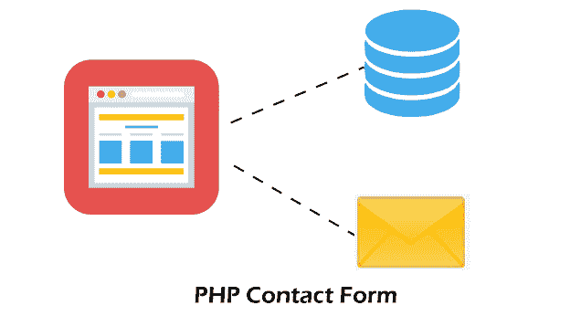
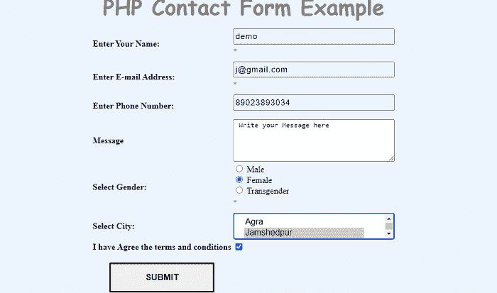

# PHP 联系人表单

> 原文:[https://www.javatpoint.com/php-contact-form](https://www.javatpoint.com/php-contact-form)

在这一节中，我们将借助一些例子在 PHP 中创建一个联系人表单。在进入高级概念之前，我们先了解一下 PHP 和 Contact 表单的基础知识。

## 你说的 PHP 联系人表单是什么意思？

[PHP](https://www.javatpoint.com/php-tutorial) 中的联系表单或网页表单是每个网站中非常重要的交互和联系网站访问者的工具。它响应迅速，将适用于所有设备，如移动设备、平板电脑和其他设备。该表单包括许多选项，如电子邮件、电话号码等。



**我们以 PHP 中的联系人表单为例。**

### 例 1:

```php
<! Doctype html>  
<html lang="en">  
     <head>
	 <meta charset="utf-8">
  <meta name="viewport" content="width=device-width, initial-scale=1, shrink-to-fit=no">
  <title> PHP Contact Form Example </title>
   <style>
  .error {
    color: red;
    font-weight: 400;
    display: block;
    padding: 6px 0;
    font-size: 14px;
}
form {
    border: 1px solid #1A33FF;
    background: #ecf5fc;
    padding: 40px 50px 45px;
}
   h2 {
 font-style: italic;
font-family: "Playfair Display","Bookman",serif;
 color: #999; 
letter-spacing: -0.005em; 
word-spacing: 1px;
font-size: 1.75em;
font-weight: bold;
  }
  input[type="text"]
  {
  font: 15px/24px "Lato", Arial, sans-serif; 
  color: #333; 
 width: 100%; 
 box-sizing: border-box; 
 letter-spacing: 1px;
	  }
  select:hover {
      color: #000000;
      background-color: white;
    }
   select {
      width: 100%;
      height: 50px;
      font-size: 100%;
      font-weight: bold;
      cursor: pointer;
      border-radius: 0;
      border: none;
      border: 2px solid #1A33FF;
      border-radius: 4px;
      appearance: none;
      padding: 8px 38px 10px 18px;
      -webkit-appearance: none;
      -moz-appearance: none;
      transition: color 0.3s ease, background-color 0.3s ease, border-bottom-color 0.3s ease;
    }
  body {  
 text-align: center;  
background: #ecf5fc; 
 }  
  h1 {
margin: 10 auto;
font-family: 'Lily Script One', cursive;
font-size: 40px;
font-weight: bold;
text-align: center;
color: gray;
-webkit-transition: 0.2s ease all;
 -moz-transition: 0.2s ease all;
 -ms-transition: 0.2s ease all;
 -o-transition: 0.2s ease all;
transition: 0.2s ease all;
}
h1:hover {
color: cornflowerblue;
}
  input[type=submit] {
  border: 3px solid;
  border-radius: 2px;
  color: ;
  display: block;
  font-size: 1em;
  font-weight: bold;
  margin: 1em auto;
  padding: 1em 4em;
  position: relative;
  text-transform: uppercase;
}
input[type=submit]::before
 {
  background: #fff;
  content: '';
  position: absolute;
  z-index: -1;
}
input[type=submit]:hover {
  color: #1A33FF;
}
input[type=submit]::after {
  background: #fff;
  content: '';
  position: absolute;
  z-index: -1;
}
      </style>
   </head>

   <body> 
      <?php
         $nameErr = "";
		 $emailErr = "";
		 $genderErr = "";
		 $websiteErr = "";
         $name = "";
		 $email = "";
		 $gender = "";
                           $Number = "";
		$message = "";
		 $subject = "";

         if ($_SERVER["REQUEST_METHOD"] == "POST") {
            if (empty($_POST["name"])) {
               $nameErr = "Name is required";
            } else {
               $name = test_input($_POST["name"]);
            }
               if (empty($_POST["email"])) {
               $emailErr = "Email is required";
            } else {
               $email = test_input($_POST["email"]);
                    if (!filter_var($email, FILTER_VALIDATE_EMAIL)) {
                  $emailErr = "Invalid email format"; 
               }
            }
             if (empty($_POST["course"])) {
               $Number = "";
            } else {
               $Number = test_input($_POST["course"]);
            }
            if (empty($_POST["class"])) {
               $message = "";
            } else {
               $message = test_input($_POST["class"]);
            }
           if (empty($_POST["gender"])) {
               $genderErr = "Gender is required";
            } else {
               $gender = test_input($_POST["gender"]);
            }
             if (empty($_POST["subject"])) {
               $subjectErr = "You must select 1 or more";
            } else {
               $subject = $_POST["subject"];	
            }
         }
           function test_input($data) {
            $data = trim($data);
            $data = stripslashes($data);
            $data = htmlspecialchars($data);
            return $data;
         }
      ?>  
      <form method = "POST"   align ="center" action = "<?php echo htmlspecialchars($_SERVER["PHP_SELF"]);?>">
	  <h1> PHP Contact Form Example </h1> 
         <table align ="center">
            <tr>
               <td> <b> Enter Your Name: </b> </td>
               <td> <input type = "text" name = "name" placeholder ="Type in your username..">
                  <span class = "error"> * <?php echo $nameErr;?> </span>
               </td>
            </tr>
                 <tr>
               <td> <b> Enter E-mail Address: </b> </td>
               <td> <input type = "text" name = "email" placeholder = "Type in your E-mail..">
                  <span class = "error"> * <?php echo $emailErr;?> </span>
               </td>
            </tr>
                <tr>
               <td> <b> Enter Phone Number: </b> </td>
               <td> <input type = "text" name = "course" placeholder ="Type in your Number..">
                  <span class = "error"> <?php echo $websiteErr;?> </span>
               </td>
            </tr>
                 <tr>
               <td> <b> Message </b> </td>
               <td> <textarea name = "class" rows = "5" cols = "40"> Write your Message here </textarea> </td>
            </tr>
                  <tr>
               <td> <b> Select Gender: </b> </td>
               <td>
        <input type="radio"
               name = "gender" 
               value  = "yes"> <label for = "gender"> Male
            </label> <br>
        <input type = "radio"
                name = "gender" 
               value = "no"> <label for = "gender">  Female
            </label> <br>
      <input type="radio"
               name = "gender" 
               value="no"> <label for = "gender"> Transgender  </label> 
                  <span class = "error"> * <?php echo $genderErr;?> </span>
               </td>
            </tr>
                  <tr>
               <td> <b> Select City: </b> </td>
               <td>
                  <select name = "city[]" size = "4" multiple>
                     <option value = "Agra"> Agra </option>
                     <option value = "Jamshedpur"> Jamshedpur </option>
                     <option value = "Chandigarh"> Chandigarh </option>
                     <option value = "Delhi"> Delhi </option>
                     <option value = "Hyderabad"> Hyderabad </option>
                     <option value = "Varanasi"> Varanasi </option>
                  </select>
               </td>
            </tr>
            <tr>
               <td> <b> I have Agree the terms and conditions </b> </td>
               <td> <input type = "checkbox" name = "checked" value = "1"> </td>
               <?php if(!isset($_POST['checked']))  { ?>
                 <?php } ?> 
            </tr>
                 <tr>
               <td>
                  <input type = "submit" name = "submit" value = "Submit"> 
               </td>
            </tr>
             </table>
      </form>
            <?php
         echo "<h2> Your given values are as : </h2>";
         echo ("<p> Your name is:  $name </p>");
         echo ("<p>  your email address is :  $email </p>");
         echo ("<p> Your Phone Number is:  $Number </p>");
         echo ("<p> your message info:  $message </p>");
         echo ("<p> your gender is:  $gender </p>"); 
         for($i = 0; $i < count($subject); $i++) {
            echo($subject[$i] . " ");
         }
      ?>
   </body>
</html>

```

**说明:**

在上面的例子中，我们在 html 和 PHP 的帮助下创建了一个联系人表单。在这个表单的帮助下，用户可以输入他们的信息，然后所有者用这些信息联系访问者。

**输出:**

下面是这个例子的输出。



* * *