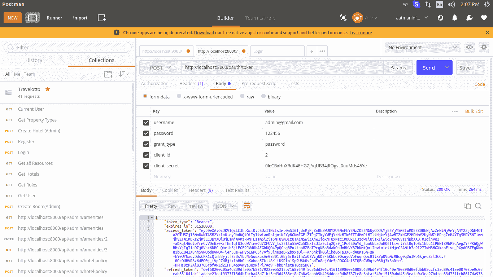
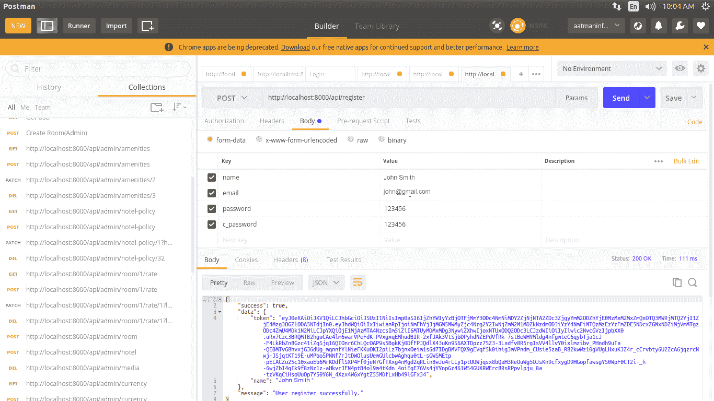
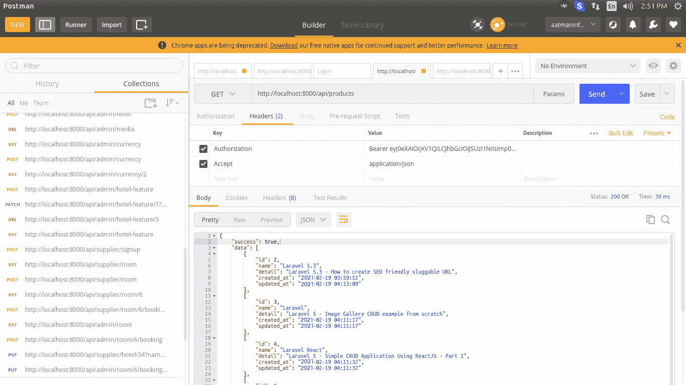
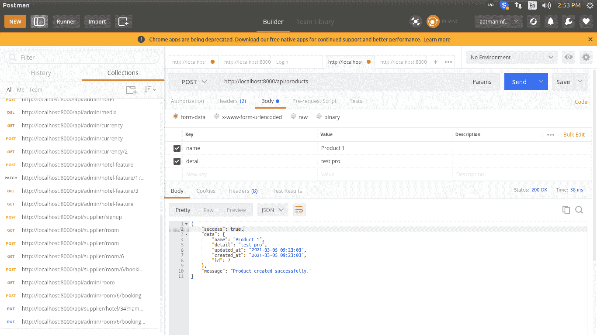
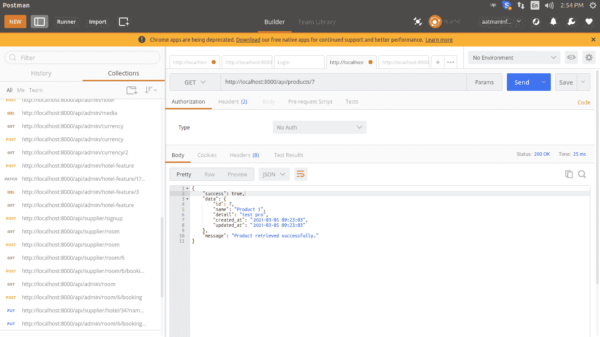

# PHP Laravel 5.6 -带 Passport 的 Rest API

> 原文:[https://www . javatpoint . com/PHP-laravel-5-6-rest-API-with-passport](https://www.javatpoint.com/php-laravel-5-6-rest-api-with-passport)

在本节中，我们将学习带有 passport 身份验证的 rest API。我们将使用 Laravel 和 PHP 来实现这一点。在我们的 Laravel 应用程序中，我们将创建 rest API。我们还将安装和实施护照进行认证。在我们的应用中，我们可以非常容易地使用它，并且非常容易理解。

流行的 [PHP](https://www.javatpoint.com/php-tutorial) 框架被称为 Laravel。Laravel 被认为是最好的框架，这就是为什么大多数开发人员使用 Laravel 为后端框架创建应用编程接口。Laravel 提供了很多功能，比如 passport、路由、安全、中间件、模型、rest API、事件等。这些特性很容易使用，我们可以让 Laravel 成为干净的代码。在这个 [Laravel](https://www.javatpoint.com/laravel) 应用中，我们将学习 Rest API 与 Passport 的集成。如果我们没有那么多关于 Laravel 的知识，这个应用程序对于设置 API 和身份验证将非常有用。为了设置 rest 应用编程接口，逐步过程描述如下:

**第一步:**

在这一步中，我们将去**安装 Laravel 应用程序**。我们将使用以下命令来获取 Laravel 5.6 应用程序的新版本。为此，我们将使用我们的 CMD 打开，然后运行如下命令:

```php

composer create-project --prefer-dist laravel/laravel blog

```

**第二步:**

这一步，我们要去**安装软件包**。这里我们将使用 Composer 包管理器来安装 passport。为此，我们将使用命令提示符，并像这样在其中运行以下代码:

```php

composer require laravel/passport

```

当上述软件包成功安装后，我们需要获得默认迁移。我们将使用我们的数据库，并通过使用这个迁移创建一个新的 passport 表。为此，我们将运行以下命令:

```php

php artisan migrate

```

之后，我们将使用以下命令安装 passport。此命令用于创建安全令牌密钥。为此，我们将运行以下命令:

```php

php artisan passport:install

```

**第三步:**

在这一步中，我们将执行**护照配置**。在这里，我们将在 auth config 文件、服务提供者和 place 模型上添加配置。为此，我们将对 User.php、AuthServiceProvider.php 和 auth.php 这三个文件进行一些更改。这些文件的更改描述如下。在 User.php 文件中，我们必须添加一类名为 HasApiTokens 的护照，如下所示:

app/user . PHP

```php
<?php

namespace App;

use Illuminate\Notifications\Notifiable;
use Laravel\Passport\HasApiTokens;
use Illuminate\Foundation\Auth\User as Authenticatable;

class User extends Authenticatable
{
    use HasApiTokens, Notifiable;

    /**
     * The attributes which are mass assigned will be used.
     *
     * @var array
     */
    protected $fillable = [
        'name', 'email', 'password',
    ];

    /**
     * It is used to define the attributes that are hidden for arrays.
     *
     * @var array
     */
    protected $hidden = [
        'password', 'remember_token',
    ];
}

```

现在我们将使用 AuthServiceProvider.php 文件，并在其中添加“Passport::routes()”如下所示:

**app/Providers/authserviceprovider . PHP**

```php
<?php

namespace App\Providers;

use Laravel\Passport\Passport;
use Illuminate\Support\Facades\Gate;
use Illuminate\Foundation\Support\Providers\AuthServiceProvider as ServiceProvider;

class AuthServiceProvider extends ServiceProvider
{
    /**
     * It is used to define application?s policy mappings.
     *
     * @var array
     */
    protected $policies = [
        'App\Model' => 'App\Policies\ModelPolicy',
    ];

    /**
     * It is used to register authorization services or any authentication.
     *
     * @return void
     */
    public function boot()
    {
        $this->registerPolicies();

        Passport::routes();
    }
}

```

现在，我们将使用 auth.php 文件，并向其中添加 api 身份验证配置，如下所示:

```php
<?php

return [
    .....
    'guards' => [
        'web' => [
            'driver' => 'session',
            'provider' => 'users',
        ],
        'api' => [
            'driver' => 'passport',
            'provider' => 'users',
        ],
    ],
    .....
]

```

**第四步:**

在这一步中，我们将进入**创建产品表和模型**。在这里，我们将使用下面的命令为 post 表创建迁移。为此，我们将首先运行以下代码:

```php

php artisan make:migration create_products_table

```

当我们成功运行上述命令时，我们将在数据库/迁移路径中看到一个新文件。现在，我们将使用迁移文件创建一个产品表，并将以下代码放入该文件:

```php
<?php

use Illuminate\Support\Facades\Schema;
use Illuminate\Database\Schema\Blueprint;
use Illuminate\Database\Migrations\Migration;

class CreateProductsTable extends Migration
{
    /**
     * It is used for the running of migration.
     *
     * @return void
     */
    public function up()
    {
        Schema::create('products', function (Blueprint $table) {
            $table->increments('id');
            $table->string('name');
            $table->text('detail');
            $table->timestamps();
        });
    }

    /**
     * It is used to perform reverse migrations.
     *
     * @return void
     */
    public function down()
    {
        Schema::dropIfExists('products');
    }
}

```

当我们成功运行上面的命令时，我们必须使用下面的命令来运行上面创建的迁移，如下所示:

```php

php artisan migrate

```

当我们成功创建“产品”表时，我们必须为产品创建一个产品模型。因此，我们将使用 app/Product.php 路径并创建一个名为 item.php 的新文件。然后我们将把下面的代码添加到这个创建的文件中，如下所示:

**app/Product.php**

```php
<?php

namespace App;

use Illuminate\Database\Eloquent\Model;

class Product extends Model
{
    /**
     * The attributes which are mass assigned will be used.
     *
     * @var array
     */
    protected $fillable = [
        'name', 'detail'
    ];
}

```

**第五步:**

在这一步中，我们将去**创建 API 路由**。我们可以通过使用 Laravel 提供的 api.php 文件轻松地编写 web 服务路线。现在，我们将使用该文件，并向其中添加一条新路由，如下所示:

**路线/api.php**

```php
<?php

/*
|--------------------------------------------------------------------------
| API Routes
|--------------------------------------------------------------------------
|
| Here, we can use our application and register API routes. Within 
| the groups, RouteServiceProvider is used to load these routes 
| that is assigned the "api" middleware group. Now we can 
| enjoy building our API!
|
*/

Route::post('register', 'API\RegisterController@register');

Route::middleware('auth:api')->group( function () {
	Route::resource('products', 'API\ProductController');
});

```

**第六步:**

在这一步中，我们将去**创建控制器**。在这里，我们将创建 RegisterController、BaseController 和 ProductController 作为三个新的控制器。现在我们必须创建一个单独的 APIs 控制器。因此，我们将使用控制器文件夹，并创建一个名为“应用编程接口”的新文件夹。现在我们将创建这些控制器。首先，我们将像这样创建基本控制器:

**app/Http/controller/API/base controller . PHP**

```php
<?php

namespace App\Http\Controllers\API;

use Illuminate\Http\Request;
use App\Http\Controllers\Controller as Controller;

class BaseController extends Controller
{
    /**
     * It is used to perform the success response method.
     *
     * @return \Illuminate\Http\Response
     */
    public function sendResponse($result, $message)
    {
    	$response = [
            'success' => true,
            'data'    => $result,
            'message' => $message,
        ];

        return response()->json($response, 200);
    }

    /**
     * It is used to return error response.
     *
     * @return \Illuminate\Http\Response
     */
    public function sendError($error, $errorMessages = [], $code = 404)
    {
    	$response = [
            'success' => false,
            'message' => $error,
        ];

        if(!empty($errorMessages)){
            $response['data'] = $errorMessages;
        }

        return response()->json($response, $code);
    }
}

```

现在我们将这样创造 ProductController.php:

**app/Http/controller/API/Productcontroller . PHP**

```php
<?php

namespace App\Http\Controllers\API;

use Illuminate\Http\Request;
use App\Http\Controllers\API\BaseController as BaseController;
use App\Product;
use Validator;

class ProductController extends BaseController
{
    /**
     * It is used to show the resource list.
     *
     * @return \Illuminate\Http\Response
     */
    public function index()
    {
        $products = Product::all();

        return $this->sendResponse($products->toArray(), 'Products retrieved successfully.');
    }

    /**
     * It uses storage to store the above-created resource.
     *
     * @param  \Illuminate\Http\Request  $request
     * @return \Illuminate\Http\Response
     */
    public function store(Request $request)
    {
        $input = $request->all();

        $validator = Validator::make($input, [
            'name' => 'required',
            'detail' => 'required'
        ]);

        if($validator->fails()){
            return $this->sendError('Validation Error.', $validator->errors());       
        }

        $product = Product::create($input);

        return $this->sendResponse($product->toArray(), 'Product created successfully.');
    }

    /**
     * It is used to show specified resources.
     *
     * @param  int  $id
     * @return \Illuminate\Http\Response
     */
    public function show($id)
    {
        $product = Product::find($id);

        if (is_null($product)) {
            return $this->sendError('Product not found.');
        }

        return $this->sendResponse($product->toArray(), 'Product retrieved successfully.');
    }

    /**
     * It uses storage to update the specified resource.
     *
     * @param  \Illuminate\Http\Request  $request
     * @param  int  $id
     * @return \Illuminate\Http\Response
     */
    public function update(Request $request, Product $product)
    {
        $input = $request->all();

        $validator = Validator::make($input, [
            'name' => 'required',
            'detail' => 'required'
        ]);

        if($validator->fails()){
            return $this->sendError('Validation Error.', $validator->errors());       
        }

        $product->name = $input['name'];
        $product->detail = $input['detail'];
        $product->save();

        return $this->sendResponse($product->toArray(), 'Product updated successfully.');
    }

    /**
     * It uses storage and removes the specified resource from it.
      *
     * @param  int  $id
     * @return \Illuminate\Http\Response
     */
    public function destroy(Product $product)
    {
        $product->delete();

        return $this->sendResponse($product->toArray(), 'Product deleted successfully.');
    }
}

```

之后，我们将像这样创建 RegisterController:

**app/Http/Controllers/API/registercontroller . PHP**

```php
<?php

namespace App\Http\Controllers\API;

use Illuminate\Http\Request;
use App\Http\Controllers\API\BaseController as BaseController;
use App\User;
use Illuminate\Support\Facades\Auth;
use Validator;

class RegisterController extends BaseController
{
    /**
     * It is used for the registration of api
     *
     * @return \Illuminate\Http\Response
     */
    public function register(Request $request)
    {
        $validator = Validator::make($request->all(), [
            'name' => 'required',
            'email' => 'required|email',
            'password' => 'required',
            'c_password' => 'required|same:password',
        ]);

        if($validator->fails()){
            return $this->sendError('Validation Error.', $validator->errors());       
        }

        $input = $request->all();
        $input['password'] = bcrypt($input['password']);
        $user = User::create($input);
        $success['token'] =  $user->createToken('MyApp')->accessToken;
        $success['name'] =  $user->name;

        return $this->sendResponse($success, 'User register successfully.');
    }
}

```

现在 passport api 和完整的 restful api 已经准备好在 Laravel 中运行。**我们将使用以下命令快速运行这段代码:**

```php

php artisan serve

```

我们应该记住下面的标题将用于详细的 api。

```php
'headers' => [
    'Accept' => 'application/json',
    'Authorization' => 'Bearer '.$accessToken,
]

```

现在我们用一个动词来描述各种路由网址。首先，我们将使用这样一个动词来描述登录路由网址:

**登录:**动词:GET，URL:http://localhost:8000/oauth/token

当我们运行上述网址时，我们将获得如下登录应用编程接口:



我们将使用这样的动词来描述注册路由网址:

**Register:** 动词:GET，URL:http://localhost:8000/API/Register

当我们运行上述网址时，我们将获得如下注册应用编程接口:



我们将使用这样的动词来描述列表路由 URL:

**列表:**动词:GET，URL:http://localhost:8000/API/products

当我们运行上述网址时，我们将获得如下列表应用编程接口:



我们将使用这样一个动词来描述创建路由网址:

**Create:** 动词:POST，URL:http://localhost:8000/API/products

当我们运行上述网址时，我们将获得如下创建应用编程接口:



我们将使用这样一个动词来描述显示路由网址:

**Show:** 动词:GET，URL:http://localhost:8000/API/products/{ id }

当我们运行上面的网址时，我们将获得如下所示的显示应用编程接口:



我们将使用如下动词来描述更新路由网址:

**更新:**动词:PUT，URL:http://localhost:8000/API/products/{ id }

当我们运行上面的网址时，我们将获得如下更新应用编程接口:


我们将使用这样一个动词来描述删除路由网址:

**Delete:** 动词:Delete，URL:http://localhost:8000/API/products/{ id }

当我们运行上面的网址时，我们会得到如下删除应用编程接口:


* * *