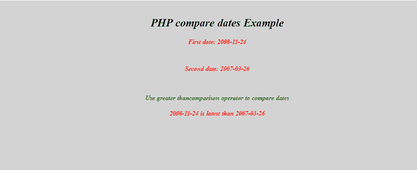
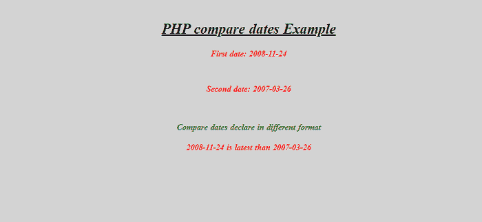
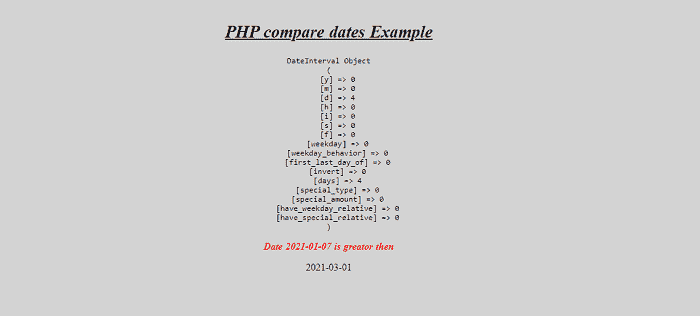

# PHP 比较日期

> 原文:[https://www.javatpoint.com/php-compare-dates](https://www.javatpoint.com/php-compare-dates)

在本文中，我们将对 PHP 中的日期进行比较。


当日期的格式相似时，在 PHP 中比较日期并不是一件乏味的工作，但是当我们以不同的格式比较日期时，这就变得困难了。然后我们将使用 DateTime 类、date_diff 方法和 strtotime 函数来比较 php 中的日期。

## PHP 中的 strtotime 函数是什么意思？

在 PHP 中，strtotime()函数将文本日期时间描述转换为 UNIX 时间戳。该函数接受一个表示日期时间描述的字符串参数。我们可以使用 date()函数以日期格式返回文本日期时间。

### 语法:

```php

strtotime ($DateTime, $time_now)

```

## PHP 中 date_diff()函数是什么意思？

php 中使用的 date_diff()函数返回两个 DateTime 对象之间的差异。

**语法:**

```php

date_diff(datetime1, datetime2, absolute)

```

**我们来举几个 PHP 中如何比较日期的例子。**

### 例 1:

```php
<! Doctype html>
<html lang="en">
<head>
  <meta charset="utf-8">
  <meta name="viewport" content="width=device-width, initial-scale=1, shrink-to-fit=no">
  <title> PHP compare dates Example </title>
  <style>
  body
  {
	margin-top: 20px;
	text-align: center;
  padding: 20px 20px 20px 20px;
  background-color: lightgrey;
  }
  h2 {
 font-style: italic;
font-family: "Playfair Display","Bookman",serif;
  color: black; 
letter-spacing: -0.005em; 
word-spacing: 1px;
font-size: 1.75em;
font-weight: bold;
  }
  h3 {
 font-style: italic;
font-family: "Playfair Display","Bookman",serif;
 color: red; 
letter-spacing: -0.005em; 
word-spacing: 1px;
font-size: 1em;
font-weight: bold;
  }
  h4 {
 font-style: italic;
font-family: "Playfair Display","Bookman",serif;
 color: green; 
letter-spacing: -0.005em; 
word-spacing: 1px;
font-size: 1em;
font-weight: bold;
  }
  </style>
  <body>
  <h2> <u> PHP compare dates Example </u> </h2>
  </body>
  </html>
  <?php
$date1 = "2008-11-24";
$date2 = "2007-03-26";
echo " <h3> First date: $date1 </h3>";
echo "<br>";
echo " <h3> Second date: $date2 </h3>";
echo "<br>";
echo  " <h4> Use greater than comparison operator to compare dates </h4>";
if ($date1 > $date2)
	echo " <h3> $date1 is latest than $date2 </h3>";
else
	echo " <h3> $date1 is older than $date2 </h3>";
?>

```

**说明:**

在上面的例子中，我们在相同格式的给定日期之间创建了一个比较。在本文中，我们使用了一个简单的比较运算符来比较 php 中的日期。

**输出:**

以下是该示例的输出:



### 例 2:

```php
<! Doctype html>
<html lang="en">
<head>
  <meta charset="utf-8">
  <meta name="viewport" content="width=device-width, initial-scale=1, shrink-to-fit=no">
  <title> PHP compare dates Example </title>
  <style>
  body
  {
	margin-top: 20px;
  text-align: center;
  padding: 20px 20px 20px 20px;
  background-color: lightgrey;
  }
  h2 {
 font-style: italic;
font-family: "Playfair Display","Bookman",serif;
  color: black; 
letter-spacing: -0.005em; 
word-spacing: 1px;
font-size: 1.75em;
font-weight: bold;
  }
  h3 {
 font-style: italic;
font-family: "Playfair Display","Bookman",serif;
 color: red; 
letter-spacing: -0.005em; 
word-spacing: 1px;
font-size: 1em;
font-weight: bold;
  }
  h4 {
 font-style: italic;
font-family: "Playfair Display","Bookman",serif;
 color: green; 
letter-spacing: -0.005em; 
word-spacing: 1px;
font-size: 1em;
font-weight: bold;
  }
  </style>
  <body>
  <h2> <u> PHP compare dates Example </u> </h2> 
  </body>
  </html>
  <?php
$date1 = "2008-11-24";
$date2 = "2007-03-26";
echo " <h3> First date: $date1 </h3>";
echo "<br>";
echo " <h3> Second date: $date2 </h3>";
echo "<br>";
echo  " <h4> Compare dates
declare in different format
 </h4>";
$Timestamp1 = strtotime($date1);
$Timestamp2 = strtotime($date2);
if ($Timestamp1 > $Timestamp2)
	echo " <h3> $date1 is latest than $date2 </h3>";
else
	echo " <h3> $date1 is older than $date2 </h3>";
?>

```

**说明:**

在上面的例子中，我们比较了两个给定日期格式不同时的给定日期。在这种情况下，使用 strtotime()函数将给定的日期转换为相应的时间戳格式，然后比较时间戳值以获得所需的结果。

**输出:**

以下是该示例的输出:



### 例 3:

```php
<! Doctype html>
<html lang="en">
<head>
  <meta charset="utf-8">
  <meta name="viewport" content="width=device-width, initial-scale=1, shrink-to-fit=no">
  <title> PHP compare dates Example </title>
  <style>
  body
  {
	margin-top: 20px;
	text-align: center;
  padding: 20px 20px 20px 20px;
  background-color: lightgrey;
  }
  h2 {
 font-style: italic;
font-family: "Playfair Display","Bookman",serif;
  color: black; 
letter-spacing: -0.005em; 
word-spacing: 1px;
font-size: 1.75em;
font-weight: bold;
  }
  h3 {
 font-style: italic;
font-family: "Playfair Display","Bookman",serif;
 color: red; 
letter-spacing: -0.005em; 
word-spacing: 1px;
font-size: 1em;
font-weight: bold;
  }
  h4 {
 font-style: italic;
font-family: "Playfair Display","Bookman",serif;
 color: green; 
letter-spacing: -0.005em; 
word-spacing: 1px;
font-size: 1em;
font-weight: bold;
  }
  </style>
  <body>
  <h2> <u> PHP compare dates Example </u> </h2> 
  </body>
  </html>
 <?php
   $date1 = new DateTime("19-02-24");
   $date2 = new DateTime("2020-03-24");
   if ($date1 > $date2) {
    echo '<h3> datetime1 greater than datetime2 </h3>';
   }
   if ($date1 < $date2) {
    echo '<h3> datetime1 lesser than datetime2 </h3>';
   }
  if ($date1 == $date2) {
    echo '<h3> datetime2 is equal than datetime1 </h3>';
   }
?>

```

**说明:**

在上面的例子中，我们在给定的日期之间创建了一个比较。在本文中，我们使用了一个 DateTime 类来比较 php 中的两个日期。

**输出:**

以下是该示例的输出:


### 例 4:

```php
<! Doctype html>
<html lang="en">
<head>
  <meta charset="utf-8">
  <meta name="viewport" content="width=device-width, initial-scale=1, shrink-to-fit=no">
  <title> PHP compare dates Example </title>
  <style>
  body
  {
	margin-top: 20px;
	text-align: center;
  padding: 20px 20px 20px 20px;
  background-color: lightgrey;
  }
  h2 {
 font-style: italic;
font-family: "Playfair Display","Bookman",serif;
  color: black; 
letter-spacing: -0.005em; 
word-spacing: 1px;
font-size: 1.75em;
font-weight: bold;
  }
  h3 {
 font-style: italic;
font-family: "Playfair Display","Bookman",serif;
 color: red; 
letter-spacing: -0.005em; 
word-spacing: 1px;
font-size: 1em;
font-weight: bold;
  }
  h4 {
 font-style: italic;
font-family: "Playfair Display","Bookman",serif;
 color: green; 
letter-spacing: -0.005em; 
word-spacing: 1px;
font-size: 1em;
font-weight: bold;
  }
  </style>
  <body>
  <h2> <u> PHP compare dates Example </u> </h2> 
  </body>
  </html>
 <?php
 $date1 =   "2021-03-01";
$date2 =   "2021-01-07";
 $d1     =   date_create("2020-01-01");
$d2     =   date_create("2020-01-05");
$diff   =   date_diff($d1,$d2);
print "<pre>";
print_r($diff);
print "</pre>";
if($diff->invert=="0"){
    echo ' <h3> Date '.$date2.' is greater then </h3>'.$date1;  
}
?>

```

**说明:**

在上面的例子中，我们在给定的日期之间创建了一个比较。在本文中，我们使用 date_diff()方法来创建比较。

**输出:**

以下是该示例的输出:



* * *