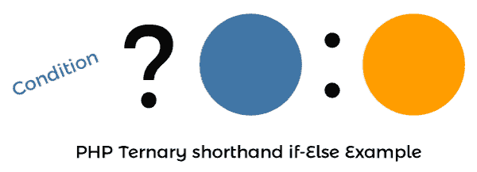
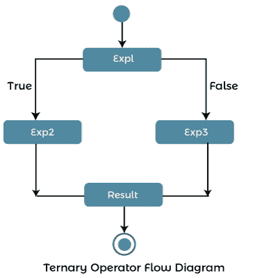

# PHP 三元运算符

> 原文：<https://www.javatpoint.com/php-ternary-operator>

在本文中，我们将借助各种示例来了解一个 PHP 三元运算符。

### 三元运算符是什么意思？

它也被称为条件运算符。三进制运算符是一个[运算符](https://www.javatpoint.com/php-operators)，用于在执行比较时减少代码长度。它是使用 if-else 和嵌套 if-else 语句的替代方法。当需要简化 if-else 语句并从复杂的程序结构中生成高效的代码时，我们可以使用三元运算符。


### 语法:



**下面是 php 中三元运算符的语法。**

```php

(Condition) ? (code1) : (code2);

```

在上面的语法中，

*   **条件语句:**是一个 PHP 表达式，为了返回一个布尔值，将对其进行求值。
*   **code1:** 这将是条件结果返回 true 时执行的语句。
*   **code2:** 这将是条件结果以假状态返回时将执行的语句。

### PHP 流程图:



### 例 1:

```php
<! Doctype html>  
<html lang="en">  
<head>  
  <meta charset="utf-8">  
  <meta name="viewport" content="width=device-width, initial-scale=1, shrink-to-fit=no">  
  <title> Ternary Operator Example in PHP </title>  
  <style>  
body {
  color: #FFFFFF;
 font-family: 'League Gothic', Impact, sans-serif;
 text-transform: uppercase;
 text-align: center;
 font-size: 1em;
 text-align: center;
 line-height: 12px;
 margin: 120px;
 background: #282537;
 background-image: -webkit-radial-gradient(top, circle cover, #3c3b52 0%, #252233 80%);
 background-image: -moz-radial-gradient(top, circle cover, #3c3b52 0%, #252233 80%);
 background-image: -o-radial-gradient(top, circle cover, #3c3b52 0%, #252233 80%);
 background-image: radial-gradient(top, circle cover, #3c3b52 0%, #252233 80%);
}
h2 {
font-family: 'Indie Flower', cursive;
font-size: 32px;
  color: #03A9F4;
  font-weight: bold;
  text-align: center;
  padding: 10px 0;
}
</style>  
  <body>  
  <h2> Ternary Operator Example in PHP </h2>   
  </body>  
  </html>  
<?php
$a = 40;
$b = $a > 45 ? 20 : 5;
print ("<h2>Value of b is: " . $b . "</h2>");
?>

```

**说明:**

在上面的例子中，我们采用了一个条件，如果条件为真，则显示 20 值，否则显示 5 值。

**输出:**

以下是该示例的输出:


### 例 2:

```php
<! Doctype html>  
<html lang="en">  
<head>  
  <meta charset="utf-8">  
  <meta name="viewport" content="width=device-width, initial-scale=1, shrink-to-fit=no">  
  <title> Ternary Operator Example in PHP </title>  
  <style>  
body {
  color: #FFFFFF;
 font-family: 'League Gothic',Impact,sans-serif;
 text-transform: uppercase;
 text-align: center;
 font-size: 1em;
 text-align: center;
 line-height: 12px;
 margin: 120px;
 background: #282537;
 background-image: -webkit-radial-gradient(top, circle cover, #3c3b52 0%, #252233 80%);
 background-image: -moz-radial-gradient(top, circle cover, #3c3b52 0%, #252233 80%);
 background-image: -o-radial-gradient(top, circle cover, #3c3b52 0%, #252233 80%);
 background-image: radial-gradient(top, circle cover, #3c3b52 0%, #252233 80%);
}
h2 {
font-family: 'Indie Flower', cursive;
font-size: 32px;
  color: #03A9F4;
  font-weight: bold;
  text-align: center;
  padding: 10px 0;
}
</style>  
  <body>  
  <h2> Ternary Operator Example in PHP </h2>   
  </body>  
  </html>  
  <?php
$result = 62;
echo ($result >= 40) ? "Passed" : " Failed";
?>

```

**说明:**

在上面的例子中，我们采用了一个条件，如果条件为真，则显示通过的消息，否则显示失败的消息。

**输出:**

以下是该示例的输出:


### 例 3:

```php
<! Doctype html>  
<html lang="en">  
<head>  
  <meta charset="utf-8">  
  <meta name="viewport" content="width=device-width, initial-scale=1, shrink-to-fit=no">  
  <title> Ternary Operator Example in PHP </title>  
  <style>  
body {
  color: #FFFFFF;
 font-family: 'League Gothic',Impact,sans-serif;
 text-transform: uppercase;
 text-align: center;
 font-size: 1em;
 text-align: center;
 line-height: 12px;
 margin: 120px;
 background: #282537;
 background-image: -webkit-radial-gradient(top, circle cover, #3c3b52 0%, #252233 80%);
 background-image: -moz-radial-gradient(top, circle cover, #3c3b52 0%, #252233 80%);
 background-image: -o-radial-gradient(top, circle cover, #3c3b52 0%, #252233 80%);
 background-image: radial-gradient(top, circle cover, #3c3b52 0%, #252233 80%);
}
h2 {
font-family: 'Indie Flower', cursive;
font-size: 32px;
  color: #03A9F4;
  font-weight: bold;
  text-align: center;
  padding: 10px 0;
}
</style>  
  <body>  
  <h2> Ternary Operator Example in PHP </h2>   
  </body>  
  </html>  
  <?php
$age = 20;
print ($age >= 18) ? "Adult" : "Not Adult";
?>

```

**说明:**

在上面的例子中，我们采用了一个条件，如果年龄更大，则显示成人消息，否则显示非成人消息。

**输出:**

以下是该示例的输出:


### 例 4:

```php
<! Doctype html>  
<html lang="en">  
<head>  
  <meta charset="utf-8">  
  <meta name="viewport" content="width=device-width, initial-scale=1, shrink-to-fit=no">  
  <title> Ternary Operator Example in PHP </title>  
  <style>  
body {
  color: #FFFFFF;
 font-family: 'League Gothic', Impact, sans-serif;
 text-transform: uppercase;
 text-align: center;
 font-size: 1em;
 text-align: center;
 line-height: 12px;
 margin: 120px;
 background: #282537;
 background-image: -webkit-radial-gradient(top, circle cover, #3c3b52 0%, #252233 80%);
 background-image: -moz-radial-gradient(top, circle cover, #3c3b52 0%, #252233 80%);
 background-image: -o-radial-gradient(top, circle cover, #3c3b52 0%, #252233 80%);
 background-image: radial-gradient(top, circle cover, #3c3b52 0%, #252233 80%);
}
h2 {
font-family: 'Indie Flower', cursive;
font-size: 32px;
  color: #03A9F4;
  font-weight: bold;
  text-align: center;
  padding: 10px 0;
}
</style>  
  <body>  
  <h2> Ternary Operator Example in PHP </h2>   
  </body>  
  </html>  
<?php
$eligible = true;
$has_credit = false;
$message = $eligible
			? ($has_credit
					? 'Eligible for credit card?
					: 'Not eligible for credit card ')
			: 'Not eligible to buy';
echo $message;
?>

```

**说明:**

在上面的示例中，我们采用了一个条件，即如果条件为真，则显示符合信用卡条件的消息，否则显示不符合信用卡条件的消息。

**输出:**

以下是该示例的输出:


* * *