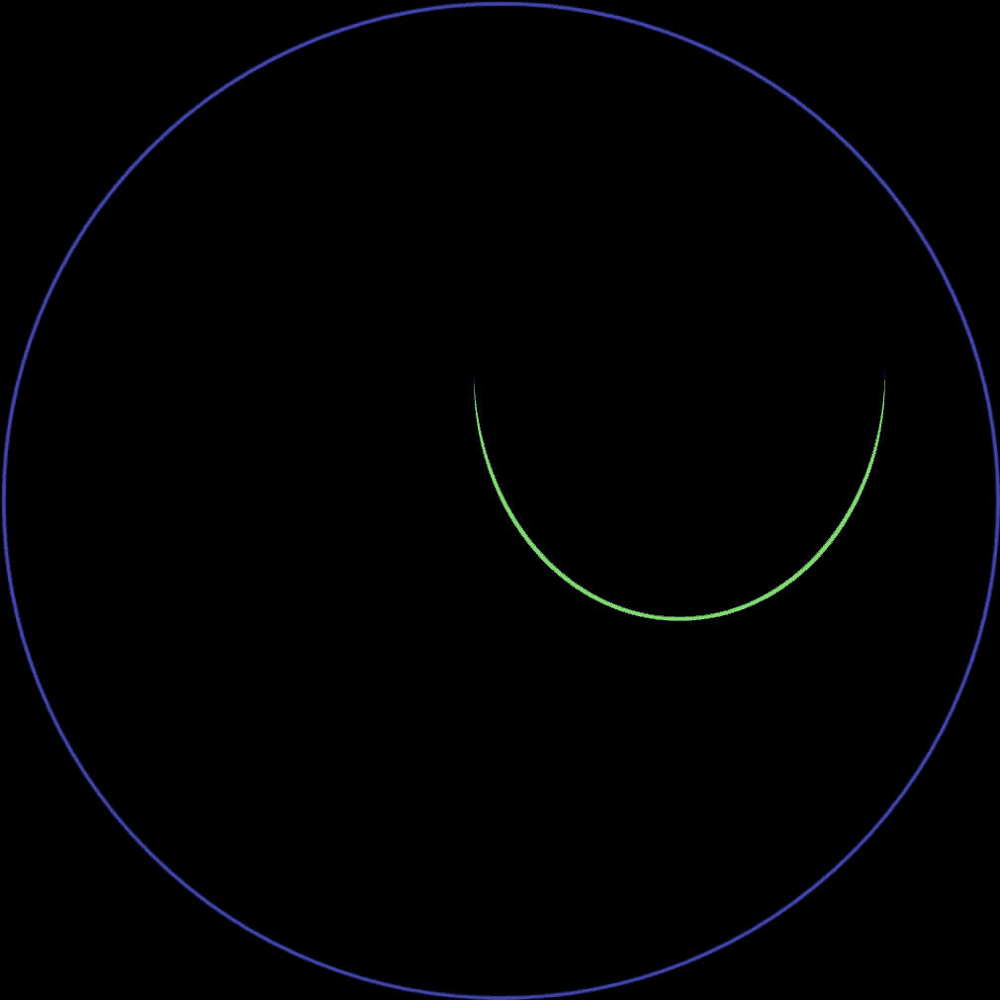
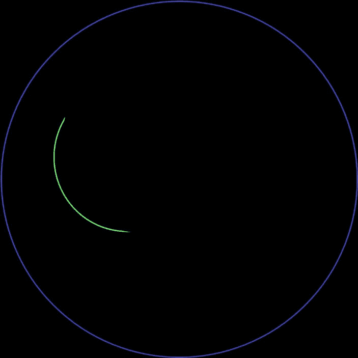
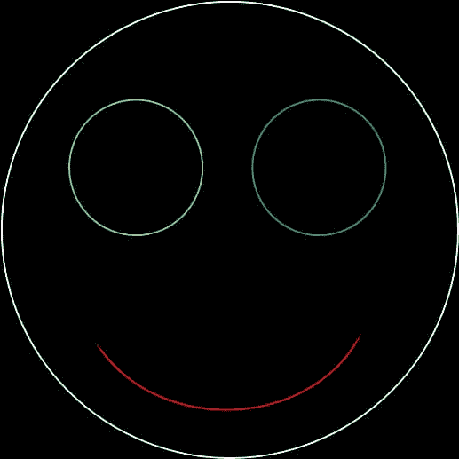
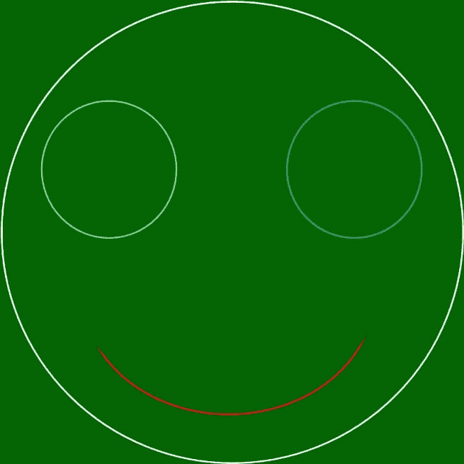
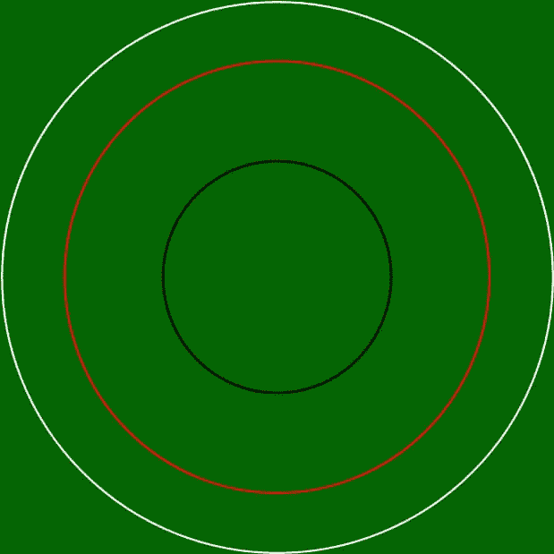

# PHP Imagearc()函数

> 原文:[https://www.javatpoint.com/php-imagearc-function](https://www.javatpoint.com/php-imagearc-function)

Imagearc()函数是另一个内置的 PHP 函数，主要用于绘制具有特定中心和给定坐标的圆弧。该函数使用 x 轴和 y 轴工作，用于设置图片绘制起点的坐标。原点坐标(0，0)在浏览窗口的左上角，从原点出发，我们可以根据自己的需要设置坐标得到结果弧。该函数返回布尔值，成功时为真，失败时为假。

**语法**

```php

bool imagearc( $image, $cx, $cy, $width, $height, $start, $end, 
$color )

```

### 因素

这个函数接受这八个参数。

| S.No | 参数 | 描述 | 可选/强制 |
| **1** | $ image | 此参数用于定义我们要显示的图像的大小。此参数由图像资源使用，如用于返回图像源的 imagecreatetruecolor()函数。 | 命令的 |
| **2** | $ cx | 此参数用于设置所需弧的 x 坐标。从原点开始 | 命令的 |
| **3** | $ cd | 此参数用于设置所需弧的 y 坐标。从原点开始 | 命令的 |
| **4** | $宽度 | 此参数用于定义将要打印的弧的宽度 | 命令的 |
| **5** | $高度 | 此参数用于定义将要打印的弧的高度 | 命令的 |
| **6** | $开始 | 此参数用于定义将要打印的弧的起始角度，单位为度 | 命令的 |
| **7** | $ end | 此参数用于定义将要打印的弧的结束角度(以度为单位)。0 位于三点钟位置，弧顺时针绘制。 | 命令的 |
| **8** | $颜色 | 此参数用于定义图像的颜色。此参数用于创建颜色标识，如 imagecolorallocate()函数 | 可选择的 |

imagearc()函数在程序成功执行时返回真，在尝试失败时返回假。

**程序 1:** PHP 程序显示 imagearc()函数的基础知识

```php
<!DOCTYPEhtml>
<html lang= " en ">
<head>
  <meta charse t= " UTF - 8 ">
  <meta http - equiv= " X - UA - Compatible " content = " IE = edge ">
  <meta name = " viewport " content = " width = device - width, initial - scale = 1 .0">
  <title>PHP </title>
</head>
<body>
 php
// to define the size of the image
$image = imagecreatetruecolor(210, 210);
// to define thecolor of the image
$image-color-1 = imagecolorallocate( $image, 110, 55, 250 );
$image-color-2 = imagecolorallocate( $image, 35, 250, 155 );
// imagearc function to display an arc inside a circle
Imagearc( $image, 110, 110, 210, 210, 0, 360, $image-color-1 );
Imagearc( $image, 135, 55, 105, 155, 25, 155, $image-color-2 );
header ( ' Content - type : image / png ');
imagepng( $image);  
imagedestroy( $image); 
?>
</body>
</html>

```

**输出**

上面的代码给出了以下输出。



在这个程序中，我们已经声明了各种变量，比如 **$image** 来定义我们需要的图像的大小， **$ image - color -1，**和 **$ image - color - 2** 来定义我们需要的弧的颜色。

我们已经使用了 **imagearc( )** 函数来声明我们想要显示为图像的弧。为了显示图像的输出，我们使用了内置的 PHP 命令**标题**和**图像 png** 在浏览器上显示。

**程序 2:** PHP 程序显示 imagearc()函数的基础知识

```php
<!DOCTYPEhtml>
<html lang= " en ">
<head>
  <meta charse t= " UTF - 8 ">
  <meta http - equiv= " X - UA - Compatible " content = " IE = edge ">
  <meta name = " viewport " content = " width = device - width, initial - scale = 1 .0">
  <title> PHP </title>
</head>
<body>
 php
// to define the size of the image
$image = imagecreatetruecolor(250, 250);
// to define thecolor of the image
$image-color-1 = imagecolorallocate( $image, 110, 55, 250 );
$image-color-2 = imagecolorallocate( $image, 35, 250, 155 );
// imagearc function to display an arc inside a circle
Imagearc( $image, 130, 101, 201, 210, 0, 360, $image-color-1 );
Imagearc( $image, 141, 51, 142, 155, 95, 155, $image-color-2 );
// output image in the browser
header ( ' Content - type : image / png ');
imagepng( $image);  
// free memory
imagedestroy( $image); 
?>
</body>
</html>

```

**输出**



在这个程序中，我们已经声明了各种变量，比如 **$image** 来定义我们需要的图像的大小， **$ image - color -1，**和 **$ image - color - 2** 来定义我们需要的弧的颜色。我们已经使用了 **imagearc( )** 函数来声明我们想要显示为图像的弧。为了显示图像的输出，我们使用了内置的 PHP 命令**标题**和 **imagepng** 在浏览器上显示。

**程序 3:** PHP 程序显示 imagearc()函数的基础知识

```php
<!DOCTYPEhtml>
<html lang= "en ">
<head>
  <meta charse t= " UTF - 8 ">
  <meta http - equiv= " X - UA - Compatible " content = " IE = edge ">
  <meta name = " viewport " content = " width = device - width, initial - scale = 1 .0">
  <title> PHP </title>
</head>
<body>
 php
// to define the size of the image
$image = imagecreatetruecolor(200, 200);
// to define thecolor of the image
$image-color-white = imagecolorallocate( $image, 255 , 255, 255 );
$image-color-red = imagecolorallocate( $image, 255, 1, 1 );
$image-color-green = imagecolorallocate( $image, 1, 255, 1 );
$image-color-blue = imagecolorallocate( $image, 1, 1 , 255 );
// imagearc function to display an arc inside a circle
// head using arc 
Imagearc( $image, 101, 101, 201, 210, 0, 360, $image-color-white );
//mouth using arc
Imagearc( $image, 101, 101, 151 , 151 , 25, 155, $image-color-red );
// eyes using arc
Imagearc( $image, 61 , 76 , 51 , 51 ,  0 , 360 , $image-color-green );
Imagearc( $image, 141 , 76 , 51 , 51 ,  0 , 360 , $image-color-blue );
// to output the image in the browser
header ( ' Content - type : image / png ');
imagepng( $image);  
// to free the stored memory
imagedestroy( $image); 
?>
</body>
</html>

```

**输出**



在这个程序中，我们已经声明了各种变量，如 **$image** 来定义我们需要的图像大小， **$ image - color -white，$ image - color - red，$ image - color - green，**和 **$ image - color - blue** 来定义我们需要的弧的颜色。我们使用了 **imagearc( )** 函数来声明我们想要显示的弧，并使用 imagearc()函数创建了一个人脸。为了显示图像的输出，我们使用了内置的 PHP 命令**标题**和 **imagepng** 在浏览器上显示。

**程序 4:** PHP 程序显示 imagearc()函数的基础知识

```php
<!DOCTYPEhtml>
<html lang= " en ">
<head>
  <meta charse t= " UTF - 8 ">
  <meta http - equiv= " X - UA - Compatible " content = " IE = edge ">
  <meta name = " viewport " content = " width = device - width, initial - scale = 1 .0">
  <title>PHP </title>
</head>
<body>
 php
// to define the size of the image
$image = imagecreatetruecolor(200, 200);
// to declare the background color of the image
$background-color = imagecolorallocate($image , 0 , 100 , 0 );
// to fill background with the selected color
Imagefill( $image , 0 , 0 , $background-color );
// to define thecolor of the image
$image-color-white = imagecolorallocate( $image, 255 , 255 , 255 );
$image-color-red = imagecolorallocate( $image, 255, 1, 1 );
$image-color-green = imagecolorallocate( $image, 1, 255, 1 );
$image-color-blue = imagecolorallocate( $image, 1 , 1 , 255 );
// imagearc function to display an arc inside a circle
// head using arc 
Imagearc( $image, 101, 101, 201, 210, 0, 360, $image-color-white );
//mouth using arc
Imagearc( $image, 101, 101, 151 , 151 , 25, 155, $image-color-red );
// eyes using arc
Imagearc( $image, 61 , 76 , 51 , 51 ,  0 , 360 , $image-color-green );
Imagearc( $image, 141 , 76 , 51 , 51 ,  0 , 360 , $image-color-blue );
// to output the image in the browser
header ( ' Content - type : image / png ');
imagepng( $image);  
// to free the stored memory
imagedestroy( $image); 
?>
</body>
</html>

```

**输出:**



在这个程序中，我们已经声明了各种变量，如 **$image** 来定义我们需要的图像的大小，我们已经声明了 **$background-color** 来分配背景颜色， **$ image - color -white，$ image - color - red，$ image - color - green** 和 **$ image - color - blue** 来定义我们需要的弧的颜色。我们使用了 **imagearc( )** 函数来声明我们想要显示的弧，并使用 imagearc()函数创建了一个人脸。为了显示图像的输出，我们使用了内置的 PHP 命令**标题**和 **imagepng** 在浏览器上显示。

**Program5:** PHP 程序显示 imagearc()函数的基础知识

```php
<!DOCTYPEhtml>
<html lang= " en ">
<head>
  <meta charse t= " UTF - 8 ">
  <meta http - equiv= " X - UA - Compatible " content = " IE = edge ">
  <meta name = " viewport " content = " width = device - width, initial - scale = 1 .0">
  <title> PHP </title>
</head>
<body>
 php
// to define the size of the image
$image = imagecreatetruecolor(200, 200);
// to declare the background color of the image
$background-color = imagecolorallocate($image , 0 , 100 , 0 );
// to fill background with the selected color
Imagefill( $image , 0 , 0 , $background-color );
// to define thecolor of the image
$image-color-white = imagecolorallocate( $image, 255 , 255 , 255 );
$image-color-red = imagecolorallocate( $image, 255, 1, 1 );
$image-color-black = imagecolorallocate( $image, 1, 1 , 1 );
// imagearc function to display an arc inside a circle
Imagearc( $image, 201, 151, 201, 210, 0, 360, $image-color-white );
Imagearc( $image, 201, 151, 151 , 151 , 0, 360, $image-color-red );
Imagearc( $image, 201, 151, 51 , 51 ,  0 , 360 , $image-color-black );
// to output the image in the browser
header ( ' Content - type : image / png ');
imagepng( $image);  
// to free the stored memory
imagedestroy( $image); 
?>
</body>
</html>

```

**输出:**



在这个程序中，我们已经声明了各种变量，如 **$image** 来定义我们需要的图像的大小，我们已经声明了 **$background-color** 来分配背景颜色， **$ image - color -white，$ image - color - red，**和 **$ image - color - black** 来定义我们需要的弧的颜色。我们使用了 **imagearc( )** 函数来声明我们想要显示的弧，并使用 image are()函数创建了一个人脸。为了显示图像的输出，我们使用了内置的 PHP 命令**标题**和 **imagepng** 在浏览器上显示。

* * *