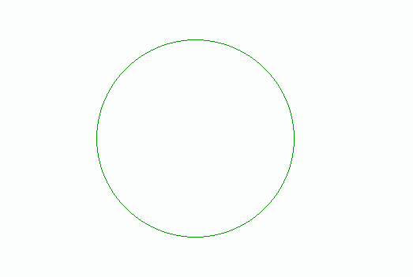

# PHP Imagecolortransparent()函数

> 原文:[https://www . javatpoint . com/PHP-imagecolor transparent-function](https://www.javatpoint.com/php-imagecolortransparent-function)

Imagecolortransparent()函数是另一个内置的 PHP 函数，主要用于将一种颜色区分为透明。它用于将图像的颜色自定义为透明。它返回新透明颜色的标识符，如果图像上没有定义透明元素或没有指定颜色，函数将返回- 1。

**语法**

```php

imagecolortransparent(  $ image , $ color )

```

### 因素

imagecolortransparent()函数接受这两个参数。

| S.No | 参数 | 描述 | 可选/强制 |
| **1** | $ image | 此参数用于定义我们要显示的图像的大小。此参数由 imagecreatetruecolor()函数等图像资源使用，该函数返回图像源。 | 命令的 |
| **6** | $颜色 | 此参数用于定义图像的颜色。此参数用于创建一个颜色标识，如 imagecolorallocate()函数。 | 命令的 |

函数的作用是:在程序成功执行后，返回新的透明颜色的标识符。如果图像的颜色未指定或不包含任何透明颜色，则在尝试失败时将返回- 1。

### 例子

下面是多个使用 imagecolortransparent()函数的示例。

**程序 1:** PHP 程序显示基本使用 **imagecolortransparent( )** 功能。

```php
<!DOCTYPEhtml>
<html lang= " en ">
<head>
  <meta charse t= " UTF - 8 ">
  <meta http - equiv= " X - UA - Compatible " content = " IE = edge ">
  <meta name = " viewport " content = " width = device - width, initial - scale = 1 .0">
  <title> PHP </title>
</head>
<body>
 php
// to define the size of the image
$image = imagecreate(100, 100);
// to define the green color in the image
$background-color =imagecolorallocate( $image, 0, 155, 0 );
// to define a blackcolor in the image
$background-color-2 = imagecolorallocate( $image, 0, 0, 0 );
//to draw a rectangle using the green color
Imagefilledrectangle($image , 55 , 55 , 455 , 310 , $background-color);
// to display the image on the browser
header ( ' Content - type : image / png ');
imagepng( $image);  
//to release the stored memory
imagedestroy($image);
?>
</body>
</html>

```

**输出**


在这个程序中，我们已经声明了各种变量，如 **$ image** 来定义我们需要的图像的大小， **$background color** 来定义我们需要的背景， **$background - color - 2** 来定义我们需要的其他背景颜色。我们使用**imagefiledrectangle()**函数创建了一个绿色矩形。为了显示图像的输出，我们使用了内置的 PHP 命令**标题**和 **imagepng** 在浏览器上显示。

**程序二:** PHP 程序显示基本使用 **imagecolortransparent( )** 功能。

```php
<!DOCTYPEhtml>
<html lang= " en ">
<head>
  <meta charse t= " UTF - 8 ">
  <meta http - equiv= " X - UA - Compatible " content = " IE = edge ">
  <meta name = " viewport " content = " width = device - width, initial - scale = 1 .0">
  <title> PHP </title>
</head>
<body>
 php
// to define the size of the image
$image = imagecreate(100, 100);
// to define the blue color in the image
$background-color = imagecolorallocate( $image , 0 , 0 , 250 );
// to define a black color in the image
$background-color-2 = imagecolorallocate( $image, 0, 0, 0 );
//to make the black background color  transparent
Imagecolortransparent( $image , $background-color-2);
//to draw a rectangle using the green color
Imagefilledrectangle($image , 55 , 55 , 455 , 310 , $background-color);
// to display the image on the browser
header ( ' Content - type : image / png ');
imagepng( $image);  
//to release the stored memory
imagedestroy($image);
?>
</body>
</html>

```

**输出**


在这个程序中，我们已经声明了各种变量，如 **$ image** 来定义我们需要的图像的大小， **$background color** 来定义我们需要的背景， **$background - color - 2** 来定义我们需要的其他背景颜色。并且我们已经使用了 **Imagecolortransparent( )** 函数来使黑色背景透明，最后我们使用了**图像填充矩形()**函数来创建蓝色矩形。为了显示图像的输出，我们使用了内置的 PHP 命令**标题**和 **imagepng** 在浏览器上显示。

**程序 3:** PHP 程序显示基本使用 **imagecolortransparent( )** 功能。

```php
<!DOCTYPEhtml>
<html lang= " en ">
<head>
  <meta charse t= " UTF - 8 ">
  <meta http - equiv= " X - UA - Compatible " content = " IE = edge ">
  <meta name = " viewport " content = " width = device - width, initial - scale = 1 .0">
  <title> PHP </title>
</head>
<body>
 php
// to define the size of the image
$image = imagecreate(100, 100);
// to define the blue color in the image
$background-color = imagecolorallocate( $image , 250 , 0 , 0 );
// to define a black color in the image
$background-colro-2 = imagecolorallocate( $image, 0, 0, 0 );
//to make the black background color  transparent
Imagecolortransparent( $image , $background-color-2);
//to draw a rectangle using the green color
Imagerectangle($image , 55 , 55 , 455 , 310 , $background-color);
// to display the image on the browser
header ( ' Content - type : image / png ');
imagepng( $image);  
//to release the stored memory
imagedestroy($image);
?>
</body>
</html>

```

**输出**


在这个程序中，我们已经声明了各种变量，如 **$ image** 来定义我们需要的图像的大小， **$background color** 来定义我们需要的背景， **$background - color - 2** 来定义我们需要的其他背景颜色。并且我们使用了**imagecolortacoustic()**函数来使黑色背景透明，最后我们使用了 **Imagerectangle ( )** 函数来创建一个红色的空心矩形。为了显示图像的输出，我们使用了内置的 PHP 命令**标题**和 **imagepng** 在浏览器上显示。

**程序 4:** PHP 程序显示基本使用 **imagecolortransparent( )** 功能。

```php
<!DOCTYPEhtml>
<html lang= " en ">
<head>
  <meta charse t= " UTF - 8 ">
  <meta http - equiv= " X - UA - Compatible " content = " IE = edge ">
  <meta name = " viewport " content = " width = device - width, initial - scale = 1 .0">
  <title> PHP </title>
</head>
<body>
 php
// to define the size of the image
$image = imagecreate(100, 100);
// to define the green color in the image
$background-color = imagecolorallocate( $image, 0, 155, 0 );
// to define a black color in the image
$background-colro-2 = imagecolorallocate( $image, 0, 0, 0 );
//to make the black background color  transparent
Imagecolortransparent( $image , $background-color-2);
//to draw a circle using the green color
Imageellipse($image , 255 , 210 , 255 , 255 , $background-color);
// to display the image on the browser
header ( ' Content - type : image / png ');
imagepng( $image);  
//to release the stored memory
imagedestroy($image);
?>
</body>
</html>

```

**输出**



在这个程序中，我们已经声明了各种变量，如 **$ image** 来定义我们需要的图像的大小， **$background color** 来定义我们需要的背景， **$background - color - 2** 来定义我们需要的其他背景颜色。为了显示图像的输出，我们使用了一个内置的 PHP 命令头和 imagepng 来显示在浏览器上。并且我们使用了 **Imagecolortransparent( )** 函数来使黑色背景透明，最后我们使用了 Image **椭圆()**函数来创建一个空心的绿色圆。

* * *