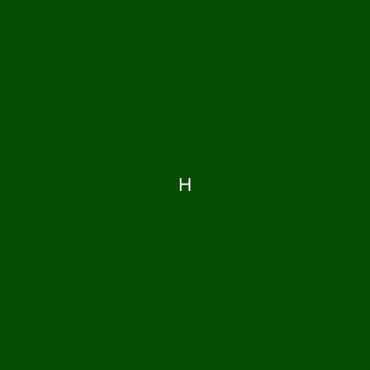

# PHP Imagechar()函数

> 原文:[https://www.javatpoint.com/php-imagechar-function](https://www.javatpoint.com/php-imagechar-function)

Imagechar()函数是另一个内置的 PHP 函数，主要用于绘制水平字符。该函数使用 x 轴和 y 轴工作，用于设置图片绘制起点的坐标。原点坐标(0，0)位于浏览窗口的左上角。我们可以根据需要从原点相应地设置坐标，得到最终的图片。

**语法**

```php

bool imagechar( $image, $font, $x, $y, $c, $color )

```

| S.No | 参数 | 描述 | 可选/强制 |
| **1** | $ image | 此参数用于定义我们要显示的图像的大小。此参数由 imagecreatetruecolor()函数等图像资源使用，该函数返回图像源。 | 命令的 |
| **2** | $字体 | 此参数用于定义我们要显示的字符的字体大小。它用作数字 1、2、3。。。数字越高，字体越大，反之亦然。 | 可选择的 |
| **3** | $ x | 此参数用于设置所需图像的 x 坐标。从原点开始 | 命令的 |
| **4** | $ y | 该参数用于设置所需图像的 y 坐标。从原点开始 | 命令的 |
| **5** | $ c | 该参数用于定义将要打印的字符 | 命令的 |
| **6** | $颜色 | 此参数用于定义图像的颜色。此参数用于创建颜色标识，如 imagecolorallocate()函数 | 可选择的 |

image char()函数在程序成功执行时返回真，在尝试失败时返回假。

### imagechar()函数的示例

**例 1:** PHP 程序显示 **imagechar( )** 功能的基本用法

```php
<!DOCTYPEhtml>
<html lang= " en ">
<head>
  <meta charse t= " UTF - 8 ">
  <meta http ? equiv= " X - UA - Compatible " content = " IE = edge ">
  <meta name = " viewport " content = " width = device - width, initial - scale = 1 .0">
  <title> PHP </title>
</head>
<body>
<? php
// to define the size of the image
$image = imagecreate(100, 100);
// to define the string we want to display
$string = 'PHP';
// to define the background color of the image
$background-color = imagecolorallocate($image, 255, 255, 255);
// to define the text color of the image
$text-color = imagecolorallocate($image, 0, 0, 0);
// imagechar function to display a black P on top right corner
Imagechar($image, 1, 0, 0, $string, $text-color);
header('Content - type: image/png');
imagepng($image);  
?>
</body>
</html>

```

**输出**

上面的 PHP 代码给出了以下输出:


在这个程序中，我们已经声明了各种变量，比如 **$image** 来定义我们需要的图像的大小，**$底色**来定义我们需要的背景颜色， **$text color** 来定义我们需要的文本颜色。我们已经使用了**字符串()**函数来声明我们想要显示为图像的字符串。为了显示图像的输出，我们使用了内置的 PHP 命令**标题**和 **imagepng** 在浏览器上显示。

**例 2:** PHP 程序显示使用 **imagechar( )** 功能

```php
<!DOCTYPEhtml>
<html lang= " en ">
<head>
  <meta charse t= " UTF - 8 ">
  <meta http - equiv= " X - UA - Compatible " content = " IE = edge ">
  <meta name = " viewport " content = " width = device - width, initial - scale = 1 .0">
  <title> PHP </title>
</head>
<body>
<? Php
   // to define the size of the image
$image=imagecreate(400,300);
// to define the string we want to display
  $imagestring='PLAY';
// to define the background color of the image
   $background-color=imagecolorallocate($img,0, 152, 0);
// to define the text color of the image
   $text-color=imagecolorallocate($image,255,255,255);
// imagechar function to display a whote P on green background
   imagechar($image,80,100,90, $imagestring, $text-color);
   header('Content-type: image/png');
   imagepng($image);
?>
</body>
</html>

```

**输出**

上面的代码给出了以下输出。


在这个程序中，我们已经声明了各种变量，比如 **$image** 来定义我们需要的图像的大小，**$底色**来定义我们需要的背景颜色， **$text color** 来定义我们需要的文本颜色。我们使用了**图像字符串()**函数来声明我们想要显示为图像的字符串。为了显示图像的输出，我们使用了内置的 PHP 命令**标题**和 **imagepng** 在浏览器上显示。

**例 3:** PHP 程序显示使用 **imagechar( )** 功能

```php
<!DOCTYPEhtml>
<html lang= " en ">
<head>
  <meta charse t= " UTF - 8 ">
  <meta http ? equiv= " X - UA - Compatible " content = " IE = edge ">
  <meta name = " viewport " content = " width = device - width, initial - scale = 1 .0">
  <title> PHP </title>
</head>
<body>
<? Php
   // to define the size of the image
$image= imagecreate(400, 300);
// to define the string we want to display
$imagestring= 'HELLO WORLD'; 
// to define the background color of the image
$background-color= imagecolorallocate($image, 0, 151, 0); 
// to define the text color of the image
$text-color= imagecolorallocate($image, 255, 255, 255); 
// imagechar function to display a white H in center
imagechar($image, 5, 190, 150, $imagestring, $text-color);
header('Content-type: image/png');
imagepng($image);
?>
</body>
</html>

```

**输出**

上面的 PHP 代码给出了以下输出。



在这个程序中，我们已经声明了各种变量，比如 **$image** 来定义我们需要的图像的大小，**$底色**来定义我们需要的背景颜色， **$text color** 来定义我们需要的文本颜色。我们使用了**图像字符串()**函数来声明我们想要显示为图像的字符串。为了显示图像的输出，我们使用了内置的 PHP 命令**标题**和 **imagepng** 在浏览器上显示。

**例 4:** PHP 程序显示使用 **imagechar( )** 功能

```php
<!DOCTYPEhtml>
<html lang= " en ">
<head>
  <meta charse t= " UTF - 8 ">
  <meta http - equiv= " X - UA - Compatible " content = " IE = edge ">
  <meta name = " viewport " content = " width = device - width, initial - scale = 1 .0">
  <title> PHP </title>
</head>
<body>
<? Php
   // to define the size of the image
$image= imagecreate(400, 300);
  // to define the string we want to display
$imagestring= " HELLO WORLD"; 
// to find the length of the string
$len= strlen($imagestring);  
// to define the background color of the image
$background-color= imagecolorallocate($image, 0, 153, 0); 
// to define the text color of the image
$text-color= imagecolorallocate($image, 255, 255, 255);
      // Prints all character of string using loop
for($i= 0; $i< $len; $i++)
  // imagechar function with loop to display all the letters of word HELLO WORLD in center
    imagechar($image, 6, 190 + 10 * $i, 150, $imagestring[$i], $text-color);
header('Content-type: image/png');
imagepng($image);
?>
</body>
</html>

```

**输出**

这段代码给出了以下输出。


在这个程序中，我们已经声明了各种变量，比如 **$image** 来定义我们需要的图像大小， **$background color** 来定义我们需要的背景颜色，$text color 来定义我们需要的文本颜色。我们使用了带有 for 循环的**图像字符串()**函数来声明我们想要显示为图像的完整字符串。为了显示图像的输出，我们使用了一个内置的 PHP 命令**头**和 **imagepng** 在浏览器上显示。

* * *