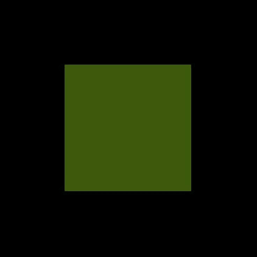
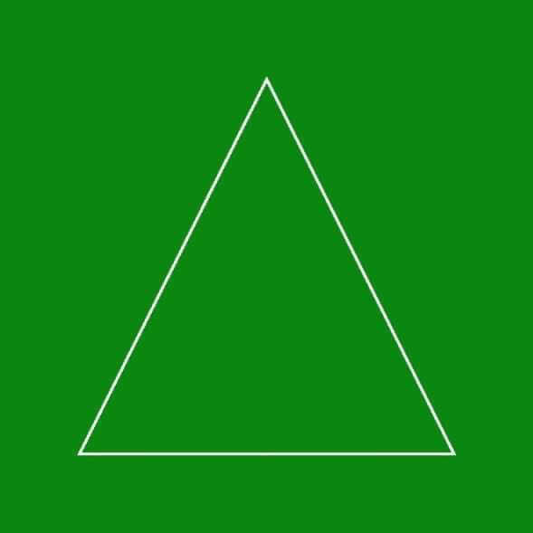

# 函数的作用是

> 原文：<https://www.javatpoint.com/php-imagecolorallocate-function>

Imagecolorallocate()函数是另一个内置的 PHP 函数，主要用于为图像实现一种新的颜色。它以 RGB 格式返回图像的颜色(红色绿色蓝色)

### 句法

```php

imagecolorallocate(  $ image , $ red , $ green , $ blue )

```

**参数:**该功能接受四个参数。

| S.No | 参数 | 描述 | 可选/强制 |
| one | $ image | 此参数用于定义我们要显示的图像的大小。此参数由 imagecreatetruecolor()函数或 imagecreate()函数等图像资源使用，这些函数返回图像源。 | 命令的 |
| Two | $红色 | 此参数用于定义图像的红色分量的值 | 命令的 |
| three | $绿色 | 此参数用于定义图像绿色分量的值 | 命令的 |
| four | 蓝色美元 | 此参数用于定义图像蓝色分量的值。 | 命令的 |

函数的作用是:在程序成功执行后，返回新颜色的标识符。如果图像的颜色未指定或不包含任何颜色，它将在尝试失败时返回 false。

**程序 1:** PHP 程序显示基本使用**imagecolorrallocate()**功能

```php
<!DOCTYPE html>
<html lang="en">
<head>
  <meta charset="UTF ? 8">
  <meta http ? equiv="X ? UA ? Compatible" content="IE=edge">
  <meta name="viewport" content="width=device-width, initial ? scale=1.0">
  <title>PHP</title>
</head>
<body>
<?php

// to define the size of the image
$image= imagecreatetruecolor (400, 200);

// to define the background color of the image
$background-color= imagecolorallocate($image, 0, 150, 2);

// to fill the selected color in the background
Imagefill ( $ image , 0 , 0 , $ background-color ) ; 

Header("Content ? Type: image/png");

Imagepng($image);
Imagedestroy($image);

?>
</body>
</html>

```

**输出**

上面的代码给出了以下输出。


在这个程序中，我们已经声明了各种变量，如 **$ image** 来定义我们需要的图像大小**$背景颜色**来定义我们需要的背景颜色。我们已经使用了**图像填充()**功能来设置图像背景的声明颜色。为了显示图像的输出，我们使用了一个内置的 PHP 命令**头**和 **imagepng** 在浏览器上显示。

**程序 2:** PHP 程序显示 **imagecolorallocate ( )** 与 **imagestring ( )** 功能的基本使用

```php
<!DOCTYPE html>
<html lang="en">
<head>
  <meta charset="UTF ? 8">
  <meta http ? equiv="X ? UA ? Compatible" content="IE=edge">
  <meta name="viewport" content="width=device-width, initial ? scale=1.0">
  <title>PHP</title>
</head>
<body>
<?php

// to define the size of the image
$image= imagecreatetruecolor (400, 200);

// to define the background color of the image
$background-color= imagecolorallocate($image, 0, 150, 2);

// to define the text color of the image
$text-color= imagecolorallocate($image, 255, 255, 255);

// function which will define the character to be displayed on the screen
Imagestring($image, 5, 180, 100,  "GOOD MORNING EVERYONE ", $text-color);
Imagestring($image, 3, 160, 120,  "HELLO WORLD ", $text-color);

Header("Content ? Type: image/png");

Imagepng($image);
Imagedestroy($image);

?>
</body>
</html>

```

**输出**

上面的程序给出了这个输出。


在这个程序中，我们已经声明了各种变量，比如 **$ image** 来定义我们需要的图像大小**，$background color** 来定义我们需要的背景颜色， **$text color** 来定义我们需要的文本颜色。我们使用了**图像字符串()**函数来声明我们想要显示为图像的字符串。为了显示图像的输出，我们使用了内置的 PHP 命令**标题**和 **imagepng** 在浏览器上显示。

**程序 3:** PHP 程序显示 **imagecolorallocate ( )** 与**imagefilredrectorgel()**功能的基本使用

```php
<!DOCTYPE html>
<html lang = " en ">
<head>
  <meta charse t= " UTF ? 8 ">
  <meta http ? equiv = " X ? UA ? Compatible " content = " IE = edge ">
  <meta name = " viewport " content = " width = device - width, initial ? scale = 1 .0">
  <title> PHP </title>
</head>
<body>
<? php

// to define the size of the image
$image = imagecreate(100, 100);

// to define the green color in the image
$background-color = imagecolorallocate ( $image, 0, 155, 0 );

// to define a black color in the image
$background-color-2 = imagecolorallocate ( $image, 0, 0, 0 );

//to draw a rectangle using the green color
Imagefilledrectangle($image , 55 , 55 , 455 , 310 , $background-color);

// to display the image on the browser
header ( ' Content ? type : image / png ');
imagepng ( $image);  

//to release the stored memory
imagedestroy($image);
?>
</body>
</html>

```

**输出**



在这个程序中，我们已经声明了各种变量，比如 **$ image** 来定义我们需要的图像的大小**，$background color** 来定义我们需要的背景， **$background - color - 2** 来定义我们需要的背景的其他颜色。我们使用了**imagefiledrectangle()**函数来创建一个绿色矩形。为了显示图像的输出，我们使用了内置的 PHP 命令**标题**和 **imagepng** 在浏览器上显示。

**程序 4:** PHP 程序显示使用**imagecolorreable()**函数绘制多边形使用 **imagecreatetruecolor ( )** 函数

```php
<!DOCTYPE html>
<html lang="en">
<head>
  <meta charset="UTF ? 8">
  <meta http ? equiv="X ? UA ? Compatible" content="IE=edge">
  <meta name="viewport" content="width=device-width, initial ? scale=1.0">
  <title>PHP</title>
</head>
<body>
<?php

// to define the size of the image
$image = imagecreatetruecolor (400, 200);

// to define the vertices of the polygon we need to define
$values = array(
            51 ,  51,  // Point 1 (x, y)
            51 , 251 ,  // Point 2 (x, y)
            251 , 51 ,  // Point 3 (x, y)
            251 ,  251 // Point 4 (x, y)
        );
// to define the background color of the image
$background-color = imagecolorallocate($image, 151 ,210,181 );

Imagefill( $image , 0 , 0 , $background-color);

// to define the text color of the polygon
$text-color = imagecolorallocate($image, 255, 255, 255);

// polygon
imagepolygon( $image , $values , 4 , $text-color);

header('Content ? type: image/png');

imagepng($image);
?>
</body>
</html>

```

**输出**


在这个程序中，我们已经声明了各种变量，比如 **$ image** 定义我们需要的图像大小**，$background color** 定义我们需要的背景颜色， **$text color** 定义我们需要的文本颜色，一个数组 **$values** 设置我们需要声明的多边形的坐标， 并且我们已经使用了**图像多边形()**功能来显示我们想要显示为图像的多边形，来显示图像的输出我们已经使用了一个内置的 PHP 命令**表头**和 **imagepng** 来显示在浏览器上。

**程序 4:** PHP 程序显示使用**imagecolorable()**函数绘制多边形。

```php
<!DOCTYPE html>
<html lang="en">
<head>
  <meta charset="UTF ? 8">
  <meta http ? equiv="X ? UA ? Compatible" content="IE=edge">
  <meta name="viewport" content="width=device-width, initial ? scale=1.0">
  <title>PHP</title>
</head>
<body>
<?php

// to define the size of the image
$image = imagecreate(400, 200);     

// to define the vertices of the polygon we need to define
$values = array(
            151 ,  51,  // Point 1 (x, y)
            51 , 251 ,  // Point 2 (x, y)
            251 , 251 ,  // Point 3 (x, y)
                   );
// to define the background color of the image
$background-color = imagecolorallocate($image, 0 ,150 ,0 );

Imagefill( $image , 0 , 0 , $background-color);

// to define the text color of the polygon
$text-color = imagecolorallocate($image, 255, 255, 255);

// polygon
imagepolygon( $image , $values , 3 , $text-color);

header('Content ? type: image/png');

imagepng($image);
?>
</body>
</html>

```

**输出**



在这个程序中，我们已经声明了各种变量，比如 **$ image** 定义我们需要的图像大小**，$background color** 定义我们需要的背景颜色， **$text color** 定义我们需要的文本颜色，一个数组 **$values** 设置我们需要声明的多边形的坐标， 并且我们已经使用了**图像多边形()**功能来显示我们想要显示为图像的多边形，来显示图像的输出我们已经使用了一个内置的 PHP 命令**表头**和 **imagepng** 来显示在浏览器上。

* * *