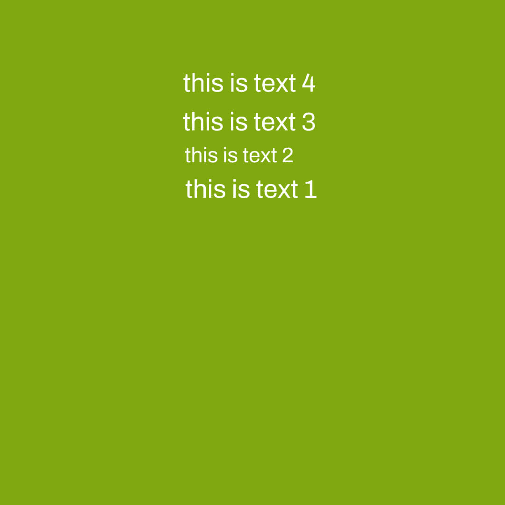
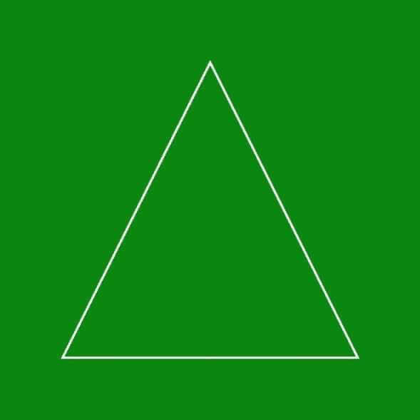

# PHP 图像创建真彩色( )函数

> 原文：<https://www.javatpoint.com/php-image-createtruecolor-function>

Image createtruecolor()函数是另一个内置的 PHP 函数，主要用于创建新的真彩色图像。该函数返回特定大小的给定图像。我们需要定义所需图像的宽度和高度。除了 image createtruecolor()函数，我们还可以使用其他创造性的函数，如 image create()，这是另一种选择，因为它将返回不同的图像质量。

**语法**

```php

Image create( $ width , $ height )

```

| S.No | 参数 | 描述 | 可选/强制 |
| one | $宽度 | 此参数用于定义我们要显示的图像宽度。 | 命令的 |
| Two | $高度 | 此参数用于定义我们要显示的图像的高度 | 命令的 |

imagecreatetruecolor()函数在程序成功执行时返回图像的资源标识符，在尝试失败时返回 FALSE。

**程序 1:** PHP 程序显示基本使用 **imagecreatetruecolor ( )** 功能

```php
<!DOCTYPE html>
<html lang="en">
<head>
  <meta charset="UTF ? 8">
  <meta http ? equiv="X ? UA ? Compatible" content="IE=edge">
  <meta name="viewport" content="width=device-width, initial ? scale=1.0">
  <title>PHP</title>
</head>
<body>
<?php

// to define the size of the image
$image= imagecreatetruecolor(400, 200);

// to define the background color of the image
$background-color= imagecolorallocate($image, 0, 150, 2);

// to define the text color of the image
$text-color= imagecolorallocate($image, 255, 255, 255);

// function which will define the character to be displayed on the screen
Imagestring($image, 5, 180, 100,  "GOOD MORNING EVERYONE", $text-color);
Imagestring($image, 3, 160, 120,  "HELLO WORLD", $text-color);

Header("Content ? Type: image/png");

Imagepng($image);
Imagedestroy($image);

?>
</body>
</html>

```

**输出**


在这个程序中，我们已经声明了各种变量，比如 **$image** 来定义我们需要的图像大小**，$background color** 来定义我们需要的背景颜色， **$text color** 来定义我们需要的文本颜色。我们使用了**图像字符串()**函数来声明我们想要显示为图像的字符串。为了显示图像的输出，我们使用了内置的 PHP 命令**标题**和 **imagepng** 在浏览器上显示。

**程序 2:** PHP 程序显示使用 **imagecreatetruecolor ( )** 功能

```php
<!DOCTYPE html>
<html lang="en">
<head>
  <meta charset="UTF ? 8">
  <meta http ? equiv="X ? UA ? Compatible" content="IE=edge">
  <meta name="viewport" content="width=device-width, initial ? scale=1.0">
  <title>PHP</title>
</head>
<body>
<?Php
// to define the size of the image
   $image= imagecreatetruecolor( 400,200);

// to define the background color of the image
   $background-color = imagecolorallocate($image,0, 155, 2);

// to define the text color of the image
   $text-color = imagecolorallocate($image,255, 255, 255);

// These function will define the character to be displayed on the screen
   Imagestring($image,13,151,121,"this is text 1", $text-color);
   Imagestring($image,4,151,101,"this is text 2", $text-color);
   Imagestring($image,10,151,81," this is text 3", $text-color);
   Imagestring($image,13,151,61," this is text  4", $text-color);

   Header("Content ? Type: image/png");
   Imagepng($image);
   Imagedestroy($image);
?>
</body>
</html>

```

**输出**



在这个程序中，我们已经声明了各种变量，比如 **$image** 来定义我们需要的图像大小**，$background color** 来定义我们需要的背景颜色， **$text color** 来定义我们需要的文本颜色。我们使用了**图像字符串()**函数来声明我们想要显示为图像的字符串。为了显示图像的输出，我们使用了内置的 PHP 命令**标题**和 **imagepng** 在浏览器上显示。

**程序 3:** PHP 程序显示使用 **imagecreatetruecolor ( )** 函数绘制多边形

```php
<!DOCTYPE html>
<html lang="en">
<head>
  <meta charset="UTF ? 8">
  <meta http ? equiv="X ? UA ? Compatible" content="IE=edge">
  <meta name="viewport" content="width=device-width, initial ? scale=1.0">
  <title>PHP</title>
</head>
<body>
<?php

// to define the size of the image
$image = imagecreatetruecolor(400, 200);

// to define the vertices of the polygon we need to define
$values = array(
            51 ,  51,  // Point 1 (x, y)
            51 , 251 ,  // Point 2 (x, y)
            251 , 51 ,  // Point 3 (x, y)
            251 ,  251 // Point 4 (x, y)
        );
// to define the background color of the image
$background-color = imagecolorallocate($image, 151,210,181 );

Imagefill( $image, 0, 0, $background-color);

// to define the text color of the polygon
$text-color = imagecolorallocate($image, 255, 255, 255);

// polygon
imagepolygon($image, $values, 4, $text-color);

header('Content ? type: image/png');

imagepng($image);
?>
</body>
</html>

```

**输出**


在这个程序中，我们已经声明了各种变量，比如 **$image** 定义我们需要的图像大小**，$background color** 定义我们需要的背景颜色， **$text color** 定义我们需要的文本颜色，一个数组 **$values** 设置我们需要声明的多边形的坐标， 并且我们已经使用了**图像多边形()**功能来显示我们想要显示为图像的多边形，来显示图像的输出我们已经使用了一个内置的 PHP 命令**表头**和 **imagepng** 来显示在浏览器上。

**程序 4:** PHP 程序显示使用 **imagecreatetruecolor ( )** 函数绘制多边形

```php
<!DOCTYPE html>
<html lang="en">
<head>
  <meta charset="UTF ? 8">
  <meta http ? equiv="X ? UA ? Compatible" content="IE=edge">
  <meta name="viewport" content="width=device-width, initial ? scale=1.0">
  <title>PHP</title>
</head>
<body>
<?php

// to define the size of the image
$image = imagecreatetruecolor (400, 200);     

// to define the vertices of the polygon we need to define
$values = array(
            151 ,  51,  // Point 1 (x, y)
            51 , 251 ,  // Point 2 (x, y)
            251 , 251 ,  // Point 3 (x, y)
                   );
// to define the background color of the image
$background-color = imagecolorallocate($image, 0,150,0);

Imagefill( $image , 0 , 0 , $background-color);

// to define the text color of the polygon
$text-color = imagecolorallocate($image, 255, 255, 255);

// polygon
imagepolygon( $image , $values , 3 , $text-color);

header('Content ? type: image/png');

imagepng($image);
?>
</body>
</html>

```

**输出**



在这个程序中，我们已经声明了各种变量，比如 **$image** 定义我们需要的图像大小**，$background color** 定义我们需要的背景颜色， **$text color** 定义我们需要的文本颜色，一个数组 **$values** 设置我们需要声明的多边形的坐标， 并且我们已经使用了**图像多边形()**功能来显示我们想要显示为图像的多边形，来显示图像的输出我们已经使用了一个内置的 PHP 命令**表头**和 **imagepng** 来显示在浏览器上。

* * *