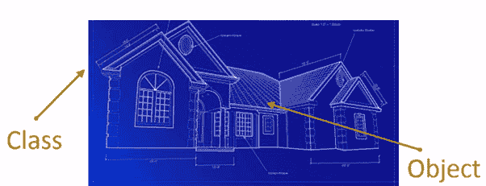
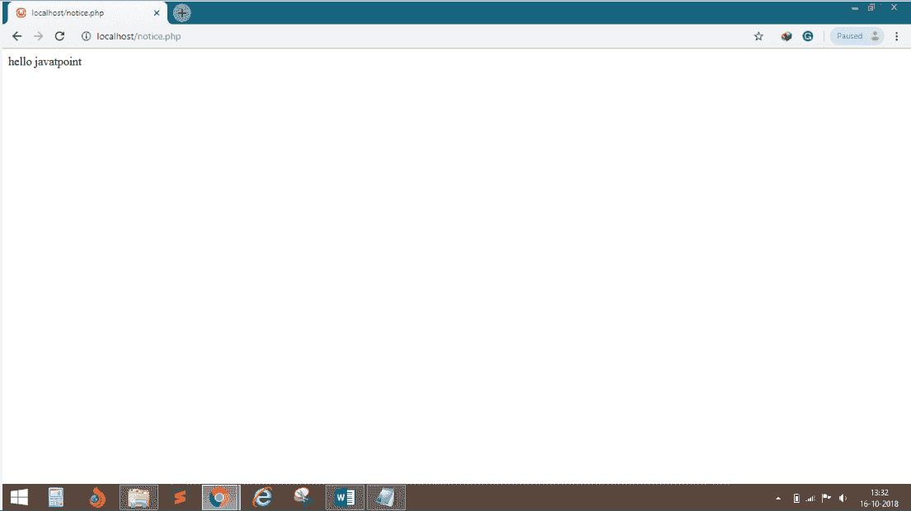
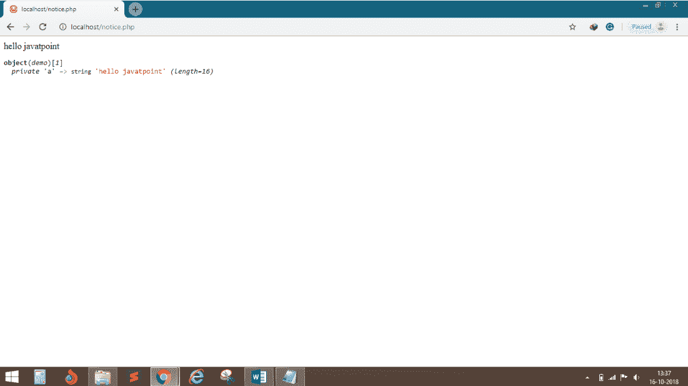

# 带有糟糕概念的 PHP

> 原文:[https://www.javatpoint.com/php-oops-concepts](https://www.javatpoint.com/php-oops-concepts)

面向对象编程是围绕**对象而不是动作**和**数据而不是逻辑**组织的编程模型。

## 类别:

类是一个实体，它决定了对象的行为和对象包含的内容。换句话说，它是构建特定类型对象的蓝图或指令集。

在 PHP 中，使用 class 关键字声明一个类，后跟该类的名称和一组大括号({})。



这是建筑作品即阶级的蓝图，由这个蓝图制作的房屋和公寓就是对象。

## 用 PHP 创建类的语法

```php
<?php
class MyClass
	{
		// Class properties and methods go here
	}
?>

```

### 重要提示:

在 PHP 中，要查看类的内容，请使用 var_dump()。var_dump()函数用于显示一个或多个变量的结构化信息(类型和值)。

## 语法:

```php

var_dump($obj);

```

## 对象:

类定义了数据结构的一个单独实例。我们定义一个类一次，然后制作许多属于它的对象。对象也称为实例。

对象是能够执行一系列相关活动的东西。

## 语法:

```php
<?php
class MyClass
{
		// Class properties and methods go here
}
$obj = new MyClass;
var_dump($obj);
?>

```

## 类和对象的示例:

```php
<?php
class demo
{
		private $a= "hello javatpoint";
		public function display()
		{
		echo $this->a;
		}
}
$obj = new demo();
	$obj->display();
?>

```

**输出:**



## 示例 2:使用 var _ dump($ obj)；

```php
<?php
class demo
{
		private $a= "hello javatpoint";
		public function display()
		{
		echo $this->a;
		}
}
$obj = new demo();
	$obj->display();
	var_dump($obj);
?>

```

**输出:**

