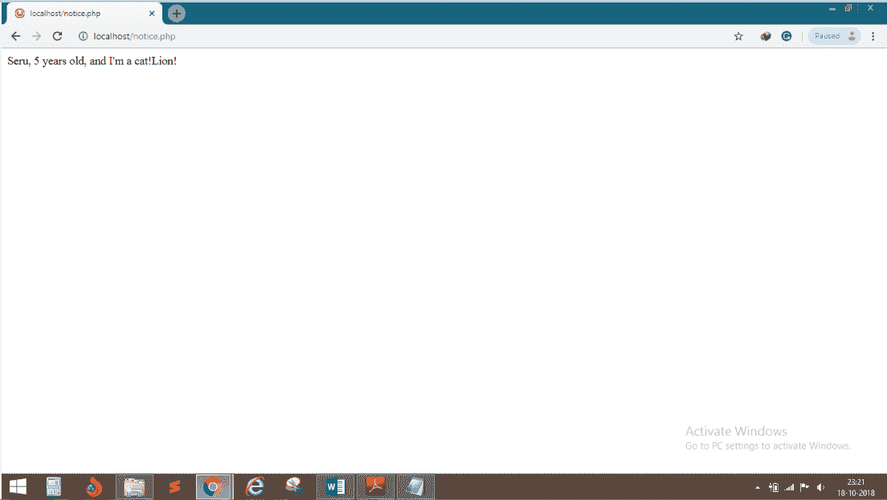

# PHP 中的抽象

> 原文:[https://www.javatpoint.com/php-oops-abstraction](https://www.javatpoint.com/php-oops-abstraction)

数据抽象是任何 OOPS 编程语言最重要的特性。它只显示有用的信息，其余的对最终用户是隐藏的。抽象是隐藏(抽象)实现细节的任何数据表示。

## 例 1

```php
<?php
abstract class Animal
{
public $name;
public $age;
public function Describe()
{
return $this->name . ", " . $this->age . " years old";    
    	}
abstract public function Greet();
}
class cat extends Animal
{
public function Greet()
{
return "Lion!";    
}
public function Describe()
{
return parent::Describe() . ", and I'm a cat!";    
}
}
$animal = new cat();
$animal->name = "Seru";
$animal->age = 5;
echo $animal->Describe();
echo $animal->Greet();

?>

```

**输出:**

