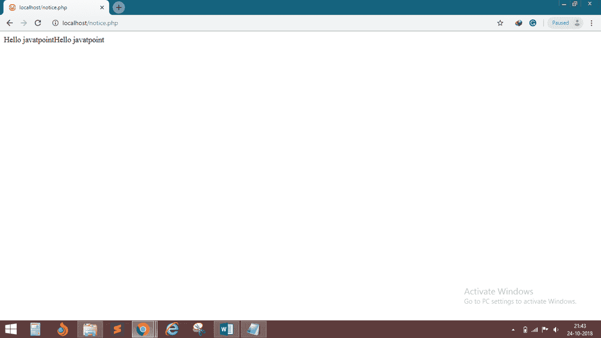
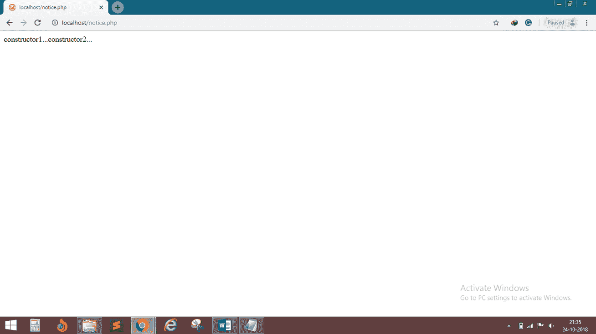

# 构造器

> 原文:[https://www.javatpoint.com/php-oops-constructor](https://www.javatpoint.com/php-oops-constructor)

*   **PHP** 5 允许开发人员为类声明**构造函数方法。**
*   构造函数适用于对象在使用前可能需要的任何**初始化**。
*   我们可以使用**“_ _ construct”或者类名**的同名来设计构造函数。
*   如果子类定义了构造函数，则不会隐式调用父构造函数。为了运行父构造函数，需要调用**父::_ _ 构造()**。

## 例 1

```php
<?php
	class Example
	{
		public function __construct()
		{
			echo "Hello javatpoint";
		}
	}
	$obj = new Example();
	$obj = new Example();
?>

```

**输出:**



## 例 2

```php
<?php
	class demo
	{
		public function demo()
		{
			echo "constructor1...";
		}
	}

	class demo1 extends demo
	{
		public function __construct()
		{
			echo parent::demo();
			echo "constructor2...";
		}
	}
	$obj= new demo1();
?>

```

**输出:**

