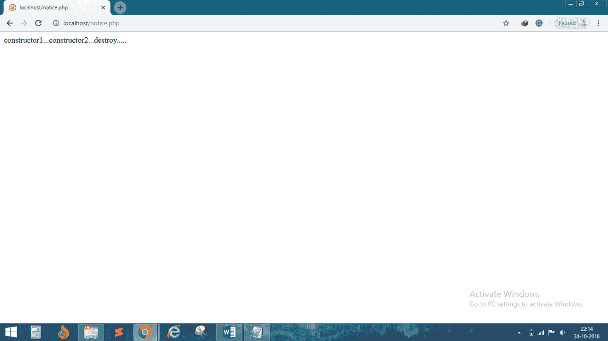

# 破坏者

> 原文：<https://www.javatpoint.com/php-oops-destructor>

*   **PHP 5** 引入了一个析构函数的概念，类似于其他面向对象语言，比如 C++。
*   一旦移除对特定对象的所有引用，或者当该对象在关闭序列中以任何顺序被显式销毁时，将调用析构函数方法。
*   我们使用**“_ _ 销毁”功能创建析构函数。**

## 例 1

```php
<?php
	class demo
	{
		public function demo()
		{
			echo "constructor1...";
		}
	}

	class demo1 extends demo
	{
		public function __construct()
		{
			echo parent::demo();
			echo "constructor2...";
		}
		public function __destruct()
		{
			echo "destroy.....";
		}
	}
	$obj= new demo1();
?>

```

**输出:**

