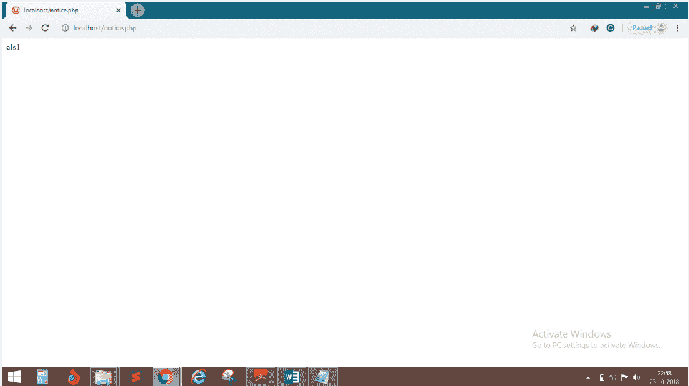
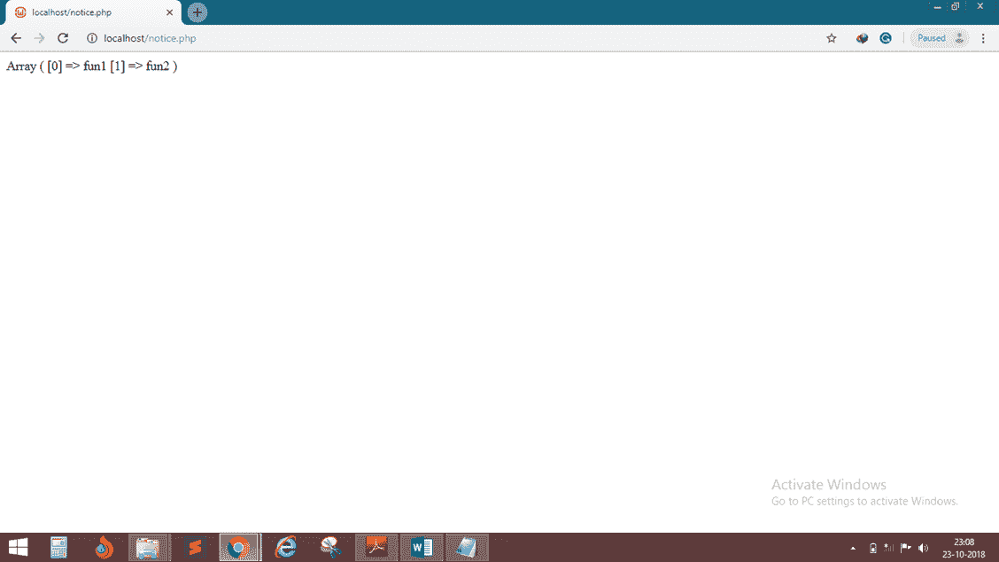
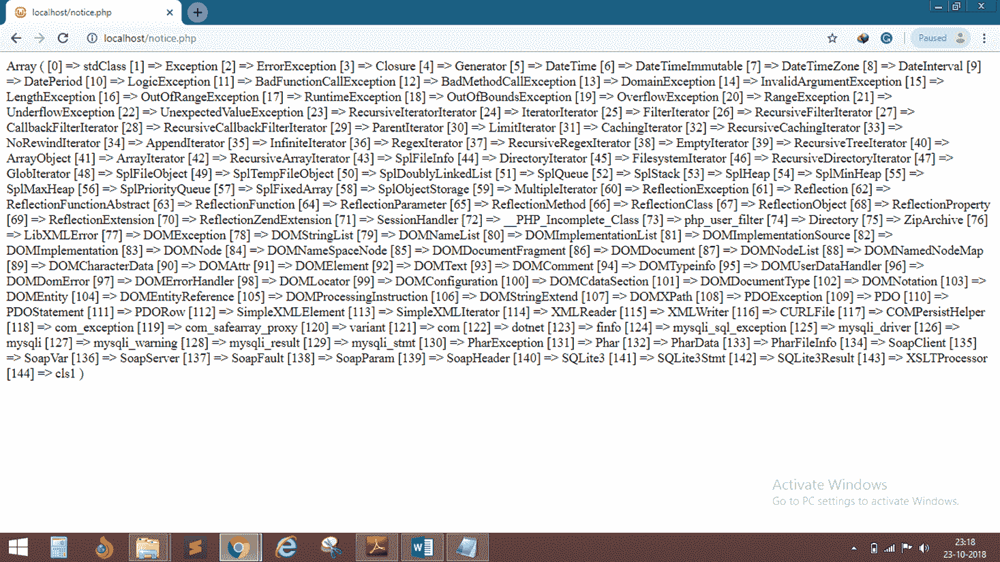

# PHP 中获取类和对象信息的一些有用函数

> 原文：<https://www.javatpoint.com/php-oops-functions>

1. **get_class:** 利用这个，我们可以得到一个对象的类名。

## 例 1

```php
<?php
	class cls1
	{

	}
	$obj=new cls1();
	echo get_class($obj);
?>

```

**输出:**



2. **get_class_vars:** 用于获取一个类的所有变量作为 Array 元素。

## 例 2

```php
<?php
	class cls1
	{
		var $x=100;
		var $y=200;
	}
	print_r(get_class_vars("cls1"));
?>

```

**输出:**


3. **get_class_methods:** 以数组的形式获取一个类的所有方法。

## 例 3

```php
<?php
	class cls1
	{
		function fun1()
		{
		}
		function fun2()
		{
		}
	}
	print_r(get_class_methods("cls1"));
?>

```

**输出:**



4.**get _ declare _ class:**获取当前脚本中的所有声明类以及预定义的类。

## 例 4

```php
<?php
	class cls1
	{

	}
	print_r(get_declared_classes());
?>

```

**输出:**



5. **get_object_vars:** 以数组形式获取对象的所有变量。

## 例 5

```php
<?php
	class cls1
	{
		var $x=100;
		var $y=200;
	}
	$obj= new cls1();
	print_r(get_object_vars($obj));
?>

```

**输出:**


6. **class_exists:** 检查指定的类是否存在。

## 例 6

```php
<?php
	class cls1
	{

	}
	echo class_exists("cls1");
?>

```

**输出:**


7.**是:**的 _ subclass _ 通过使用这个函数，我们可以检查第一类是否是第二类的子类。

## 例 7

```php
<?php
	class cls1
	{

	}
	class cls2 extends cls1
	{
	}
	echo is_subclass_of("cls2","cls1");
?>

```

**输出:**


8. **method_exists:** 通过使用这个函数，我们可以检查类方法是否存在。

## 例 8

```php
<?php
	class cls1
	{
		function fun1()
		{
		}
	}
	echo method_exists("cls1","fun1");
?>

```

**输出:**

