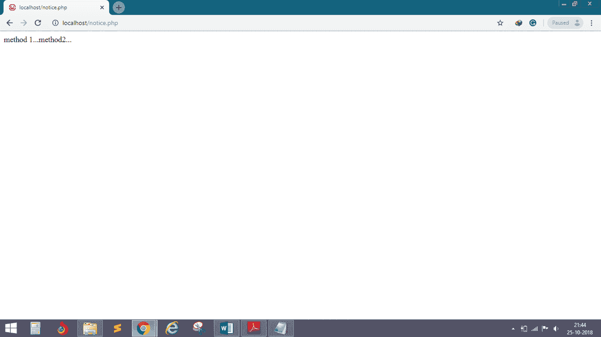
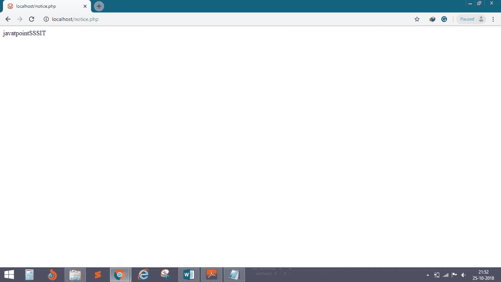

# 连接

> 原文：<https://www.javatpoint.com/php-oops-interface>

*   **接口类似于类**，只是它不能包含代码。
*   接口可以定义**方法名和参数**，但不能定义方法的内容。
*   任何实现接口的类都必须**实现接口**定义的所有方法。
*   一个类可以实现**多个接口**。
*   使用“**接口**关键字声明接口。
*   **接口**不能维护非抽象方法。

## 例 1

```php
<?php
	interface a
	{
		public function dis1();
	}
	interface b
	{
		public function dis2();
	}

class demo implements a,b
{
	public function dis1()
	{
		echo "method 1...";
	}
	public function dis2()
	{
		echo "method2...";
	}
}
$obj= new demo();
$obj->dis1();
$obj->dis2();

?>

```

**输出:**



## 例 2

```php
<?php
	interface i1
	{
		public function fun1();
	}
	interface i2
	{
		public function fun2();
	}
class cls1 implements i1,i2
{
	function fun1()
	{
		echo "javatpoint";
	}
	function fun2()
	{
		echo "SSSIT";
	}
}
$obj= new cls1();
$obj->fun1();
$obj->fun2();

?>

```

**输出:**

