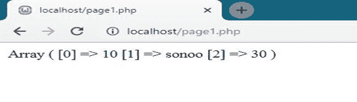
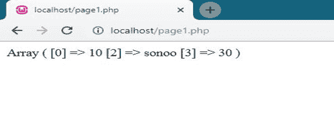
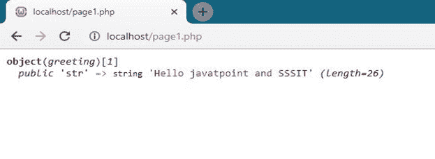

# 复合类型

> 原文:[https://www.javatpoint.com/php-compound-types](https://www.javatpoint.com/php-compound-types)

PHP 中有 2 种复合数据类型。

1.  [阵列](#array)
2.  [物体](#object)

* * *

## 数组:

数组是异构(不相似)数据类型的集合。PHP 是一种松散类型的语言，它？这就是为什么我们可以在数组中存储任何类型的值。

普通变量可以存储单个值，数组可以存储多个值。

数组包含许多元素，每个元素都是元素键和元素值的组合。

## 数组声明的语法:

```php

Variable_name = array (element1, element2, element3, element4......)

```

## 例 1

```php
<?php
	$arr= array(10,20,30);
	print_r($arr);
?>

```


## 例 2

```php
<?php
	$arr= array(10,'sonoo',30);
	print_r($arr);
?>

```



## 例 3

```php
<?php
	$arr= array(0=>10,2=>'sonoo',3=>30);
	print_r($arr);
?>

```



* * *

## 对象:

对象是一种数据类型，它积累数据以及如何处理这些数据的信息。对象是作为对象模板传递的类的特定实例。

## 语法:

首先，我们必须声明一类对象。类是由属性和方法组成的结构。类是用 class 关键字指定的。我们在对象类中指定数据类型，然后在该类的实例中使用该数据类型。

## 例 1

```php
<?php class vehicle
	{
		function car()
		{         
		echo "Display tata motors";
		}
	}
	$obj1 = new vehicle;
	$obj1->car(); 
?>

```


## 例 2

```php
<?php
	class student 
	{
    		function student() 
		{
        		$this->kundan = 100;
    		}
	}	
	$obj = new student();
	echo $obj->kundan;
?>

```


## 例 3

```php
<?php
	class greeting
	{
	public $str = "Hello javatpoint and SSSIT";
		function show_greeting()
		{
        		return $this->str;
    		}
	}
	$obj = new greeting;
	var_dump($obj);
?>

```

