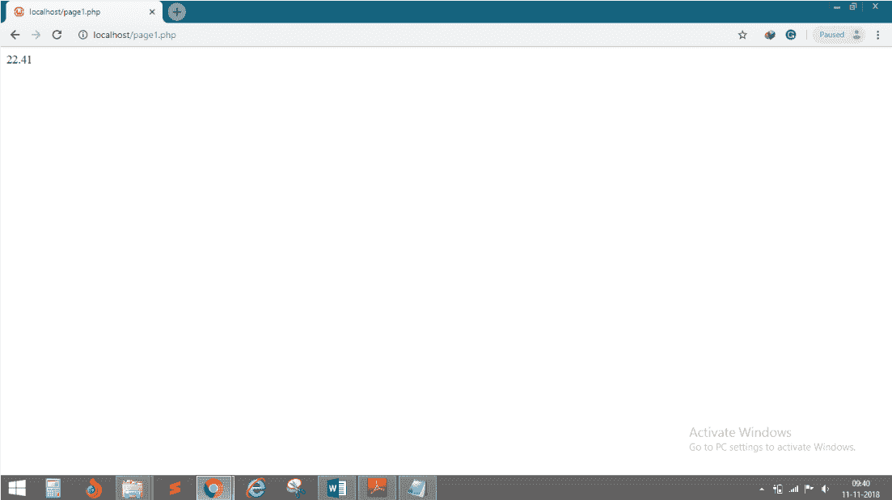
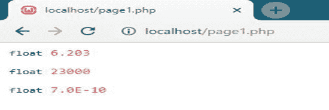

# 浮动

> 原文：<https://www.javatpoint.com/php-float>

这种数据类型代表十进制值。浮点(浮点数)是具有小数点的数字或指数形式的数字。

## 句法

```php

$a=1.234;
$x=1.2e4;
$y=7E-10;

```

## 例 1

```php
<?php
	$x=22.41;
	echo $x;
?>

```

**输出:**



## 例 2

```php
<?php 
    $a = 11.365;
    var_dump($a);
?>

```

**输出:**


## 例 3

```php
<?php
	$a = 6.203;
	$b = 2.3e4;
	$c = 7E-10;
	var_dump($a);
	var_dump($b);
	var_dump($c);
?>

```

**输出:**

